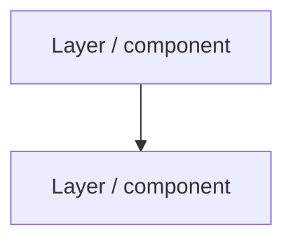

# ${1:Public architecture study}

[[index|← Home]] · [[atlas/architecture-atlas]] · [[media/visual-reference-library]]

> Editorial study reconstruction from cited public sources. **Not an internal TCS architecture diagram.**

## Official source

- **Title:**
- **URL:**
- **Figure / section:**
- **Publication date:**

## Components explicitly shown / described

- 

## Mermaid reconstruction

## Public terminology

- 

## What is explicit vs reconstructed

### Explicit in source
- 

### Editorial reconstruction
- 

## Related products / use cases

- [[tcs/tcs-bfsi-ai-offerings]]
- [[bfsi/use-case-atlas]]

## Evidence boundary

- No internal implementation details inferred.
- No customer architecture inferred unless separately published.
