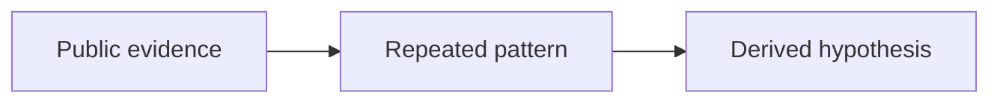

# ${1:Derived public inference}

[[index|← Home]] · [[intelligence/public-operating-model-inference]] · [[sources/source-radar]]

## Inference

> State the higher-order pattern clearly, without presenting it as internal fact.

## Evidence chain

1. **Source:**  
   **Fact:**
2. **Source:**  
   **Fact:**
3. **Source:**  
   **Fact:**

## Repeated pattern

- 

## Alternative explanation

- 

## Confidence

`low | medium | high | very-high`

Reason:

## Falsifier / missing evidence

What public evidence would weaken or overturn this inference?

- 

## Mermaid abstraction

## Related Foam nodes

- [[intelligence/public-intelligence-debugging-playbook]]
- [[tcs/public-ai-initiative-index]]
