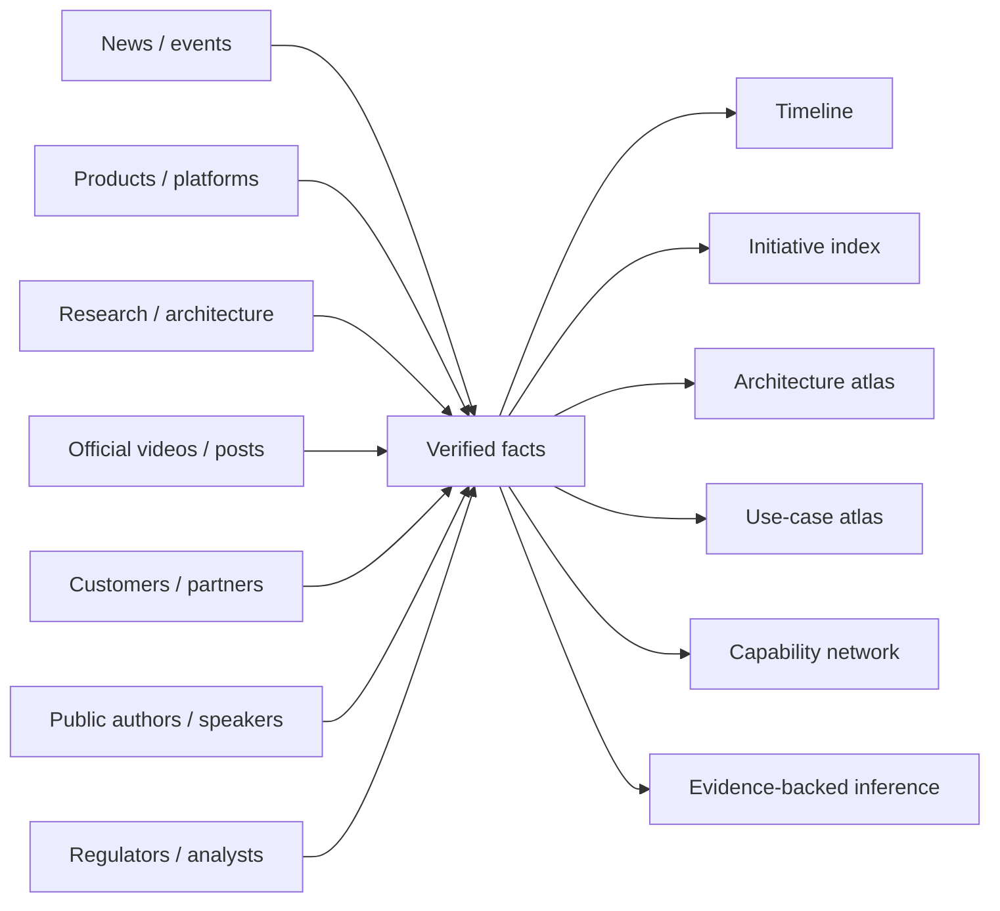

# TCS AI + BFSI Public Intelligence

A **Foam-native, source-backed public intelligence graph** for reconstructing Tata Consultancy Services (TCS) artificial-intelligence activity with deep coverage of **banking, financial services, insurance, capital markets, risk, compliance, data, quant, architecture, products, public expert networks, customer evidence, media and regulation**.

> **Facts first. Original sources first. Derived hypotheses must show their evidence chain, confidence and falsifier. No private/internal TCS information.**

## Why this repository exists

TCS publishes useful information across many disconnected surfaces: newsroom releases, product pages, white papers, BaNCS research journals, event agendas, official videos, LinkedIn posts, customer case studies, analyst pages, partner announcements and regulator material.

This repository **joins those fragments into one graph** so the same public system can be understood from multiple abstractions:



## Main knowledge surfaces

| Surface | Purpose |
|---|---|
| [[index]] | Foam command center / map of content |
| [[dashboards/tcs-bfsi-ai-radar]] | Current high-signal facts |
| [[news/timeline]] | Chronological evidence history |
| [[tcs/public-ai-initiative-index]] | Master public initiative/product/partnership inventory |
| [[intelligence/public-operating-model-inference]] | Cross-source operating-model deductions with confidence + falsifiers |
| [[intelligence/public-intelligence-debugging-playbook]] | Method for finding deeper structure without turning inference into rumor |
| [[atlas/architecture-atlas]] | Mermaid reconstructions of public TCS architecture concepts |
| [[bfsi/use-case-atlas]] | Banking/insurance/capital-markets/risk use cases mapped to public TCS assets |
| [[people/public-capability-network]] | Public thematic network of BFSI AI/data/quant/platform expertise |
| [[people/public-voices]] | Public authors, speakers and executive champions by topic |
| [[research/bfsi-ai-reading-room]] | Curated high-density public research and consumption paths |
| [[media/watchlist]] | Official TCSGlobal videos, event watch pages, public posts and journals |
| [[media/visual-reference-library]] | Official diagram/figure locators + editorial Mermaid reconstructions |
| [[events/public-event-watch]] | Event agendas, partners, demos, speakers and status |
| [[tcs/public-language-glossary]] | TCS-specific public vocabulary and product terminology |
| [[bfsi/public-implementations]] | Named/anonymous public customer evidence and reported outcomes |
| [[regulations/india-ai-bfsi]] | RBI / SEBI / IRDAI public AI/BFSI watch |
| [[sources/source-catalog]] | Canonical primary-source inventory |
| [[sources/source-radar]] | Collection, verification and evidence-status rules |

## Rich Markdown / Foam features

The graph intentionally uses:

- `[[Foam wikilinks]]`
- backlinks and graph traversal
- YAML tags / metadata
- Mermaid `flowchart`, `mindmap`, `timeline`, `stateDiagram`, `quadrantChart`
- collapsible `<details>` sections
- tables and evidence matrices
- external YouTube thumbnail embeds linked to official videos
- official TCS figure/PDF locators instead of re-hosting copyrighted artwork
- dedicated templates for public facts, architecture, events, professional context and derived inference

### Foam templates

Use **Foam: Create New Note From Template** with:

- `.foam/templates/public-source-note.md`
- `.foam/templates/inference-note.md`
- `.foam/templates/architecture-study.md`
- `.foam/templates/public-person-note.md`
- `.foam/templates/public-event-note.md`
- `.foam/templates/daily-note.md`

## Open in VS Code

```bash
git clone https://github.com/Akilankm/second-brain.git
cd second-brain
code .
```

Install the recommended **Foam** extension, then use:

- `Foam: Show Graph`
- `Foam: Update Reference List`
- `Foam: Create New Note From Template`
- `Foam: Open Daily Note`

Open **[[index]]** first.

## Evidence model

Every substantive statement should expose its status where useful:

| Status | Meaning |
|---|---|
| `live` / `deployed` | Active/production status explicitly established |
| `pilot` | Pilot/PoC explicitly established |
| `announced` | Public announcement; deployment not assumed |
| `planned` | Future event/program/activity |
| `public-case-study` | TCS/customer published implementation evidence |
| `product-capability` | Product page states capability; named deployment not inferred |
| `public-demo` | Public demo/event/experience-center evidence |
| `thought-leadership` | White paper/journal/architecture viewpoint |
| `analyst-recognition` | Analyst assessment |
| `regulatory` | Regulator material |
| `derived-inference` | Cross-source hypothesis with evidence chain + confidence + falsifier |

## Public-intelligence boundary

The repository does **not** contain:

- internal TCS information
- confidential/private client or project material
- credentials or restricted documents
- personal employment metadata
- private employee relationships or inferred internal politics
- inferred identities of anonymous customers
- rumors or unsupported claims

Public professional information is used only to map **work-related topics, authorship and public capability clusters**. Public architecture diagrams remain linked to their original TCS source; Mermaid diagrams here are clearly labelled study reconstructions.
