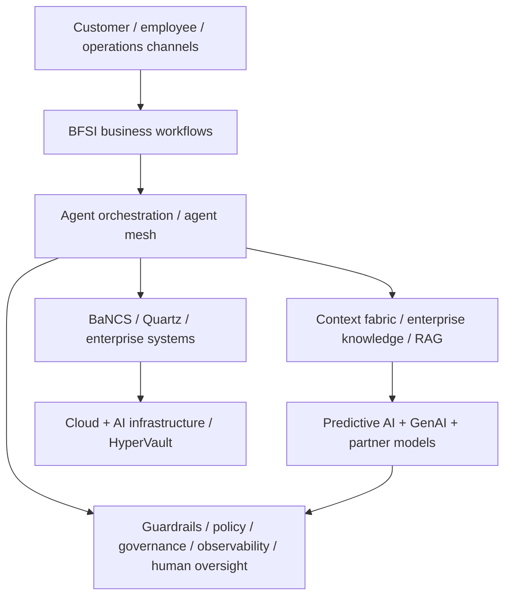

# TCS BFSI Agentic AI — Public Architecture Signals

[[index|← Home]] · [[tcs/tcs-bfsi-ai-offerings]] · [[bfsi/risk-compliance-ai]]

This page is a **cross-source map of architecture terms and capabilities that TCS publicly describes**. It is not an internal TCS reference architecture and does not claim that every deployment uses all components.

## 1. Agent orchestration / agent mesh

TCS Cognitive Automation Platform publicly describes:

- multi-agent orchestration through an **agentic mesh**
- an agent marketplace with **200+ pre-built reusable domain-trained agents**
- agent studio/builder capabilities
- coordination across business and IT workflows
- human approvals/overrides

Source: https://www.tcs.com/what-we-do/industries/insurance/solution/cognitive-automation-platform-transform-banking

## 2. Context and enterprise knowledge

TCS' BFSI **Context Fabric** white paper describes a contextual layer combining domain, process, data and regulatory context for agentic workflows such as credit risk, AML/compliance and financial advisory.

Source: https://www.tcs.com/what-we-do/industries/banking/white-paper/context-fabric-backbone-agentic-ai-bfsi

CAP also publicly references business-context knowledge models, RAG and knowledge-fabric patterns.

Source: https://www.tcs.com/what-we-do/industries/insurance/solution/cognitive-automation-platform-transform-banking

## 3. Composite AI

TCS AI Spectrum for BFSI is publicly described as combining **predictive AI + generative AI**. TCS says it leverages the NVIDIA ecosystem for enterprise/domain AI.

Source: https://www.tcs.com/what-we-do/industries/banking/solution/tcs-ai-spectrum-for-bfsi

TCS insurance thought leadership similarly discusses composite AI in claims alongside technologies such as geospatial data, wearables and digital twins.

Source: https://www.tcs.com/what-we-do/industries/insurance/white-paper/ai-agents-insurance-claims-function

## 4. Model / agent ecosystem

Public TCS partnerships expose a multi-model ecosystem rather than a single-model strategy:

- Claude / Anthropic
- Mistral Forge
- Gemini Enterprise / Google Cloud
- NVIDIA AI Enterprise ecosystem
- Microsoft AI/cloud
- OpenAI partnership at company level

See [[tcs/ai-partnerships]] for exact status and source boundaries.

## 5. Governance, guardrails and observability

Public TCS material repeatedly references:

- guardrails and policy controls
- governance and observability
- continuous evaluation
- human approvals / overrides
- audit logging
- responsible / traceable / explainable AI
- PII/security controls
- monitoring and regulatory alignment

Primary sources:
- CAP: https://www.tcs.com/what-we-do/industries/insurance/solution/cognitive-automation-platform-transform-banking
- BaNCS AI Compass: https://www.tcs.com/who-we-are/newsroom/press-release/tcs-bancs-ai-upgrade-new-core-tool-supercharge-innovation
- Risk Live 2026 agenda: https://www.tcs.com/who-we-are/events/tcs-at-risk-live-north-america-2026

## 6. Core BFSI platform integration

TCS public material connects AI capabilities with its BFSI platforms:

- TCS BaNCS AI Compass as an AI core for BaNCS
- TCS BaNCS IX GenAI agents
- Quartz Intelligent Insights
- TCS BaNCS availability at the Bengaluru BFSI Gemini Experience Center
- Quartz AI + DLT across compliance, surveillance, digital assets/currencies

See [[tcs/tcs-bfsi-ai-offerings]].

## 7. Cloud / infrastructure layer

Public TCS signals include:

- hyperscaler/on-premises deployment support in CAP
- Google Cloud/Gemini centers and accelerators
- AWS-based wealth/fraud solutions demonstrated at the AWS Financial Services Symposium
- NVIDIA-based AI Spectrum
- HyperVault AI data-center infrastructure

Sources:
- https://www.tcs.com/what-we-do/industries/insurance/solution/cognitive-automation-platform-transform-banking
- https://www.tcs.com/who-we-are/events/tcs-at-aws-financial-services-symposium-2026
- https://www.tcs.com/who-we-are/newsroom/press-release/tcs-hypervault-establish-large-scale-ai-data-center-campus-telangana

## Cross-source public stack map

The diagram below is a **repository synthesis of published TCS components**, not a diagram published by TCS.

## BFSI processes explicitly named in public TCS sources

- KYC / periodic KYC
- AML
- creditworthiness / lending / real-time loan decisions
- credit risk
- fraud monitoring / investigation
- trade-finance screening
- customer service/contact center
- underwriting
- claims
- wealth advisory
- transfer agency
- securities/corporate actions
- compliance/KYC and surveillance through Quartz

See [[bfsi/banking-ai]], [[bfsi/insurance-ai]], [[bfsi/capital-markets-ai]] and [[bfsi/risk-compliance-ai]].
