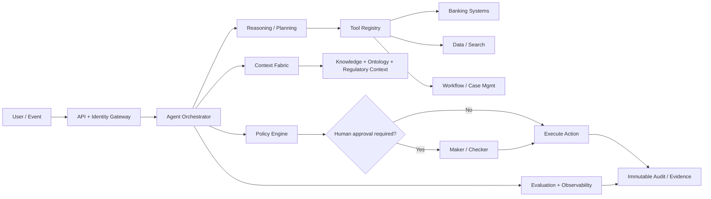

# Agentic AI Architecture for BFSI

[[index|← Home]] · [[bfsi/risk-compliance-ai]] · [[tcs/tcs-bfsi-ai-offerings]]

## Reference architecture

## 1. Identity and authorization

An agent must never have more authority than the user/workflow it represents.

Design for:

- workload identity
- RBAC/ABAC
- tenant/client isolation
- scoped credentials
- short-lived tokens
- action-level entitlements

## 2. Orchestrator

Responsibilities:

- task decomposition
- state management
- routing
- retry/recovery
- budget/latency constraints
- human handoff

Avoid letting an LLM implicitly own all workflow state.

## 3. Context fabric

The context layer should make business meaning available at runtime.

Potential context dimensions:

- customer/account/case
- product
- process state
- business ontology
- policy/regulation
- geography/jurisdiction
- effective dates
- user authorization
- historical decisions
- source provenance

This connects directly to TCS' public BFSI discussion of context fabric.

## 4. Reasoning and planning

Use bounded planning:

- explicit goal
- allowed actions
- maximum steps
- cost/latency budget
- stopping criteria
- escalation criteria

## 5. Tool registry

Every tool should define:

- schema
- owner
- permission
- side effects
- timeout
- retry behavior
- idempotency
- approval requirement
- audit requirements

Separate **read tools** from **write/transaction tools**.

## 6. Policy engine

Do not encode critical BFSI controls only in prompts.

Externalize important constraints into deterministic policy/rule checks:

- transaction thresholds
- product eligibility
- jurisdiction restrictions
- segregation of duties
- customer consent
- mandatory evidence
- model/agent allow lists

## 7. Human-in-the-loop

Use risk-tiered autonomy.

| Tier | Example | Autonomy |
|---|---|---|
| 0 | summarize policy | autonomous |
| 1 | recommend case priority | autonomous + reviewable |
| 2 | propose credit/compliance action | human approval |
| 3 | financial/regulated irreversible action | maker-checker / deterministic controls |

## 8. Evaluation

Evaluate the **workflow**, not just the model.

Metrics:

- task success
- groundedness
- source correctness
- policy compliance
- tool-call correctness
- false-positive / false-negative impact
- human override rate
- escalation quality
- latency
- token/inference cost
- failure recovery

## 9. Observability

Capture:

- trace ID
- prompts/context references
- model/version
- tool calls
- policy decisions
- human approvals
- output validation
- latency/cost
- errors/retries
- final business outcome

## 10. Audit evidence

For regulated workflows, preserve enough information to reconstruct:

**what the agent knew → what it decided → what policy applied → who approved → what action occurred**.

## Production-readiness checklist

- [ ] threat model
- [ ] PII/data classification
- [ ] prompt-injection tests
- [ ] tool permissions reviewed
- [ ] deterministic policy checks
- [ ] eval dataset
- [ ] failure-mode tests
- [ ] human escalation path
- [ ] tracing/metrics
- [ ] cost budget
- [ ] audit retention
- [ ] rollback/kill switch
- [ ] model/version governance

## First portfolio implementation

Build a **Regulatory Change Impact Agent** because it demonstrates domain context, retrieval, structured extraction, policy mapping, human approval, lineage and evaluation without needing access to private banking transactions.
