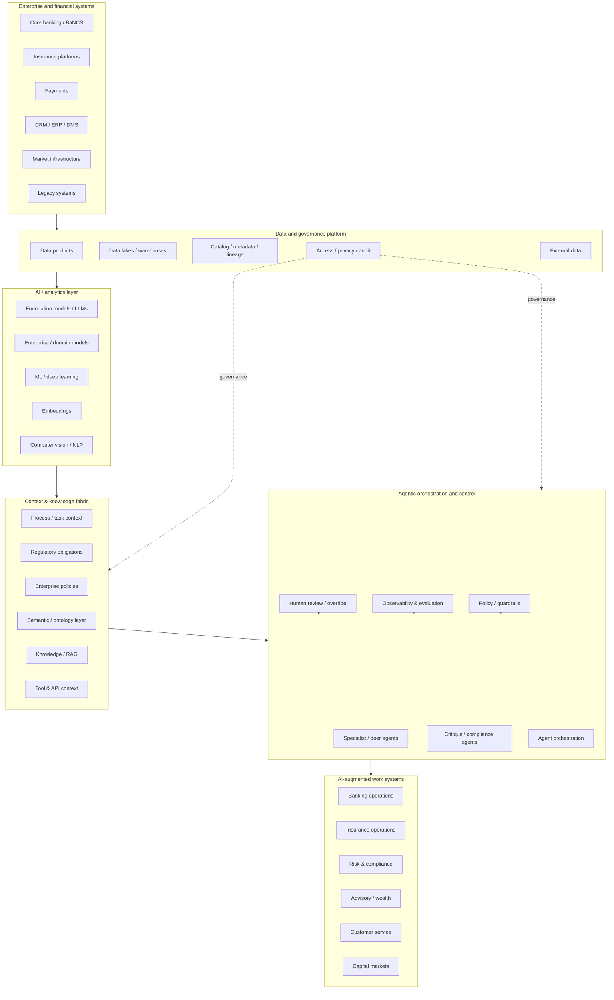
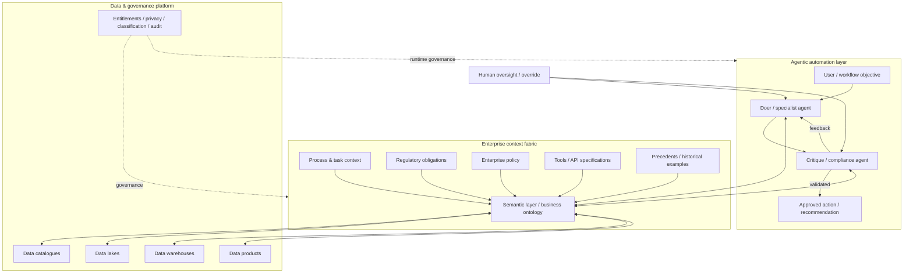
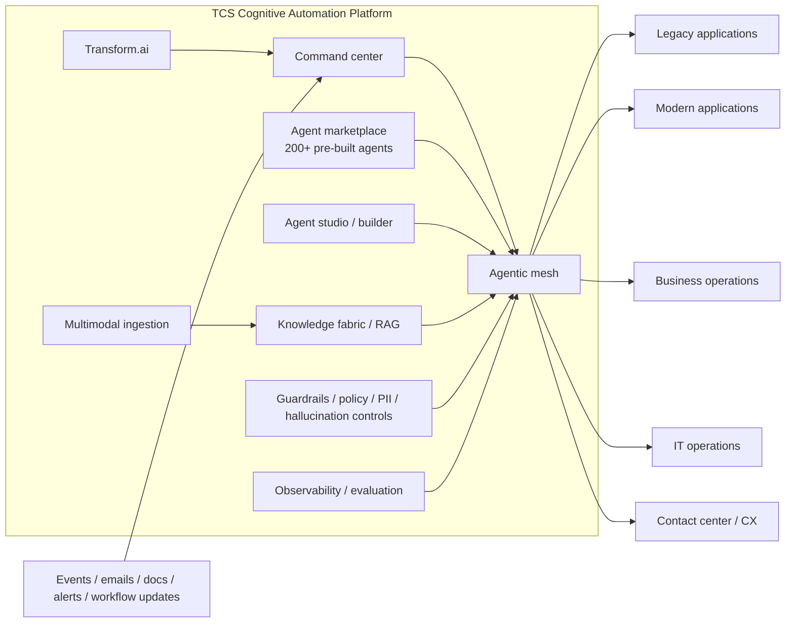
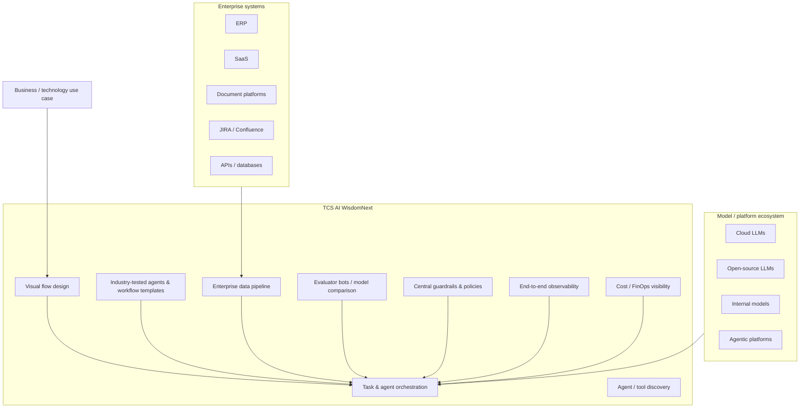
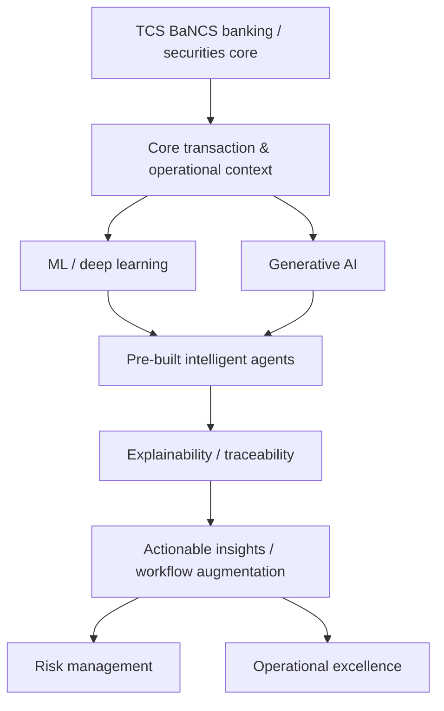
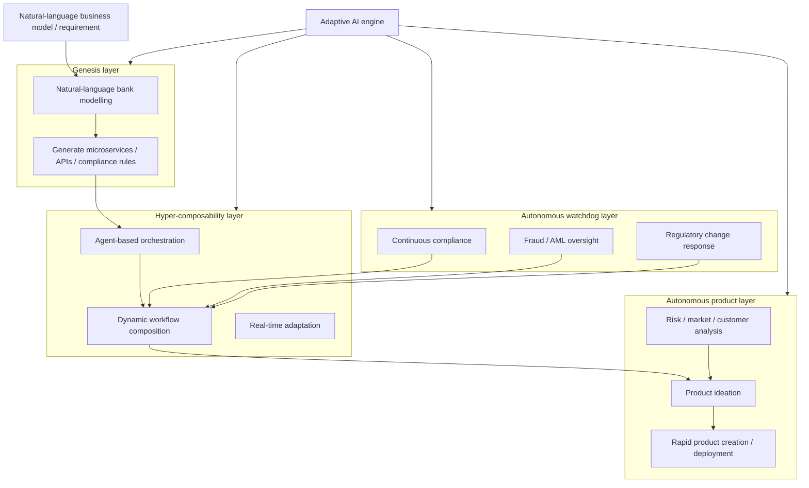
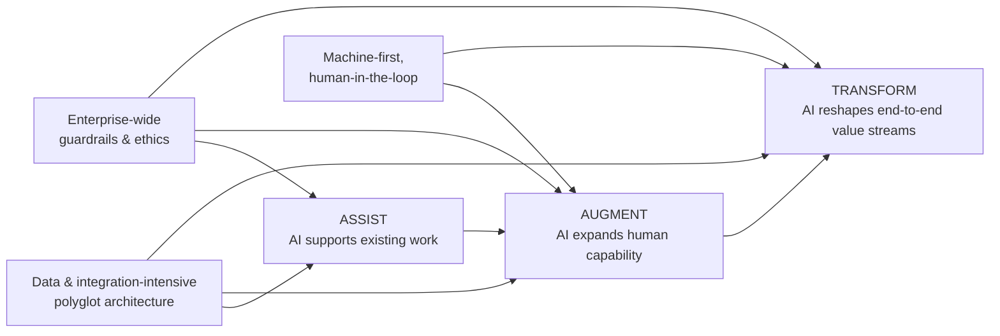
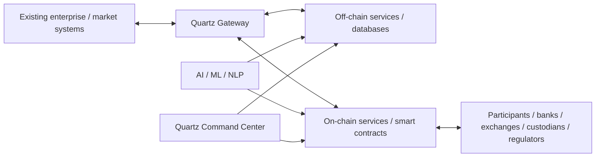

# TCS BFSI AI — Public Architecture Atlas

[[index|← Home]] · [[tcs/public-ai-initiative-index]] · [[ai/agentic-ai-bfsi-architecture]] · [[bfsi/use-case-atlas]] · [[media/visual-reference-library]]

> This page reconstructs **only architecture concepts TCS has described publicly**. Mermaid diagrams are editorial reconstructions for study; they are **not internal TCS architecture diagrams** and should not be represented as such.

## 1. The public TCS BFSI AI stack — one-page system map

The recurring pattern across TCS' public BFSI AI material is: enterprise/core systems → governed data/context → models and agents → orchestration/guardrails → AI-augmented business work.

**Public basis**

- [Context Fabric – The Backbone of Agentic AI in BFSI](https://www.tcs.com/what-we-do/industries/banking/white-paper/context-fabric-backbone-agentic-ai-bfsi)
- [Generative AI in Finance: Opening up a Sea of Possibilities](https://www.tcs.com/what-we-do/industries/banking/white-paper/generative-ai-finance-insurance-industry)
- [TCS Cognitive Automation Platform](https://www.tcs.com/what-we-do/industries/insurance/solution/cognitive-automation-platform-transform-banking)
- [TCS GenAI for BFSI](https://www.tcs.com/what-we-do/industries/banking/genai-insurance-banking-financial-services)

---

## 2. Context Fabric — architecture reconstructed from TCS Figure 1

TCS publicly describes a three-layer pattern: **agentic automation**, **context fabric**, and **data/governance platform**, with governance spanning the stack.

TCS' public terminology for operationalising this layer is:

| Pillar | Public description |
|---|---|
| **Externalise** | Curate business-specific functional context plus underlying data/analytics context into an accessible layer |
| **Harness** | Inject dynamic context into AI agents through the runtime harness |
| **Manage** | Keep context current using human-controlled feedback and enterprise knowledge |

Source: [Context Fabric – The Backbone of Agentic AI in BFSI](https://www.tcs.com/what-we-do/industries/banking/white-paper/context-fabric-backbone-agentic-ai-bfsi)

---

## 3. TCS Cognitive Automation Platform — public capability topology

TCS describes CAP as an agentic AI orchestration platform combining existing automation with agentic systems, knowledge, governance, observability, multi-modal inputs and integrations.

Publicly stated CAP features include:

- agentic mesh and agent marketplace
- **200+ pre-built reusable domain-trained AI agents**
- agent studio and future-ready agent builder
- event-driven agent triggers
- multi-step goal-driven workflows
- knowledge fabric and RAG
- responsible-agentic-AI guardrails
- multi-modal inputs
- deep process observability
- on-premises or hyperscaler deployment options

Source: [TCS Cognitive Automation Platform](https://www.tcs.com/what-we-do/industries/insurance/solution/cognitive-automation-platform-transform-banking)

See also: [[media/watchlist#tcs-unified-workbench--cognitive-automation-platform]]

---

## 4. TCS AI Spectrum for BFSI — NVIDIA-backed composite AI path

TCS describes AI Spectrum as an end-to-end BFSI AI framework for operationalising **Composite AI** — predictive AI plus generative AI — using NVIDIA's stack.

```mermaid
flowchart LR
  RAW[Financial documents / operational data / enterprise knowledge]
  CURATE[NeMo Curator\ndata preparation & curation]
  EMBED[NVIDIA embedding model\nlanguage understanding]
  CUSTOM[NeMo Customizer\nBFSI / enterprise customization]
  MODELS[Domain / enterprise AI models]
  GUARD[NeMo Guardrails\nsafety & topical controls]
  INFER[TensorRT / NIM\noptimized inference]
  USERS[Advisors / fund managers / investors / regulators / operations]

  RAW --> CURATE --> EMBED --> CUSTOM --> MODELS --> GUARD --> INFER --> USERS
```

Source: [TCS AI Spectrum for BFSI](https://www.tcs.com/what-we-do/industries/banking/solution/tcs-ai-spectrum-for-bfsi)

Official visual reference: [[media/visual-reference-library#tcs-ai-spectrum-for-bfsi-framework]]

---

## 5. TCS AI WisdomNext — public enterprise orchestration topology

TCS describes WisdomNext as a layer above models and agentic platforms that orchestrates **models, agents, data and workflows** while centralising governance, observability and cost visibility.

Sources:

- [Accelerate Enterprise Generative AI Adoption with TCS AI WisdomNext](https://www.tcs.com/what-we-do/services/artificial-intelligence/solution/enterprise-generative-ai-adoption-wisdomnext)
- [TCS Launches WisdomNext](https://www.tcs.com/who-we-are/newsroom/press-release/tcs-launches-wisdomnext-an-industry-first-genai-aggregation-platform)
- [TCS AI WisdomNext — official TCSGlobal video](https://www.youtube.com/watch?v=FhQSMJT0vwc)

---

## 6. TCS BaNCS AI Compass — public AI core model

TCS announced AI Compass in December 2025 as an AI core for BaNCS combining ML/deep learning, GenAI and pre-built intelligent agents, with emphasis on responsible, explainable and traceable AI.

Source: [TCS BaNCS Gets AI Upgrade: AI Compass](https://www.tcs.com/who-we-are/newsroom/press-release/tcs-bancs-ai-upgrade-new-core-tool-supercharge-innovation)

---

## 7. ABOS — public fully agentic banking-operating-platform concept

The TCS BaNCS Research Journal describes ABOS as a **fully agentic AI-driven bank operating platform**. This is public TCS BaNCS thought leadership; the source should not be treated as proof of a named production deployment unless TCS publishes such evidence separately.

Sources:

- [Redefining Banking Intelligence with ABOS](https://www.tcs.com/what-we-do/products-platforms/tcs-bancs/articles/redefining-banking-intelligence-abos)
- [TCS BaNCS Research Journal Issue 16](https://www.tcs.com/what-we-do/products-platforms/tcs-bancs/research-journal/tcs-bancs-research-journal-16-future-finance)
- [Research Journal PDF — Redefining Banking Intelligence](https://www.tcs.com/content/dam/global-tcs/en/pdfs/what-we-do/platforms/TCS-BaNCS/research-journal/tcs-bancs-research-journal-16-redefining-banking-intelligence.pdf)

---

## 8. GenAI-for-BFSI operating model — public TCS framing

TCS' GenAI for BFSI page summarises its approach as:

Source: [TCS GenAI for BFSI](https://www.tcs.com/what-we-do/industries/banking/genai-insurance-banking-financial-services)

---

## 9. Quartz — coexistence of traditional systems, DLT and AI

Quartz publicly uses the idea of **co-existence**: keep conventional systems where appropriate while using on-chain/off-chain DLT and AI/ML where they add value.

Sources:

- [Quartz — The Smart Ledgers](https://www.tcs.com/what-we-do/products-platforms/quartz)
- [Quartz Smart Solutions](https://www.tcs.com/what-we-do/products-platforms/quartz/solution/quartz-smart-solutions-dlt-friendly-ready-to-use)
- [Quartz for Interbank Ledger](https://www.tcs.com/what-we-do/products-platforms/quartz/solution/quartz-interbank-ledger)
- [Quartz for Surveillance](https://www.tcs.com/what-we-do/products-platforms/quartz/solution/quartz-surveillance)

---

## 10. Cross-map: which public TCS asset sits where?

| Public asset / concept | Primary public role | BFSI relevance | Evidence type |
|---|---|---|---|
| **TCS Cognitive Automation Platform** | Agentic orchestration + business/IT automation | Direct | Product/solution page |
| **TCS AI Spectrum for BFSI** | Composite AI framework | Direct | BFSI solution page |
| **Context Fabric** | Semantic/context layer for regulated agents | Direct | BFSI white paper |
| **TCS AI WisdomNext** | Model/agent/data orchestration and governance | Cross-industry, usable in BFSI | Product page + video |
| **TCS BaNCS AI Compass** | AI core for banking/securities platform | Direct | Product announcement |
| **ABOS** | Fully agentic banking-operating-platform concept | Direct | BaNCS thought leadership |
| **Quartz** | DLT + AI for trusted financial ecosystems | Direct in several solutions | Product pages/case evidence |
| **GenAI for BFSI** | AI-led assist/augment/transform operating model | Direct | BFSI capability page |

## Related Foam notes

- [[tcs/tcs-bfsi-ai-offerings]]
- [[tcs/public-language-glossary]]
- [[bfsi/use-case-atlas]]
- [[bfsi/public-implementations]]
- [[media/watchlist]]
- [[media/visual-reference-library]]
- [[people/public-voices]]
