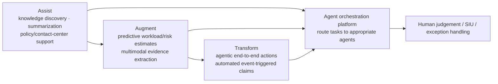
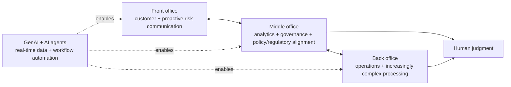

# TCS Insurance AI — Public Intelligence

[[bfsi/domain-map|← BFSI map]] · [[tcs/tcs-bfsi-ai-offerings]] · [[bfsi/public-implementations]]

## Insurance AI themes published by TCS

TCS' insurance pages and public materials describe AI activity across:

- claims processing
- underwriting
- intelligent document processing
- customer service and contact centers
- complaint handling
- call-quality verification
- fraud detection
- policy/service operations
- risk and compliance
- composite AI
- agentic AI
- cyber insurance and connected-mobility risk

Industry source: https://www.tcs.com/what-we-do/industries/insurance

## AI agents in claims — `thought-leadership / architecture`

TCS' claims paper is unusually useful because it exposes a public operating model for moving insurance claims from conventional automation toward composite and agentic AI.

### Public claims architecture themes

TCS describes combining:

- predictive AI
- GenAI
- NLP
- retrieval-augmented generation
- fine-tuning / prompt engineering
- image/audio/video evidence processing
- geospatial data
- wearables
- digital twins
- enterprise knowledge fabric
- role-based purposive agents
- human judgement for complex/high-risk claims

The paper frames AI-agent maturity through an **assist → augment → transform** continuum:

**Diagram status:** editorial reconstruction of the TCS paper, not an internal TCS architecture diagram.

TCS says future-proof claims environments would place an enterprise knowledge fabric over contextual artifacts, with role-based access for purposive AI agents. It also argues that maturing insurers will need orchestration platforms capable of switching/routing between agents.

### Four public agentic dimensions

The paper maps claims-agent opportunities across:

1. customer experience
2. back-office operations
3. smart engineering
4. IT operations

TCS' Figure 1 maps traditional AI/ML and GenAI opportunities across claims personas, while Figure 2 depicts claims-lifecycle automation with AI agents.

### Adoption caution

The paper explicitly keeps regulated insurance and human judgement in scope: not every claim should be autonomously processed, and complex/high-value/suspicious cases may require specialist or SIU involvement.

### Study figures cited by TCS

TCS cites its AI for Business Study and states that **94% of surveyed insurance executives** had AI implementation planned, in process or completed. It also says only **4%** regarded AI as a differentiating factor for business transformation at that time.

These are study results cited in TCS-authored thought leadership, not TCS deployment counts.

**Public author:** Sukriti Jalali, publicly described by TCS as an innovation partner in its BFSI business unit.

Source: https://www.tcs.com/what-we-do/industries/insurance/white-paper/ai-agents-insurance-claims-function

## Autonomous-vehicle insurance + cyber risk — `thought-leadership / architecture`

A newer public TCS paper extends the insurance-AI model into **autonomous vehicles (AVs)**, where the insured object is itself a connected AI/software/cyber-physical system.

TCS identifies four major AV risk classes:

- multi-party liability
- system malfunction
- cyber vulnerabilities
- data security

The paper says driver-centric historical models are poorly suited to distributed liability involving OEMs, software providers, sensors and other technology dependencies. TCS proposes combining **GenAI, AI agents, composite AI and intelligent workflows** for dynamic profiling, automated analysis, underwriting, claims, cyber-risk management and compliance.

### Front / middle / back-office model

The strongest operating-model signal is TCS' public description of a tightly integrated front-, middle- and back-office environment:

TCS explicitly describes the **middle office as an analytical and governance layer** that checks AI-supported outputs against policy and regulatory requirements. It also says underwriters and adjusters can increasingly move away from routine work toward activities requiring human judgment.

### Official figures

The page exposes three useful public visuals:

1. **Figure 1 — The expanding cyberthreat landscape for AVs**
2. **Figure 2 — How GenAI and AI agents can assist in overcoming cyber risks in AV insurance**
3. **Figure 3 — Front-, middle-, and back-office operations powered by AI**

Deep note: [[research/autonomous-vehicle-insurance-agentic-ai]] · visual locators: [[media/visual-reference-library]].

**Public authors:** Adiel Karthak, Ankur Agarwal and Meenu Mittal; see [[people/public-voices]].

Source: https://www.tcs.com/what-we-do/industries/insurance/white-paper/generative-agentic-autonomous-vehicle-insurance

**Date discipline:** the retrieved public page does not expose a reliable publication date, so no chronology date is inferred.

## Cognitive Automation Platform — `live-capability`

TCS publishes multiple insurance examples for CAP, including document processing, underwriting/claims and customer operations. Published platform features include agentic orchestration, 200+ reusable agents, governance, human approvals and continuous evaluation.

Source: https://www.tcs.com/what-we-do/industries/insurance/solution/cognitive-automation-platform-transform-banking

## Public insurance implementation evidence

### AmTrust Financial Services — E&S clearance — `public-case-study` / `deployed`

TCS' current public case study describes a production AI-and-automation transformation for AmTrust Financial Services' **Excess & Surplus (E&S)** clearance process.

The publicly described workflow combines:

TCS states that the implementation was completed in **12 weeks** and then rolled out across all E&S products. Reported outcomes include underwriting-response turnaround moving from **a few days to same/next day**, with **more than 80% of submissions processed in less than four hours** after broker submission.

Source: https://www.tcs.com/what-we-do/industries/insurance/case-study/amtrust-financial-services-transformation

**Date discipline:** the retrieved TCS case-study page does not expose a publication date, so no event date is inferred.

### Tryg — `announced`
On 2 September 2025, TCS announced a **seven-year, €550 million** agreement with Tryg covering AI and cloud across its IT landscape and automation of core processes.

Source: https://www.tcs.com/who-we-are/newsroom/press-release/tcs-partners-tryg-deal-propel-growth-comprehensive-digital-transformation-over-next-7-years

### Canada Life — `announced`
On 8 June 2026, TCS announced a multimillion-euro AI-powered services transformation agreement with Canada Life focused on infrastructure operations, automation, resilience and digital modernization.

Source: https://www.tcs.com/who-we-are/newsroom/press-release/tcs-wins-multimillion-euro-ai-powered-services-transformation-deal-canada-life

### Tier-1 insurer pilots/projects — `pilot/project evidence`
On 23 January 2025, TCS said it was working with customers including tier-1 insurers on **two pilots and three projects** around newly announced GenAI capabilities in TCS BaNCS IX and Quartz Intelligent Insights.

Source: https://www.tcs.com/who-we-are/newsroom/news-alert/tcs-offers-genai-based-solutions-help-financial-institutions-enhance-customer-experience-improve-reporting

### Anonymous top-five US life insurer — `public-case-study`
TCS' CAP page describes **100% automated call-quality verification** with agentic AI for a top-five US life insurer. The customer is not named publicly on that page.

Source: https://www.tcs.com/what-we-do/industries/insurance/solution/cognitive-automation-platform-transform-banking

### Anonymous top-five US P&C insurer — `public-case-study`
The same CAP page describes ingestion of **1M+ documents per month** and a **60% processing-cost reduction** for a top-five US P&C insurer.

Source: https://www.tcs.com/what-we-do/industries/insurance/solution/cognitive-automation-platform-transform-banking

### Anonymous US life carrier — `public-case-study`
TCS says a US life carrier centralized and intelligently manages **12,000+ SOPs** using the platform.

Source: https://www.tcs.com/what-we-do/industries/insurance/solution/cognitive-automation-platform-transform-banking

See [[bfsi/public-implementations]] for the consolidated evidence table.

## TCS annual-report BFSI platform signal — `reported/public customer story`

TCS' FY2025-26 Annual Report includes a “Serviced by Software” BFSI platform customer story. TCS reports that its BFSI products platform serves **25M+ customers** with **100+ AI agents** across contact centers, back-office, communications and complaints. The annual report also describes reported outcomes including reduced after-call work, reduced call-quality audit effort and faster complaint-response turnaround.

Source: https://www.ar.tcs.com/

These figures are TCS-reported platform/customer-story metrics.

## Insurance analyst signals

### P&C Insurance BPS — `analyst-recognition`
Everest Group positioned TCS as a Leader; TCS' public summary emphasizes agentic AI and full-stack P&C operations such as FNOL, underwriting triage, subrogation, litigation support, broking and reinsurance.

Source: https://www.tcs.com/who-we-are/newsroom/analyst-reports/tcs-named-leader-p-and-c-insurance-bps

### P&C Insurance IT Services — `analyst-recognition`
TCS' public summary of Everest Group's assessment cites investments in AI across underwriting, claims, fraud, customer experience and compliance.

Source: https://www.tcs.com/who-we-are/newsroom/analyst-reports/tcs-named-leader-property-casualty-insurance-it-services

## Upcoming public signal — ITC Vegas 2026 — `planned`

TCS is sponsoring an AI-first insurance program from 29 September to 1 October 2026 with **Anthropic, AWS and FICO**. Published topics include:

- composable AI
- enterprise scaling
- governance
- ownership decisions
- cloud-first insurance
- quantum readiness

Source: https://www.tcs.com/who-we-are/events/tcs-at-itc-vegas-2026

## Related

[[tcs/ai-partnerships]] · [[bfsi/risk-compliance-ai]] · [[ai/agentic-ai-bfsi-architecture]] · [[research/advanced-quantz-analytics-public-capability]] · [[research/autonomous-vehicle-insurance-agentic-ai]] · [[news/timeline]] · [[people/public-voices]]
