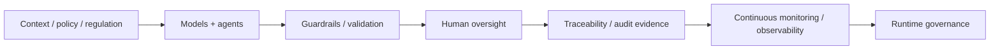

# TCS BFSI AI — Risk, Compliance and Governance Public Intelligence

[[bfsi/domain-map|← BFSI map]] · [[regulations/india-ai-bfsi]] · [[ai/agentic-ai-bfsi-architecture]] · [[research/responsible-ai-financial-crime-governance]]

## Risk Live North America 2026 — `planned`

TCS' public event page for 24 September 2026 states that its BFSI risk-management program will cover:

- scaling AI and agentic intelligence across risk and compliance
- AI governance and monitoring frameworks
- AI adoption metrics and business impact
- robust, transparent and auditable models
- bias mitigation
- alignment with regulatory expectations and internal risk appetite
- human judgment and oversight for accountability and trust

Source: https://www.tcs.com/who-we-are/events/tcs-at-risk-live-north-america-2026

This is a stated public agenda for an upcoming event, not evidence that a particular client has implemented all listed controls.

## Responsible AI in financial crime — `thought-leadership / governance`

A TCS public paper on Responsible AI in financial-crime compliance makes the governance model unusually explicit. It connects AI-supported KYC, fraud, sanctions, transaction monitoring and regulatory reporting with:

- AI system/use-case inventories
- data quality and representativeness controls
- model validation and bias management
- human-in-the-loop oversight
- third-party/vendor governance
- model decisions traceable to data inputs
- incident readiness
- cross-border AI/data governance
- board/senior-management accountability
- continuous governance monitoring
- **decision-level audit evidence**, moving beyond static policy/checklist compliance

Source: https://www.tcs.com/what-we-do/industries/banking/white-paper/responsible-ai-financial-crime-global-compliance-governance

The page is TCS-authored thought leadership and does not establish regulator endorsement or client deployment. Deep note: [[research/responsible-ai-financial-crime-governance]].

## Cognitive Automation Platform governance — `live-capability`

TCS publicly describes governance/control capabilities including:

- enterprise guardrails and policy controls
- agent governance and observability
- continuous evaluation
- human approvals and overrides
- business-context knowledge models
- RAG / knowledge-fabric patterns
- PII/security controls
- hallucination-prevention/guardrail mechanisms
- auditability across agent workflows

Source: https://www.tcs.com/what-we-do/industries/insurance/solution/cognitive-automation-platform-transform-banking

## Context Fabric for agentic AI in BFSI — `thought-leadership`

TCS' BFSI white paper describes a context fabric as a backbone for agentic AI, bringing together domain, process, data and regulatory context. The paper uses complex BFSI tasks such as credit-risk assessment, AML/compliance and financial advisory as examples of multi-step agentic workflows.

Source: https://www.tcs.com/what-we-do/industries/banking/white-paper/context-fabric-backbone-agentic-ai-bfsi

This source represents TCS' published architecture viewpoint rather than deployment proof.

## TCS BaNCS AI Compass controls — `announced/live-capability`

TCS' AI Compass announcement describes:

- responsible, traceable and explainable AI
- guardrails
- audit logging
- no-code AI lifecycle capabilities

Source: https://www.tcs.com/who-we-are/newsroom/press-release/tcs-bancs-ai-upgrade-new-core-tool-supercharge-innovation

## TCS AI Spectrum / NVIDIA guardrails — `live-capability`

TCS publicly describes AI Spectrum for BFSI as a composite-AI platform leveraging NVIDIA ecosystem components, including NeMo Guardrails, for enterprise/domain-specific AI.

Source: https://www.tcs.com/what-we-do/industries/banking/solution/tcs-ai-spectrum-for-bfsi

## Quartz for Compliance — `product-capability`

TCS publicly describes Quartz for Compliance as an AI/ML-driven financial-crime compliance solution spanning:

- KYC
- sanctions screening
- AML
- transaction and fraud monitoring
- real-time payment screening
- regulatory reporting
- risk analyzers
- case/workflow management
- advanced analytics

TCS states that the solution can ingest regulatory, third-party and bank-specific watchlists and use AI/ML over large data volumes to identify patterns while reducing manual review.

Source: https://www.tcs.com/what-we-do/products-platforms/quartz/compliance

## Quartz for Surveillance — `product-capability`

TCS' current public page provides detailed market-surveillance capability evidence. Quartz for Surveillance combines rule/statistical surveillance with AI/ML and NLP over transaction and news data. TCS states that the solution supports:

- multi-asset and multi-market surveillance
- real-time or periodic feeds through Quartz Gateway
- anomaly detection
- labelled-alert training to reduce false positives
- NLP over unstructured news
- end-to-end alert investigation workflows
- market replay
- **50+ rule-based alerts**
- **30+ statistical/behavioural alerts**

Publicly named abuse patterns include wash trades, mark-the-close, front running, collusion, circular trading and spoofing.

Source: https://www.tcs.com/what-we-do/products-platforms/quartz/solution/quartz-surveillance

These are product capability claims; they do not by themselves establish a specific customer deployment.

## Automated Regulatory Compliance — `product-capability`

TCS publicly describes a regulatory-compliance solution using NLP, ML, ontologies and metadata to support regulation tracking, obligation extraction, risk-taxonomy management, lineage analytics and control assurance. TCS states benefit ranges including **70–80% improved accuracy in obligation identification** and **50–75% improved compliance-readiness agility**.

Source: https://www.tcs.com/what-we-do/industries/banking/solution/smart-compliance-risk-identification-management

Treat the percentage ranges as TCS product-page claims, not independently validated outcomes.

## Proactive risk management with GenAI — `thought-leadership`

TCS' public white paper discusses GenAI for continuous/proactive risk intelligence in BFSI. TCS cites survey findings that **59%** of firms were implementing/testing GenAI in risk/compliance and **53%** expected moderate or high impact.

Source: https://www.tcs.com/what-we-do/industries/banking/white-paper/generative-ai-proactive-risk-management-bfsi

These are figures cited by TCS in thought-leadership material, not TCS deployment counts.

## Public risk/compliance use cases described by TCS

Across CAP, Context Fabric, Quartz and compliance material, TCS publicly references:

- KYC and periodic KYC
- customer risk rating
- AML monitoring
- sanctions screening
- credit risk
- fraud/transaction monitoring
- trade-finance screening
- market surveillance
- regulatory reporting
- real-time payment screening
- regulatory-context injection into agent workflows
- obligation extraction and regulatory knowledge modelling

Sources:
- https://www.tcs.com/what-we-do/industries/insurance/solution/cognitive-automation-platform-transform-banking
- https://www.tcs.com/what-we-do/industries/banking/white-paper/context-fabric-backbone-agentic-ai-bfsi
- https://www.tcs.com/what-we-do/products-platforms/quartz/compliance
- https://www.tcs.com/what-we-do/products-platforms/quartz/solution/quartz-surveillance
- https://www.tcs.com/what-we-do/industries/banking/solution/smart-compliance-risk-identification-management

## Cross-source public control-plane pattern

Several independent TCS surfaces now converge around the same regulated-AI control vocabulary:

**Inference discipline:** this is an editorial abstraction across public TCS sources, not evidence that CAP, Context Fabric, BaNCS, Quartz and the Risk Practice share one internal technical implementation.

## Model-provider partnership risk/governance signal

### Anthropic — `announced`
TCS' partnership announcement explicitly frames regulated sectors as requiring accuracy, auditability and oversight and says TCS and Anthropic will jointly target highly regulated sectors including financial services.

Source: https://www.tcs.com/who-we-are/newsroom/press-release/tcs-anthropic-launch-global-premier-partnership-drive-enterprise-ai-scaling

### Mistral — `announced`
TCS says the Mistral collaboration will support domain-specific AI grounded in enterprise knowledge/data and names BFSI among the initial sectors, with a dedicated CoE supporting design, deployment and governance.

Source: https://www.tcs.com/who-we-are/newsroom/press-release/tcs-partners-mistral-first-global-systems-integrator-enterprises-worldwide

## India regulatory sources

See [[regulations/india-ai-bfsi]] for RBI/SEBI/IRDAI public material. TCS-authored governance approaches and regulator requirements are kept separate in this graph.

## Related

[[bfsi/banking-ai]] · [[bfsi/insurance-ai]] · [[bfsi/capital-markets-ai]] · [[tcs/ai-partnerships]] · [[sources/source-catalog]] · [[research/responsible-ai-financial-crime-governance]]
