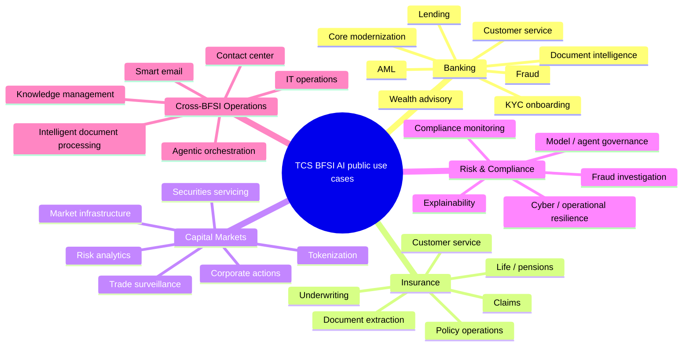
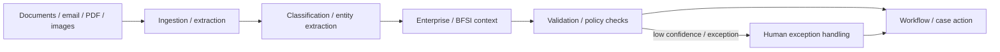

# TCS BFSI AI — Public Use-Case Atlas

[[index|← Home]] · [[atlas/architecture-atlas]] · [[bfsi/public-implementations]] · [[tcs/tcs-bfsi-ai-offerings]] · [[tcs/public-language-glossary]]

> A domain-by-domain map of **use cases TCS has publicly described, demonstrated, implemented, or published as case evidence**. Status labels are intentionally conservative.

## Evidence legend

| Status | Meaning here |
|---|---|
| `public-case-study` | TCS/customer page describes a customer implementation/outcome |
| `deployed/live` | Public source explicitly states deployment/production/live status |
| `announced` | Public solution/initiative announcement |
| `event-demo/solution` | Public event page says solution/demo was presented |
| `product-capability` | Product page states capability; no named deployment inferred |
| `thought-leadership` | White paper/journal architecture/use-case discussion |

---

## Domain map

---

# Banking

## Fraud detection / investigation

### AWS-based fraud detection solution

- **Status:** `event-demo/solution`
- **Public fact:** TCS' AWS Financial Services Symposium 2026 page says TCS introduced two AWS-based solutions, one focused on **fraud detection**.
- **Source:** [TCS at AWS Financial Services Symposium 2026](https://www.tcs.com/who-we-are/events/tcs-at-aws-financial-services-symposium-2026)
- **Related:** [[events/public-event-watch]] · [[tcs/ai-partnerships]]

### Gemini Experience Center BFSI fraud investigation

- **Status:** `public-demo`
- **Public fact:** TCS' public Gemini Experience Center material describes financial-services demonstrations/use cases including fraud investigation.
- **Source:** [TCS and Google Cloud launch Gemini Experience Center in Mexico](https://www.tcs.com/who-we-are/newsroom/press-release/tcs-and-google-cloud-gemini-experience-center-mexico-drive-ai-adoption)
- **Related:** [[tcs/ai-partnerships]]

### Quartz fraud / surveillance capabilities

- **Status:** `product-capability`
- **Public fact:** Quartz pages describe AI/ML-based fraud-prevention/surveillance capabilities across financial ecosystems.
- **Sources:** [Quartz](https://www.tcs.com/what-we-do/products-platforms/quartz) · [Quartz for Surveillance](https://www.tcs.com/what-we-do/products-platforms/quartz/solution/quartz-surveillance)

---

## AML / financial crime

### Context-aware AML agent workflows

- **Status:** `thought-leadership`
- **Public fact:** TCS' Context Fabric white paper uses AML monitoring/compliance as an example of multi-step work suited to context-aware agentic AI.
- **Source:** [Context Fabric – The Backbone of Agentic AI in BFSI](https://www.tcs.com/what-we-do/industries/banking/white-paper/context-fabric-backbone-agentic-ai-bfsi)

### ABOS automated fraud and AML management

- **Status:** `thought-leadership/product-concept`
- **Public fact:** The public ABOS article describes continuous transaction analysis, fraud detection and automated AML risk/compliance functions as agentic capabilities.
- **Source:** [Redefining Banking Intelligence with ABOS](https://www.tcs.com/what-we-do/products-platforms/tcs-bancs/articles/redefining-banking-intelligence-abos)

---

## KYC / onboarding

### Dynamic onboarding / KYC path selection

- **Status:** `public-article-example`
- **Public fact:** A TCS BaNCS article states that a leading financial institution in India implemented AI agents able to detect onboarding friction and switch customers to a faster KYC-validation path.
- **Source:** [Agentic AI for Human-centric Engagement in Financial Services](https://www.tcs.com/what-we-do/products-platforms/tcs-bancs/articles/agentic-ai-human-centric-engagement-financial-services)
- **Customer identity:** not inferred beyond TCS' public wording.

### ABOS KYC workflow adaptation

- **Status:** `thought-leadership/product-concept`
- **Public fact:** ABOS public material uses a digital-first bank adapting KYC processes to changing rules as an illustrative scenario.
- **Source:** [ABOS](https://www.tcs.com/what-we-do/products-platforms/tcs-bancs/articles/redefining-banking-intelligence-abos)

---

## Lending / credit

### Credit-risk assessment

- **Status:** `thought-leadership`
- **Public fact:** Credit-risk assessment is explicitly named in the Context Fabric white paper as a complex multi-step BFSI task for agentic AI.
- **Source:** [Context Fabric](https://www.tcs.com/what-we-do/industries/banking/white-paper/context-fabric-backbone-agentic-ai-bfsi)

### Digital lending product generation in ABOS

- **Status:** `thought-leadership/product-concept`
- **Public fact:** ABOS uses a scenario in which business teams describe a digital-lending product in natural language and AI handles workflow, compliance checks and pricing-model setup.
- **Source:** [ABOS](https://www.tcs.com/what-we-do/products-platforms/tcs-bancs/articles/redefining-banking-intelligence-abos)

### GenAI in lending operations

- **Status:** `analyst-recognition/public-capability`
- **Public fact:** Everest Group recognition published by TCS highlights integration of GenAI into TCS lending offerings, including originations and reusable frameworks.
- **Source:** [TCS Named a Leader in Lending Services Operations by Everest Group](https://www.tcs.com/who-we-are/newsroom/analyst-reports/tcs-named-leader-lending-services-operations-everest-group)

---

## Wealth / advisory

### AWS-based wealth management advisory solution

- **Status:** `event-demo/solution`
- **Public fact:** TCS says it introduced an AWS-based solution focused on wealth-management advisory at AWS Financial Services Symposium 2026.
- **Source:** [Event page](https://www.tcs.com/who-we-are/events/tcs-at-aws-financial-services-symposium-2026)

### Financial advisory in Context Fabric

- **Status:** `thought-leadership`
- **Public fact:** TCS lists financial advisory among areas where context-sensitive agentic AI can support BFSI decisions.
- **Source:** [Context Fabric](https://www.tcs.com/what-we-do/industries/banking/white-paper/context-fabric-backbone-agentic-ai-bfsi)

---

## Customer engagement / next-best action

### Dynamic offer sequencing

- **Status:** `public-article-example`
- **Public fact:** TCS BaNCS describes AI agents dynamically sequencing lending, investment or insurance offers based on market conditions and predicted intent at a leading financial institution in India.
- **Source:** [Agentic AI for Human-centric Engagement in Financial Services](https://www.tcs.com/what-we-do/products-platforms/tcs-bancs/articles/agentic-ai-human-centric-engagement-financial-services)

### Smart contact center

- **Status:** `product-capability`
- **Public fact:** TCS GenAI for BFSI lists smart contact-center capabilities including real-time call guidance, quality improvement, agent copilots and first-contact-resolution support.
- **Source:** [TCS GenAI for BFSI](https://www.tcs.com/what-we-do/industries/banking/genai-insurance-banking-financial-services)

---

## Enterprise-wide GenAI operating model — Lloyds Banking Group

- **Status:** `public-case-study`
- **Public fact:** TCS says it worked with Lloyds Banking Group to establish a GenAI Office with a secure/governed foundation, self-service products/models and frameworks/guardrails.
- **Published outcome:** TCS reports **50+ GenAI use cases** and **more than $50 million in business value**.
- **Source:** [Lloyds Banking Group Reimagines Banking with Generative AI](https://www.tcs.com/what-we-do/industries/banking/case-study/lloyds-banking-group-reimagine-banking-generative-ai)
- **Related:** [[bfsi/public-implementations]]

---

# Insurance

## Customer service / conversational AI

### Momentum Metropolitan Life

- **Status:** `deployed/public-case-study`
- **Public fact:** Momentum Metropolitan Life used the TCS conversational AI platform across web, WhatsApp and Facebook; TCS says the solution moved from pilot/feasibility to production in four months.
- **Source:** [Momentum Metropolitan Life Embraces Chatbots for Better CX](https://www.tcs.com/what-we-do/industries/insurance/case-study/reimagining-client-experience-conversational-ai)
- **Related:** [[bfsi/insurance-ai]] · [[bfsi/public-implementations]]

---

## Claims

### Insurance claims automation / agentic AI demonstrations

- **Status:** `public-demo/product-capability`
- **Public fact:** TCS Gemini Experience Center material includes insurance-claims use cases/demonstrations, while CAP targets insurance service operations with agentic automation.
- **Sources:** [Gemini Experience Center Mexico](https://www.tcs.com/who-we-are/newsroom/press-release/tcs-and-google-cloud-gemini-experience-center-mexico-drive-ai-adoption) · [CAP](https://www.tcs.com/what-we-do/industries/insurance/solution/cognitive-automation-platform-transform-banking)

---

## Underwriting / policy operations / document extraction

### Employee health insurance digitization

- **Status:** `public-case-study`
- **Public fact:** TCS describes use of **TCS Intelligent Digital Extraction Suite**, an AI/ML solution, to extract attributes from unstructured files for renewal-premium calculation in an insurer transformation.
- **Source:** [TCS Helps Insurer Implement an Employee Health Insurance Solution](https://www.tcs.com/what-we-do/industries/insurance/case-study/tcs-helps-insurer-implement-employee-health-insurance-solution)

---

## Life / annuity / pensions

- **Status:** `product-capability`
- **Public asset:** TCS BaNCS for Life, Annuity and Pensions.
- **Video provenance:** [TCS BaNCS Newsletter 34](https://www.tcs.com/content/dam/global-tcs/en/pdfs/what-we-do/platforms/TCS-BaNCS/newsletter/TCS_BaNCS_Newsletter_34.pdf) links the product video.
- **Watch:** [YouTube](https://youtu.be/MSz7O7FG1Ec)

---

# Capital markets / market infrastructure

## Trade surveillance

### Quartz for Surveillance

- **Status:** `product-capability` plus public implementation claims on Quartz pages
- **Public fact:** Quartz for Surveillance uses AI/ML/NLP for multi-asset, multi-market monitoring to identify suspicious behavior, market manipulation, fraud and abnormalities.
- **Source:** [Quartz for Surveillance](https://www.tcs.com/what-we-do/products-platforms/quartz/solution/quartz-surveillance)

---

## Tokenization / digital assets

### Quartz for Markets

- **Status:** `product-capability/public implementation evidence`
- **Public fact:** Quartz for Markets supports tokenized securities and coexistence with traditional market infrastructure.
- **TCS-published implementation examples include:** bond issuance using DLT for a large Indian depository; crypto custody for a Swiss private bank/financial-services firm; market surveillance for an exchange and central bank in APAC.
- **Source:** [Quartz for Markets](https://www.tcs.com/what-we-do/products-platforms/quartz/solution/quartz-markets-blockchain-solution-token-economy)

### Crypto custody / transaction processing

- **Status:** `product-capability`
- **Public fact:** Quartz for Crypto Services provides connectivity to public blockchains, HSM devices and marketplaces for regulated financial institutions.
- **Source:** [Quartz for Crypto Services](https://www.tcs.com/what-we-do/products-platforms/quartz/solution/quartz-crypto-services)

---

## Interbank lending / borrowing

### Quartz for Interbank Ledger

- **Status:** `product-capability`
- **Public fact:** Hybrid on-chain/off-chain architecture for interbank borrowing/lending, collateral workflows, negotiation, audit trails, SWIFT payments and external AML checks.
- **Source:** [Quartz for Interbank Ledger](https://www.tcs.com/what-we-do/products-platforms/quartz/solution/quartz-interbank-ledger)

---

## Securities / post-trade / corporate actions

- **Status:** `product-capability`
- **Public assets:** TCS BaNCS securities and asset-servicing capabilities, including cloud corporate-actions material in the public BaNCS video archive.
- **Watch provenance:** [[media/watchlist#tcs-bancs-public-video-archive]]

---

# Risk, compliance and governance

## AI in risk management

- **Status:** `public-research`
- **Public fact:** TCS/Chartis research examines adoption of AI/RiskTech across banking, capital markets and insurance, including behavioral analytics, segmentation, cyber risk and operational resilience.
- **Sources:**
  - [AI in Risk Management](https://www.tcs.com/what-we-do/industries/banking/white-paper/ai-in-risk-management-a-game-changer-for-banks-and-insurers)
  - [RiskTech BFSI overview](https://www.tcs.com/insights/global-studies/risktech-role-risk-management-bfsi-industry)
  - [Banking](https://www.tcs.com/insights/global-studies/risktech-role-mitigate-emerging-risks-banking)
  - [Capital markets](https://www.tcs.com/insights/global-studies/risktech-risk-management-capital-market-firms)
  - [Insurance](https://www.tcs.com/insights/global-studies/risktech-role-insurance-risk-management)

---

## Agent governance / observability

- **Status:** `product-capability`
- **CAP:** guardrails, policy controls, PII detection, hallucination prevention, behavior-control policies, observability/evaluation.
- **WisdomNext:** centralized guardrails/policies, observability, model/agent orchestration and cost visibility.
- **Sources:** [CAP](https://www.tcs.com/what-we-do/industries/insurance/solution/cognitive-automation-platform-transform-banking) · [WisdomNext](https://www.tcs.com/what-we-do/services/artificial-intelligence/solution/enterprise-generative-ai-adoption-wisdomnext)

---

# Cross-BFSI operations

## Intelligent document processing

Public TCS pages repeatedly position document intelligence/extraction as a BFSI capability through AI Spectrum, CAP and insurer case material.

**Public basis:** [AI Spectrum](https://www.tcs.com/what-we-do/industries/banking/solution/tcs-ai-spectrum-for-bfsi) · [CAP](https://www.tcs.com/what-we-do/industries/insurance/solution/cognitive-automation-platform-transform-banking)

---

## Smart email / contact center / IT operations

- **Status:** `product-capability`
- **Public fact:** CAP explicitly combines smart email management, conversational assistants, self-service analytics, intelligent document processing, low-code workflows, business operations and IT operations.
- **Source:** [CAP](https://www.tcs.com/what-we-do/industries/insurance/solution/cognitive-automation-platform-transform-banking)

---

# Use case ↔ public TCS asset matrix

| Use-case family | CAP | AI Spectrum | BaNCS / AI Compass | ABOS | Quartz | WisdomNext | Context Fabric |
|---|:---:|:---:|:---:|:---:|:---:|:---:|:---:|
| Fraud / investigation | ✓ | ✓ | ✓ | ✓ | ✓ | orchestration | context |
| AML / compliance | ✓ | ✓ | ✓ | ✓ | external checks / surveillance | orchestration | ✓ |
| Lending / credit | automation | analytics | banking core | ✓ | — | orchestration | ✓ |
| KYC / onboarding | automation | AI processing | ✓ | ✓ | KYC smart solutions | orchestration | context |
| Wealth advisory | workflows | insights | banking | concept | — | orchestration | ✓ |
| Customer service | ✓ | ✓ | banking | concept | — | orchestration | context |
| Insurance claims | ✓ | ✓ | insurance suite | — | — | orchestration | context |
| Document intelligence | ✓ | ✓ | workflow integration | — | — | data pipelines | context |
| Trade surveillance | workflow | analytics | securities | — | ✓ | orchestration | context |
| Tokenization | — | — | securities integration | — | ✓ | — | — |

**Note:** check marks mean the public source associates the asset with the capability/domain. They do not mean every asset is deployed for every customer or that the implementations are technically identical.

## Related

- [[bfsi/banking-ai]]
- [[bfsi/insurance-ai]]
- [[bfsi/capital-markets-ai]]
- [[bfsi/risk-compliance-ai]]
- [[bfsi/public-implementations]]
- [[atlas/architecture-atlas]]
- [[media/watchlist]]
