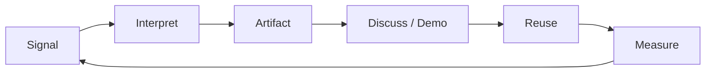

# Recognition Operating System

[[index|← Home]] · [[dashboards/career-visibility]] · [[career/c2-30-60-90]]

## Objective

Build durable recognition from **usefulness and leverage**, not self-promotion.

## The loop

## 1. Detect high-value signals

Sources:

- client/business pain
- recurring engineering friction
- regulatory change
- repeated architecture questions
- new TCS platform capability
- AI ecosystem change

See [[sources/source-radar]].

## 2. Interpret before sharing

For every signal answer:

- What changed?
- Which BFSI process is affected?
- What risk/control changes?
- Is this relevant now or merely interesting?
- What decision could this improve?

## 3. Create a reusable artifact

High-value formats:

- one-page architecture
- decision matrix
- evaluation checklist
- working reference implementation
- benchmark
- migration/runbook
- domain/process map
- risk-control matrix

## 4. Communicate at the right level

### With engineers

Focus on interfaces, failure modes, benchmarks, trade-offs and implementation detail.

### With architects/leads

Focus on architecture boundaries, reuse, security, governance, cost and rollout.

### With business/client stakeholders

Focus on process outcome, risk, KPI, operational change and evidence.

## 5. Optimize for reuse

A strong artifact should have:

- clear problem statement
- assumptions
- architecture
- setup/run instructions
- test/evaluation method
- known limitations
- owner/version

## 6. Measure recognition indirectly

Good indicators:

- people ask for the artifact again
- it appears in another solution/design
- it saves implementation/review time
- it becomes a standard checklist/template
- it helps close a design decision
- it reduces risk or rework

## Weekly cadence

### Monday
Review [[dashboards/tcs-bfsi-ai-radar]] and select one meaningful signal.

### Tuesday–Wednesday
Research and create one artifact.

### Thursday
Validate it with a domain/engineering perspective.

### Friday
Capture feedback, reuse and next iteration.

## Monthly review

Ask:

1. What capability am I becoming associated with?
2. Is that capability strategically important to BFSI AI?
3. Is my work reusable across more than one project?
4. Can I quantify its value?
5. What should I stop doing because it creates activity but not leverage?

## Public/private boundary

This GitHub repository is **public external learning only**. Once inside TCS, never copy client/internal data, architecture, code, documents, meeting notes, credentials, names or proprietary material here. Maintain the same knowledge pattern internally using approved TCS systems.
