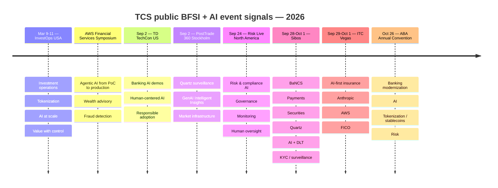
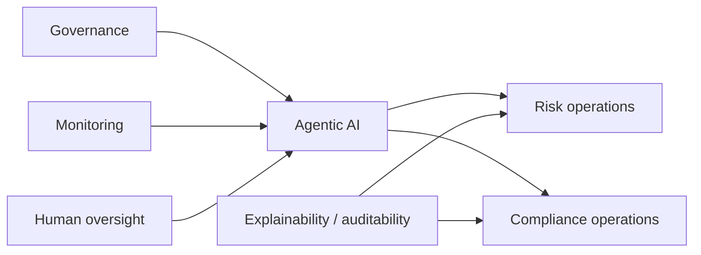
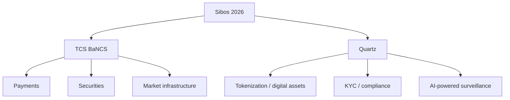
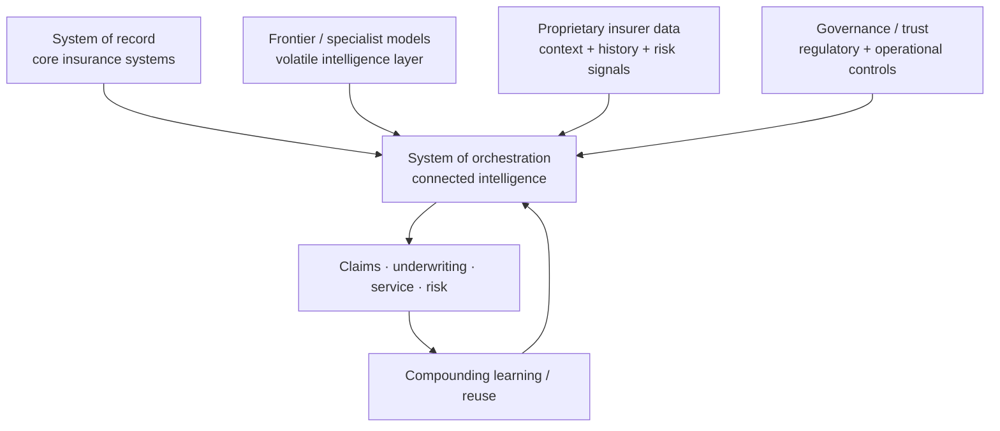
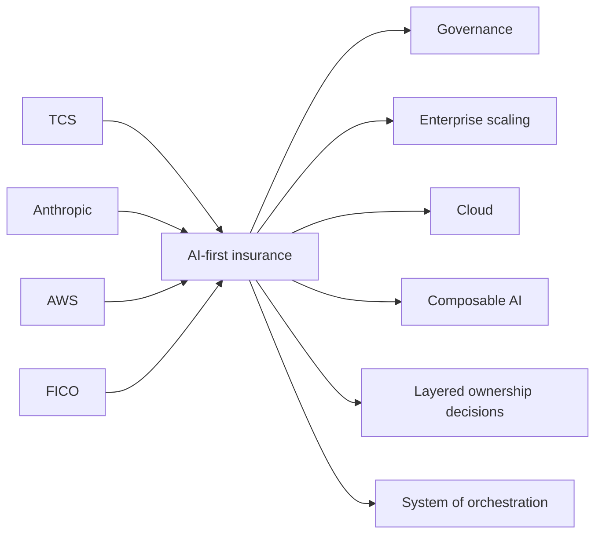

# TCS AI + BFSI — Public Event Watch

[[index|← Home]] · [[news/timeline]] · [[media/watchlist]] · [[people/public-voices]] · [[tcs/public-ai-initiative-index]]

> Public TCS events are high-signal because agenda wording, session titles, demos, partners and speakers show what TCS is currently choosing to discuss externally. **An event agenda is evidence of public positioning or planned discussion — not proof of a production deployment.**

## 2026 event map

---

## InvestOps USA 2026 — capital markets / investment operations

**Date:** March 9–11, 2026  
**Status:** `completed-public-event`  
**Evidence class:** `completed-public-event / official-post / thought-leadership`  
**Official page:** [TCS at InvestOps USA 2026](https://www.tcs.com/who-we-are/events/tcs-at-investops-usa-2026)  
**Official recap:** [TCS Financial Services and Insurance LinkedIn post](https://www.linkedin.com/posts/tcs-financial-services-and-insurance_investops2026-capitalmarkets-investmentoperations-activity-7447641291372306432-DZze)  
**Follow-up article:** [Redefining Investment Operations for the New Age](https://www.tcs.com/insights/blogs/redefining-investment-operations-for-the-new-age)

### Public session signal

TCS hosted a session titled **“The Next Frontier is Here — Powered by Tokenization, Smart Sourcing, and AI at Scale”**, with **Kabir Bhagat, Managing Partner – Global Consulting Practice, TCS** publicly listed as speaker.

The event page frames investment-operations redesign around:

- tokenized assets and near-real-time settlement
- AI-assisted decisioning
- data readiness
- controls and governance
- resilience
- workforce transformation
- sourcing-model redesign

A specific agenda item, **“Emergence of AI in Investment Operations — Value with Control,”** asks where AI is producing measurable impact and what governance models are emerging as firms adopt it responsibly.

### Post-event evidence

The official TCS Financial Services and Insurance recap says conversations at InvestOps reinforced the convergence of **AI at scale, data modernization, tokenization and smarter sourcing** as drivers of future-ready investment-operations models.

TCS' follow-up article sharpens the architecture language further: AI is described as moving beyond point solutions and task automation to become the **operating fabric of investment operations**, with intelligent systems supporting reconciliation, exception management, surveillance, corporate actions and regulatory reporting. The article explicitly describes a shift from **running processes** to **orchestrating outcomes**, with accountability moving toward data quality, model governance, explainability, embedded controls and measurable value delivery.

### Evidence boundary

This is strong public operating-model / thought-leadership evidence. It does **not** establish that a named asset manager has adopted the described target model or that every cited AI workflow is live at a TCS client.

Related: [[bfsi/capital-markets-ai]] · [[media/watchlist]] · [[bfsi/risk-compliance-ai]]

---

## AWS Financial Services Symposium 2026

**Status:** `completed-public-event`

**Official page:** [TCS at AWS Financial Services Symposium 2026](https://www.tcs.com/who-we-are/events/tcs-at-aws-financial-services-symposium-2026)

### Public signals

TCS says it engaged leaders across:
- banking
- capital markets
- payments
- insurance

The page says TCS introduced **two AWS-based solutions**:
1. wealth management advisory
2. fraud detection

### Public sessions

#### From POC to Production: Scaling Agentic AI in Financial Services

Public TCS page identifies a panel with **Anthropic and CardWorks** around moving agents from proof-of-concept to production.

#### Operationalizing AI at Scale in Financial Services

Public TCS page identifies:
- **Susheel Vasudevan**, President – BFSI Americas, TCS
- **Scott Mullins**, General Manager – AWS Worldwide Financial Services

Topic: what it takes to operationalize AI at scale in a highly regulated industry.

### Graph links

[[media/watchlist#aws-financial-services-symposium-2026]] · [[bfsi/use-case-atlas]] · [[tcs/ai-partnerships]] · [[people/public-voices#susheel-vasudevan]]

---

## TD TechCon US 2026 — banking AI demonstrations / human-centered adoption

**Date:** September 2, 2026  
**Status:** `completed-public-event`  
**Evidence class:** `public-demo / official-post / public-event positioning`  
**Official page:** [TCS at TD TechCon US 2026](https://www.tcs.com/who-we-are/events/tcs-at-td-techcon-us-2026)  
**Official TCS Financial Services post:** [TCS Financial Services and Insurance LinkedIn](https://www.linkedin.com/showcase/tcs-financial-services-and-insurance/)

### Publicly advertised signals

TCS describes TD TechCon US 2026 as a banking-technology event focused on emerging financial-services technology, digital transformation, AI and engineering. The TCS page says its booth would feature **AI-driven banking use cases, digital innovation showcases and interactive demonstrations**.

The same page frames the AI discussion around:

- enterprise AI adoption
- responsible innovation
- balancing automation with human ingenuity
- trust and responsible adoption
- human-centered transformation
- personalised banking experiences at scale
- combining strategy, data, AI, design and technology through TCS Interactive

### Public speaker / customer-event signal

TCS publicly identifies **Frank Diana, Managing Partner and Principal Futurist, TCS**, joining leaders from **TD Bank US** for a session titled **“The Human Advantage: Thriving in the age of AI.”** The session description focuses on how enterprises can create value with AI while keeping transformation human-centered.

An official TCS Financial Services and Insurance post independently reinforces the same public positioning: AI-powered experiences, digital innovation solutions, and a panel with TD Bank US technology leaders on the role of uniquely human capabilities in an AI-enabled future.

### Evidence boundary

This establishes a **named-bank event context plus public TCS banking-AI demonstrations**. It does **not** establish that TD Bank has deployed the demonstrated TCS banking use cases, nor does the public material identify the architectures, models, products, production status or business outcomes of those demonstrations.

The TD Bank relationship is therefore captured only as **event participation / public-demo context**, not `pilot`, `deployed`, or `public-case-study` evidence.

Related: [[bfsi/banking-ai]] · [[media/watchlist]] · [[people/public-voices]]

---

## PostTrade 360 Stockholm 2026 — Quartz surveillance / Intelligent Insights

**Date:** September 2, 2026  
**Status:** `completed-public-event`  
**Evidence class:** `completed-public-event / product-capability`  
**Official page:** [TCS at PostTrade 360 Stockholm 2026](https://www.tcs.com/who-we-are/events/tcs-at-posttrade-360-stockholm-2026)

### Publicly advertised signals

TCS positioned TCS BaNCS and Quartz for exchanges, CCPs, CSDs, custodians, investment institutions and other financial-market infrastructures. The page explicitly describes:

- **Quartz Surveillance** as an AI-powered capability for proactive market-abuse detection, participant-activity monitoring and regulatory-compliance support.
- **Quartz Intelligent Insights** as a GenAI-based capability for on-demand reporting using natural-language queries, sentiment analysis and structured-content generation from emails.
- Quartz more broadly as combining DLT and AI under a “trusted intelligence” framing across tokenization, digital currencies and data-driven intelligence.

### Securities-platform scale signal

The page states that the **TCS BaNCS Global Securities Platform** is deployed across **more than 60 local markets** and covers **over 100 global securities markets**, with real-time 24x5 processing and multi-currency / multi-entity / multi-market support.

### Evidence boundary

These are public event/product claims. The event page also lists named BaNCS customer successes, but it does **not** state that those customers use Quartz Surveillance or Intelligent Insights. The 60+/100+ figures describe the broader securities platform, not AI deployment counts.

Related: [[bfsi/capital-markets-ai]] · [[bfsi/risk-compliance-ai]] · [[tcs/tcs-bfsi-ai-offerings]]

---

## Risk Live North America 2026

**Date:** September 24, 2026  
**Status:** `planned`  
**Official page:** [TCS at Risk Live North America 2026](https://www.tcs.com/who-we-are/events/tcs-at-risk-live-north-america-2026)

### Publicly advertised focus

TCS frames the event under **“Building the Risk Intelligence Enterprise.”** The public page says TCS will host an invite-only roundtable titled **“From Experimentation to Trust: Scaling AI & Agentic Intelligence Across Risk and Compliance”** and participate in a keynote panel on **AI Governance and Risk Management: Balancing Innovation and Control**.

The agenda explicitly includes:

- where AI is creating the greatest value across risk and compliance
- responsible scaling of AI and agentic capabilities
- governance and monitoring frameworks
- AI adoption success factors and business-impact metrics
- robust, transparent and auditable AI models
- model risk, bias and unintended consequences
- alignment with regulatory expectations and internal risk appetite
- human judgment and oversight for accountability and trust

### Public speaker signal

TCS publicly identifies **Vijayaraghavan Venkatraman** as **Global Head - BFSI Risk Management & Regulatory Compliance, TCS** for the event.

This is especially useful when joined with TCS' 2021 Smart Risk Enterprise paper, which identifies the same public leader and describes his work across risk transformation, data-science-led innovation, RegTech compliance, solution/framework design and risk/compliance innovation.

Deep continuity study: [[research/smart-risk-enterprise-to-agentic-risk-intelligence]] · [[people/public-voices#vijayaraghavan-venkatraman]]

### Domain connections

Related: [[bfsi/risk-compliance-ai]] · [[regulations/india-ai-bfsi]]

---

## Sibos 2026 — TCS BaNCS + Quartz

**Date:** September 28 – October 1, 2026  
**Status:** `planned`  
**Official page:** [TCS BaNCS and Quartz at Sibos 2026, Miami](https://www.tcs.com/who-we-are/events/tcs-bancs-quartz-sibos-2026-miami)

### Publicly advertised TCS topics

- payments
- securities
- market infrastructure
- ISO 20022
- digital assets
- tokenization
- digital currencies
- compliance / KYC
- AI-powered surveillance
- Quartz AI + DLT

### Public scale signal

The event page publicly describes BaNCS as having:
- **500+ installations**
- **80+ clearing systems**

Treat these as TCS-published figures tied to the event page/date.

### Product relationship

Related: [[bfsi/capital-markets-ai]] · [[atlas/architecture-atlas#9-quartz--coexistence-of-traditional-systems-dlt-and-ai]]

---

## ITC Vegas 2026

**Date:** September 29 – October 1, 2026  
**Status:** `planned`  
**Evidence class:** `planned / public-event positioning`  
**Official page:** [TCS at ITC Vegas 2026](https://www.tcs.com/who-we-are/events/tcs-at-itc-vegas-2026)

### Public ecosystem signal

TCS' agenda brings together **TCS + Anthropic + AWS + FICO** around the theme **“Building AI That Compounds: The Blueprint for the AI-First Insurer.”**

The page describes a modular/composable AI model intended to become more valuable as decisions and capabilities accumulate. This is an event-positioning signal, not evidence of a named production architecture.

### High-density agenda signals

The published kickoff-summit agenda is unusually specific:

1. **Building the Composable AI Insurer** — TCS says the buy-vs-build decision is becoming layered. The agenda characterizes the **system of record as increasingly commoditized**, AI intelligence as fast-changing, and the **system of orchestration** as the layer insurers should own to create durable “connected intelligence.”
2. **The AI ownership playbook** — focuses on deciding which layers and proprietary intelligence an insurer should own versus source from the ecosystem.
3. **Scaling AI that compounds** — explicitly distinguishes working pilots from enterprise AI where each investment improves the value of subsequent investments.
4. **Architecting for Intelligence** — focuses on integrating frontier models into enterprise environments while addressing operational and regulatory risk.
5. **Scaling trustworthy AI: a cloud-first approach for insurers** — links cloud modernization to claims and underwriting AI, with governance and trust as production requirements.
6. **The quantum horizon** — frames quantum as a next-wave insurance capability rather than a current AI deployment.

### Editorial study abstraction

**Diagram status:** editorial reconstruction of the public ITC Vegas 2026 agenda language; it is **not** an internal TCS architecture diagram.

### Why this matters

This event adds a sharper public strategic distinction to the repo: TCS is not merely advocating “use AI in insurance.” It is publicly discussing **which architectural layer should become the insurer's durable control point**. That complements existing TCS public material on CAP, AI WisdomNext, Context Fabric and insurance claims orchestration, but the event alone does not prove that this ownership model is implemented for a customer.

### Ecosystem map

**Evidence boundary:** the partner/event combination demonstrates public go-to-market dialogue; it does not by itself prove those vendors are all used together in a named customer architecture.

Related: [[bfsi/insurance-ai]] · [[tcs/ai-partnerships]] · [[intelligence/public-operating-model-inference]]

---

## ABA Annual Convention 2026

**Date:** October 26, 2026  
**Status:** `planned`  
**Official page:** [TCS BaNCS at ABA Annual Convention 2026](https://www.tcs.com/who-we-are/events/tcs-bancs-at-aba-annual-convention-2026)

### Publicly advertised themes

- AI
- core modernization
- tokenization / stablecoins
- risk
- banking transformation

Related: [[bfsi/banking-ai]] · [[tcs/tcs-bfsi-ai-offerings]] · [[bfsi/capital-markets-ai]]

---

## Historical public event signal — BFSI AI Symposium, Singapore

**Dates stated in TCS APAC post:** September 7–17, 2025  
**Status:** `completed-public-event`  
**Source:** [TCS Asia Pacific LinkedIn post](https://www.linkedin.com/posts/tata-consultancy-services-asia-pacific_tcs-tcssg-bfsi-activity-7373938613199400960-FsZZ)

### TCS-published details

- hosted at TCS' Singapore Innovation Lab
- **80+ senior executives** from leading financial institutions
- TCS experts plus technology partners
- responsible AI
- IT organization setup for AI adoption
- AI for operational efficiency across business and technology operations

This is a useful historical signal because it shows TCS was already publicly organizing BFSI executive discussions around responsible/scaled AI adoption before the 2026 agentic-AI event cycle.

---

## Event evidence rules

1. Record exact date and status.
2. Capture session titles, named partners, named speakers and demos only when public.
3. Link recordings when the TCS page exposes a public “Watch” asset.
4. After an event, re-check the page for added videos, slides, recap text, customer statements or product announcements.
5. Never transform “TCS discussed X at event Y” into “TCS deployed X” without separate deployment evidence.
6. Move durable product/architecture facts into the relevant [[tcs/public-ai-initiative-index]], [[atlas/architecture-atlas]], or BFSI domain note.
