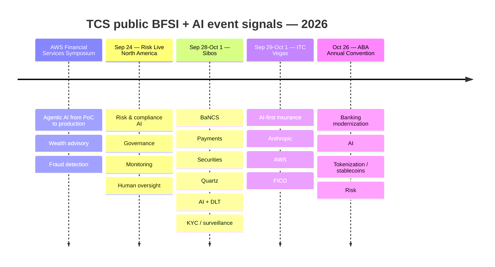
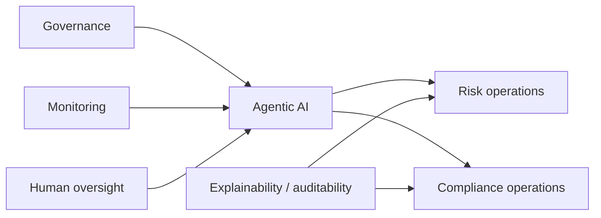
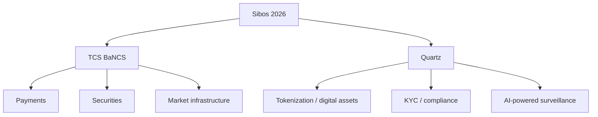
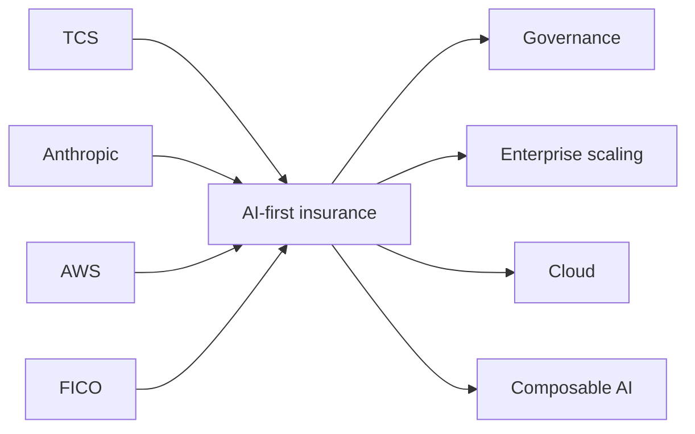

# TCS AI + BFSI — Public Event Watch

[[index|← Home]] · [[news/timeline]] · [[media/watchlist]] · [[people/public-voices]] · [[tcs/public-ai-initiative-index]]

> Public TCS events are high-signal because agenda wording, session titles, demos, partners and speakers show what TCS is currently choosing to discuss externally. **An event agenda is evidence of public positioning or planned discussion — not proof of a production deployment.**

## 2026 event map

---

## AWS Financial Services Symposium 2026

**Status:** `completed-public-event`

**Official page:** [TCS at AWS Financial Services Symposium 2026](https://www.tcs.com/who-we-are/events/tcs-at-aws-financial-services-symposium-2026)

### Public signals

TCS says it engaged leaders across:
- banking
- capital markets
- payments
- insurance

The page says TCS introduced **two AWS-based solutions**:
1. wealth management advisory
2. fraud detection

### Public sessions

#### From POC to Production: Scaling Agentic AI in Financial Services

Public TCS page identifies a panel with **Anthropic and CardWorks** around moving agents from proof-of-concept to production.

#### Operationalizing AI at Scale in Financial Services

Public TCS page identifies:
- **Susheel Vasudevan**, President – BFSI Americas, TCS
- **Scott Mullins**, General Manager – AWS Worldwide Financial Services

Topic: what it takes to operationalize AI at scale in a highly regulated industry.

### Graph links

[[media/watchlist#aws-financial-services-symposium-2026]] · [[bfsi/use-case-atlas]] · [[tcs/ai-partnerships]] · [[people/public-voices#susheel-vasudevan]]

---

## Risk Live North America 2026

**Date:** September 24, 2026  
**Status:** `planned`  
**Official page:** [TCS at Risk Live North America 2026](https://www.tcs.com/who-we-are/events/tcs-at-risk-live-north-america-2026)

### Publicly advertised focus

The TCS event page positions risk/compliance around themes including:

- agentic AI in risk and compliance
- responsible AI / governance
- model monitoring
- auditability
- bias mitigation
- regulatory expectations
- human oversight

### Domain connections

Related: [[bfsi/risk-compliance-ai]] · [[regulations/india-ai-bfsi]]

---

## Sibos 2026 — TCS BaNCS + Quartz

**Date:** September 28 – October 1, 2026  
**Status:** `planned`  
**Official page:** [TCS BaNCS and Quartz at Sibos 2026, Miami](https://www.tcs.com/who-we-are/events/tcs-bancs-quartz-sibos-2026-miami)

### Publicly advertised TCS topics

- payments
- securities
- market infrastructure
- ISO 20022
- digital assets
- tokenization
- digital currencies
- compliance / KYC
- AI-powered surveillance
- Quartz AI + DLT

### Public scale signal

The event page publicly describes BaNCS as having:
- **500+ installations**
- **80+ clearing systems**

Treat these as TCS-published figures tied to the event page/date.

### Product relationship

Related: [[bfsi/capital-markets-ai]] · [[atlas/architecture-atlas#9-quartz--coexistence-of-traditional-systems-dlt-and-ai]]

---

## ITC Vegas 2026

**Date:** September 29 – October 1, 2026  
**Status:** `planned`  
**Official page:** [TCS at ITC Vegas 2026](https://www.tcs.com/who-we-are/events/tcs-at-itc-vegas-2026)

### Public ecosystem signal

TCS' agenda brings together **TCS + Anthropic + AWS + FICO** around AI-first insurance.

Public topics include:
- composable AI
- enterprise AI scaling
- governance
- cloud-first insurance
- ownership / operating-model decisions
- quantum readiness

### Ecosystem map

**Evidence boundary:** the partner/event combination demonstrates public go-to-market dialogue; it does not by itself prove those vendors are all used together in a named customer architecture.

Related: [[bfsi/insurance-ai]] · [[tcs/ai-partnerships]]

---

## ABA Annual Convention 2026

**Date:** October 26, 2026  
**Status:** `planned`  
**Official page:** [TCS BaNCS at ABA Annual Convention 2026](https://www.tcs.com/who-we-are/events/tcs-bancs-at-aba-annual-convention-2026)

### Publicly advertised themes

- AI
- core modernization
- tokenization / stablecoins
- risk
- banking transformation

Related: [[bfsi/banking-ai]] · [[tcs/tcs-bfsi-ai-offerings]] · [[bfsi/capital-markets-ai]]

---

## Historical public event signal — BFSI AI Symposium, Singapore

**Dates stated in TCS APAC post:** September 7–17, 2025  
**Status:** `completed-public-event`  
**Source:** [TCS Asia Pacific LinkedIn post](https://www.linkedin.com/posts/tata-consultancy-services-asia-pacific_tcs-tcssg-bfsi-activity-7373938613199400960-FsZZ)

### TCS-published details

- hosted at TCS' Singapore Innovation Lab
- **80+ senior executives** from leading financial institutions
- TCS experts plus technology partners
- responsible AI
- IT organization setup for AI adoption
- AI for operational efficiency across business and technology operations

This is a useful historical signal because it shows TCS was already publicly organizing BFSI executive discussions around responsible/scaled AI adoption before the 2026 agentic-AI event cycle.

---

## Event evidence rules

1. Record exact date and status.
2. Capture session titles, named partners, named speakers and demos only when public.
3. Link recordings when the TCS page exposes a public “Watch” asset.
4. After an event, re-check the page for added videos, slides, recap text, customer statements or product announcements.
5. Never transform “TCS discussed X at event Y” into “TCS deployed X” without separate deployment evidence.
6. Move durable product/architecture facts into the relevant [[tcs/public-ai-initiative-index]], [[atlas/architecture-atlas]], or BFSI domain note.
