# TCS AI + BFSI — Public Intelligence Graph

> A deeply curated, source-backed Foam knowledge graph of **publicly documented TCS artificial intelligence activity**, with a concentrated view of banking, financial services, insurance, capital markets, risk, compliance, platforms, architecture, partnerships, customer evidence, public voices, videos, visuals and events.

  

## Command center

| Surface | Open this when you want to know… |
|---|---|
| [[dashboards/tcs-bfsi-ai-radar|📡 Current radar]] | What the highest-signal public TCS BFSI AI facts are right now |
| [[news/timeline|🕒 Public timeline]] | What happened, in chronological order |
| [[tcs/public-ai-initiative-index|🧭 Master initiative index]] | What TCS has publicly announced, launched, deployed, partnered on or planned |
| [[atlas/architecture-atlas|🏗 Architecture atlas]] | How TCS publicly describes AI/BFSI architecture and how the pieces connect |
| [[bfsi/use-case-atlas|🧩 BFSI use-case atlas]] | Which public TCS capabilities/examples map to banking, insurance, risk and markets |
| [[media/watchlist|▶ Curated watchlist]] | Which official videos, event watch pages, journals and public posts are worth opening |
| [[media/visual-reference-library|🖼 Visual reference library]] | Where the official public diagrams, figures and infographics are |
| [[tcs/public-language-glossary|📖 Public vocabulary glossary]] | What TCS-specific AI/BFSI words and product terms mean in public material |
| [[events/public-event-watch|📅 Public event watch]] | What TCS is discussing/demonstrating at current BFSI/AI events |
| [[people/public-voices|🎙 Public authors & speakers]] | Which publicly named TCS voices are attached to which AI/BFSI themes |
| [[bfsi/public-implementations|🧾 Customer evidence]] | What public case studies and implementation evidence actually exist |
| [[regulations/india-ai-bfsi|⚖ India regulatory watch]] | What RBI/SEBI/IRDAI public material matters to AI in financial services |

---

## Knowledge graph map

```mermaid
flowchart TB
  HOME((TCS AI + BFSI\nPublic Intelligence))

  HOME --> NOW[Current intelligence]
  NOW --> RADAR[Current radar]
  NOW --> TIME[Timeline]
  NOW --> EVENTS[Event watch]

  HOME --> TCS[TCS system]
  TCS --> INIT[Initiatives]
  TCS --> STRAT[AI strategy]
  TCS --> OFFER[BFSI products]
  TCS --> PART[Partnerships]
  TCS --> GLOSS[Public vocabulary]

  HOME --> BFSI[BFSI domains]
  BFSI --> BANK[Banking]
  BFSI --> INS[Insurance]
  BFSI --> CM[Capital markets]
  BFSI --> RC[Risk & compliance]
  BFSI --> UC[Use-case atlas]
  BFSI --> CASES[Public implementations]

  HOME --> TECH[Technical understanding]
  TECH --> ARCH[Architecture atlas]
  TECH --> AGENT[Agentic/context architecture]
  TECH --> VIS[Official visual references]

  HOME --> MEDIA[Public media]
  MEDIA --> WATCH[Videos / watchlist]
  MEDIA --> VOICES[Authors / speakers]
  MEDIA --> POSTS[Official posts / events]

  HOME --> REG[Regulation]
  REG --> INDIA[India AI + BFSI]

  HOME --> VERIFY[Verification]
  VERIFY --> SRC[Source catalog]
  VERIFY --> RULES[Source radar / evidence rules]
```

---

# TCS AI system

- [[tcs/public-ai-initiative-index]] — master public inventory
- [[tcs/tcs-ai-strategy]] — TCS AI direction, scale, investments and infrastructure
- [[tcs/tcs-bfsi-ai-offerings]] — AI Spectrum, Cognitive Automation Platform, BaNCS/Quartz and other BFSI offerings
- [[tcs/ai-partnerships]] — Anthropic, Mistral, Google Cloud, AWS, NVIDIA, Microsoft, OpenAI, AMD and others, with BFSI relevance separated from general partnerships
- [[tcs/public-language-glossary]] — product names, architecture vocabulary and recurring public TCS terminology

# BFSI domain graph

- [[bfsi/domain-map]] — banking/insurance/capital-markets map
- [[bfsi/banking-ai]]
- [[bfsi/insurance-ai]]
- [[bfsi/capital-markets-ai]]
- [[bfsi/risk-compliance-ai]]
- [[bfsi/use-case-atlas]] — cross-domain use-case matrix
- [[bfsi/public-implementations]] — implementation/case evidence and public outcomes

# Architecture and visual understanding

- [[atlas/architecture-atlas]] — Mermaid reconstructions of public TCS architecture concepts
- [[ai/agentic-ai-bfsi-architecture]] — detailed public agentic/context/governance signals
- [[media/visual-reference-library]] — direct locators for official TCS figures and visual assets

# Consume the source material

- [[media/watchlist]] — official TCSGlobal YouTube videos, TCS event watch pages, LinkedIn posts, journals and research
- [[events/public-event-watch]] — public agenda, speakers, partners and status
- [[people/public-voices]] — publicly named authors, speakers and executive champions by topic

# Regulation and risk

- [[regulations/india-ai-bfsi]]
- [[bfsi/risk-compliance-ai]]

# Verification layer

- [[sources/source-catalog]] — primary/public source catalog
- [[sources/source-radar]] — collection and verification rules
- [[templates/intelligence-note]] — fact-note schema

---

## Evidence-status vocabulary

Every substantive item should make its evidence level visible.

| Status | Interpretation |
|---|---|
| `live` / `deployed` | Public source explicitly establishes active/production use |
| `pilot` | Public source establishes pilot/PoC status |
| `announced` | TCS/partner/customer has announced the initiative |
| `planned` | Future event/program/activity |
| `public-case-study` | TCS/customer has published implementation evidence |
| `product-capability` | Product page states the capability; no deployment inferred |
| `thought-leadership` | Architecture, journal, white paper or viewpoint |
| `analyst-recognition` | Analyst assessment published/quoted by TCS |
| `regulatory` | Regulator/standards material |

## Foam usage

In VS Code:

1. Open this page and use **Foam: Show Graph**.
2. `Ctrl/Cmd + click` a `[[wikilink]]` to traverse the graph.
3. Use backlinks to see every place a product, use case, source or public voice is connected.
4. Search tags such as `#agentic-ai`, `#banking`, `#insurance`, `#risk`, `#architecture`, `#public-intelligence`.
5. Use [[templates/intelligence-note]] when adding a new public fact so date, status, provenance and confidence remain explicit.

## Public boundary

This knowledge base deliberately contains **public research only**. It excludes internal TCS material, private client/project information, personal employment metadata, confidential architecture, inferred client identities, credentials, rumors and unsupported claims. Mermaid diagrams in the atlas are study reconstructions from cited public sources and are not represented as proprietary TCS diagrams.
