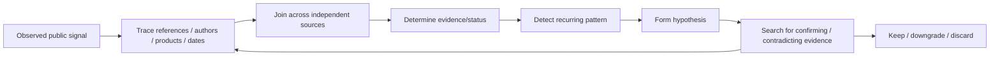
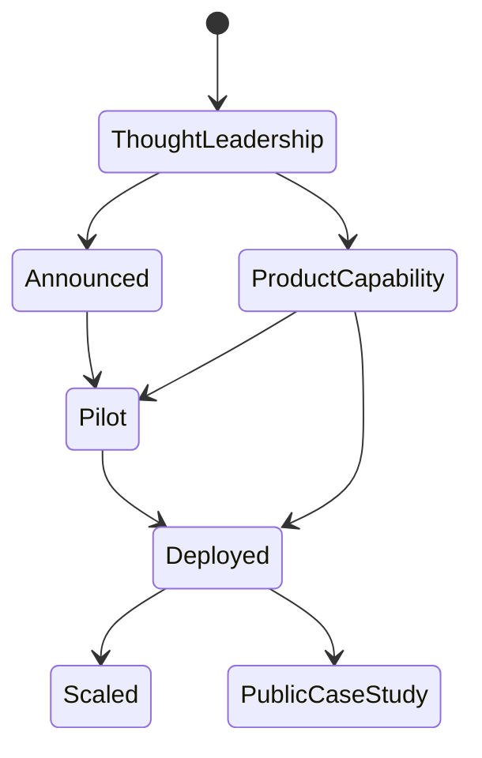
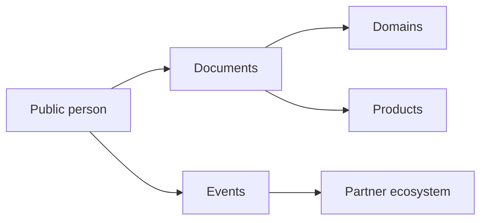
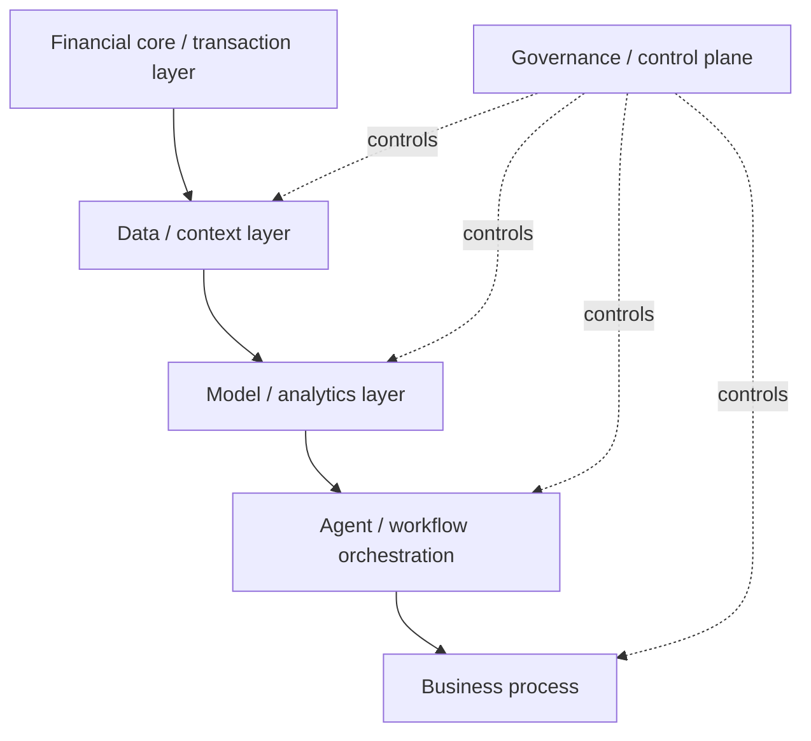
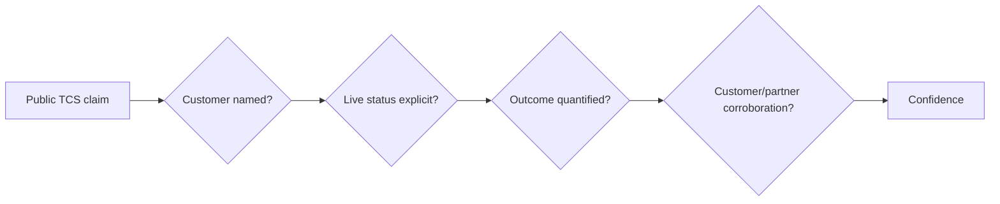
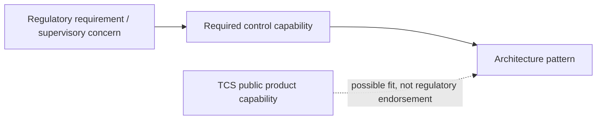

# Public Intelligence Debugging Playbook — TCS BFSI AI

[[index|← Home]] · [[intelligence/public-operating-model-inference]] · [[sources/source-radar]] · [[news/timeline]] · [[people/public-capability-network]]

> This page defines how the knowledge graph should extract deeper public context without drifting into rumor or fictional internal knowledge.

## Core model

Treat the public information space like a complex system under debugging.



The goal is not to guess hidden facts. The goal is to discover **publicly reconstructable structure** that is easy to miss when sources are consumed one at a time.

---

# Debugging lenses

## 1. Status-transition debugging

Track how a concept moves through public evidence states.



### Questions for the graph

- Was a concept first discussed in a white paper, then productized?
- Did an announced capability later show up in a customer case study?
- Did a pilot graduate to a named live implementation?
- Did TCS stop mentioning a product or rename/reframe it?

### High-value examples to track

- Context Fabric
- AI Compass
- ABOS
- Cognitive Automation Platform
- Gemini Experience Centers
- AI Spectrum for BFSI
- Quartz AI capabilities

---

## 2. Vocabulary debugging

Repeated vocabulary often signals durable architecture or strategy.

Track:
- agentic mesh
- context fabric
- knowledge fabric
- explainable / traceable AI
- polyglot architecture
- AI-ready data
- human-in-the-loop
- composite AI
- reusable agents
- co-creation
- productionization
- observability
- governance

When a term appears across several independent TCS surfaces — product page, event, white paper, customer case, partner announcement — promote it from “isolated phrase” to “strategic vocabulary.”

Related: [[tcs/public-language-glossary]]

---

## 3. Person-topic debugging

Do not ask “who reports to whom?” unless TCS publishes it.

Instead ask:
- Which authors repeatedly co-author AI/data papers?
- Which executives repeatedly appear in BFSI AI events?
- Which product leaders publish architecture visions?
- Which public experts recur around risk, quant, data, banking, insurance or capital markets?
- Which people bridge multiple topic clusters?



Promote only **professional, public topic relationships**. Never infer private relationships, influence, politics or reporting lines.

Related: [[people/public-capability-network]]

---

## 4. Product-stack debugging

For every public product/capability ask:

1. What layer does it occupy?
2. What does it integrate with?
3. Which use cases are explicitly named?
4. Which partners recur?
5. What governance/control mechanisms are named?
6. Is it TCS-owned IP, partner technology, thought leadership, or implementation service?
7. Does public customer evidence exist?



Related: [[atlas/architecture-atlas]]

---

## 5. Partner-stack debugging

Map each partner by public role rather than treating all partnerships equally.

| Public partner | Typical public role to test |
|---|---|
| Google Cloud / Gemini | cloud, models, industry experience centers, agents |
| AWS | cloud, financial-services solutions, production AI |
| NVIDIA | GPU/AI stack, composite AI, model/data/inference components |
| Anthropic | model/agent ecosystem, regulated-industry AI |
| Mistral | model ecosystem / enterprise AI |
| Microsoft | cloud/AI enterprise stack |
| FICO | decisioning/risk ecosystem in public insurance event context |

Search for independent partner confirmation before upgrading a partnership from “announcement” to “co-developed/deployed capability.”

---

## 6. Customer-evidence debugging

For every case:



Record:
- customer name if public
- anonymous descriptor if not
- implementation status
- exact metric wording
- TCS attribution
- independent corroboration if found

Never reverse-engineer anonymous customer identity from clues.

---

## 7. Event-to-strategy debugging

Events are leading indicators.

Track:
- session titles
- partners sharing the stage
- named speakers
- demos
- repeated industry themes
- post-event recordings
- later product/news announcements

Use event evidence to form **watch hypotheses**, not deployment claims.

Related: [[events/public-event-watch]]

---

## 8. Architecture-diff debugging

When TCS publishes a new architecture diagram or white paper:

1. Compare layers against older public architecture.
2. Identify new vocabulary.
3. Identify removed/de-emphasized concepts.
4. Map new vendor/product dependencies.
5. Check whether governance moved earlier/deeper into the stack.
6. Check whether human control boundaries changed.
7. Update Mermaid reconstruction with source/date.

Store official visual locators in [[media/visual-reference-library]].

---

## 9. Regulation-to-product debugging

Connect regulator signals to product/architecture only when the relationship is explicit or carefully inferred.

Example structure:



A regulator mentioning model governance does **not** mean the regulator endorses TCS CAP/AI Compass. Keep regulator facts and product mapping separate.

---

# Contradiction handling

When two public sources conflict:

1. Prefer newer primary source for current status.
2. Preserve older source in chronology.
3. Record title/status drift explicitly.
4. Do not silently overwrite historical facts.
5. Add `superseded-by` or `title-at-source-date` wording where helpful.

---

# High-value missing-information queue

The graph should continuously search for public evidence that answers these structural questions:

- Which announced agentic-AI concepts later become named production customer stories?
- Which BaNCS AI Compass use cases get independent customer validation?
- Which Gemini Experience Center prototypes become repeatable assets?
- How frequently do CAP, WisdomNext, AI Spectrum, BaNCS and Quartz appear together versus independently?
- Which public BFSI leaders/authors recur across AI strategy, risk, data, product and partner events?
- Which public assets move from generic GenAI to agentic orchestration?
- What is TCS publishing about evaluation, agent observability, identity/authorization, model risk and cost economics?
- What newer public material updates the historical ~15K BFSI Analytics & Insights capability snapshot?
- Which TCS public events publish recordings/slides after completion?
- Which RBI/SEBI/IRDAI AI signals create architecture-control implications for banking/insurance/capital-markets systems?

This queue should guide future research without inventing answers.

---

# Promotion criteria for an inference

A new inference should normally require at least **three independent public evidence points**, ideally spanning more than one source family.

```text
Candidate inference
├── TCS product / architecture source
├── TCS event / author / strategy source
└── customer / partner / regulator / analyst corroboration
```

### Confidence rubric

| Confidence | Minimum standard |
|---|---|
| `low` | plausible pattern; 1–2 evidence points; alternatives unresolved |
| `medium` | 2–3 aligned public sources |
| `high` | 3+ aligned sources across multiple source types |
| `very-high` | repeated current evidence + product/strategy/customer or event convergence |

---

## Output rules

- verified fact → factual ledger/timeline/domain note
- public architecture → architecture atlas
- official visual → visual library
- video/post/event → media/event note
- repeated term → glossary
- recurring expert-topic relationship → capability network
- cross-source deduction → inference layer
- unresolved contradiction → keep as an open evidence gap, not a guess

## Related

[[sources/source-radar]] · [[intelligence/public-operating-model-inference]] · [[tcs/public-ai-initiative-index]] · [[people/public-capability-network]] · [[research/bfsi-ai-reading-room]]
