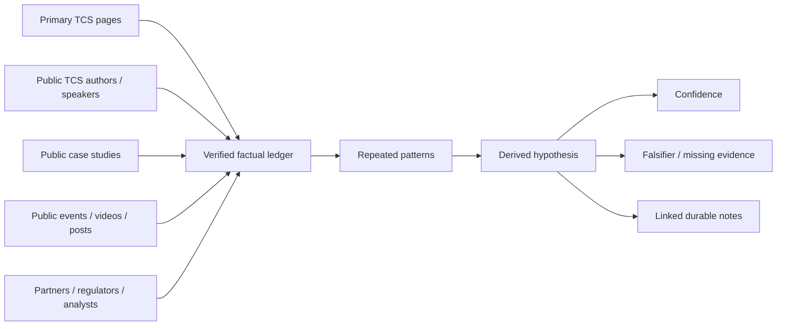
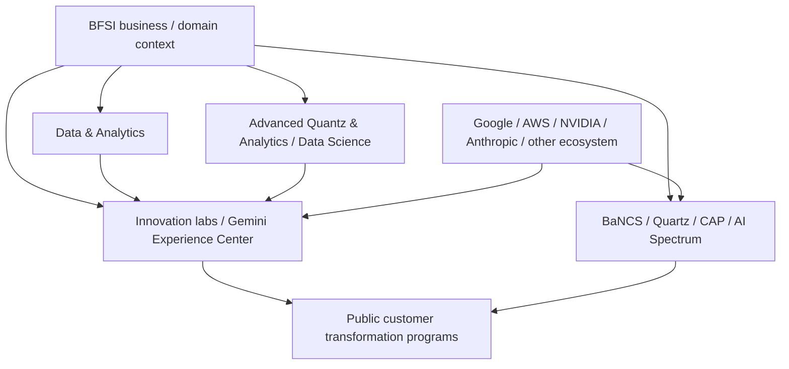
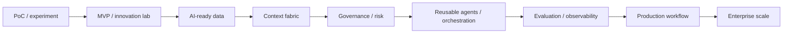
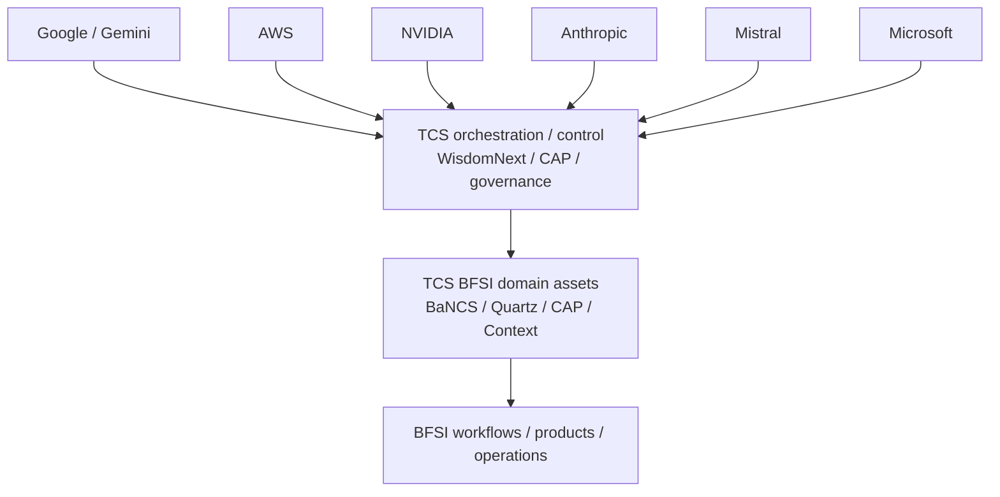
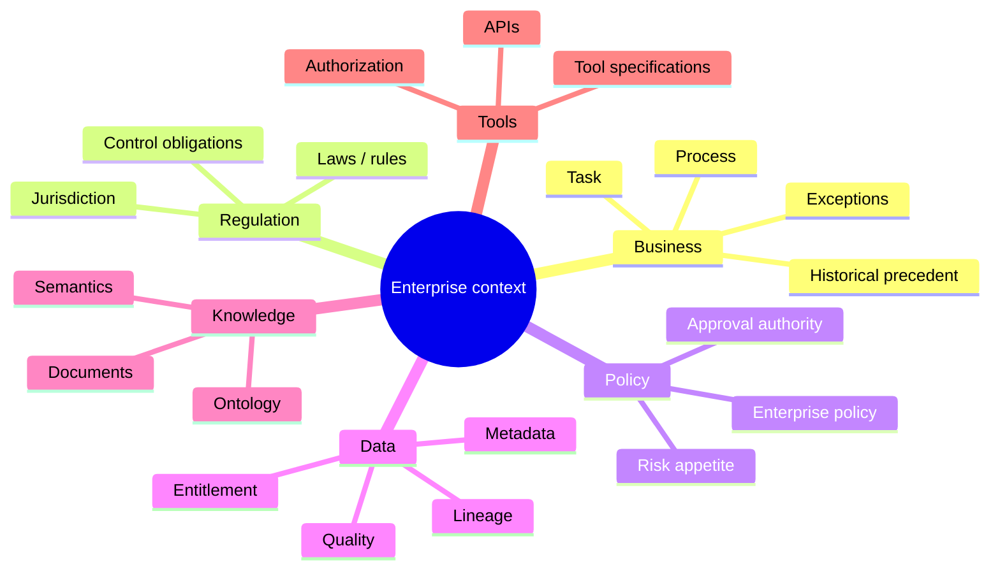
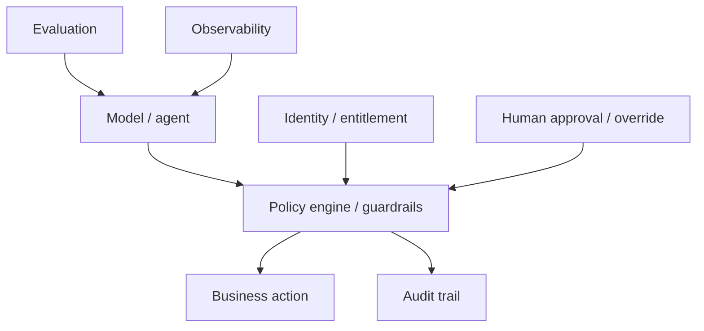
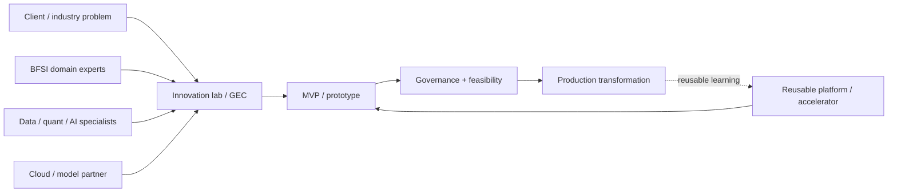
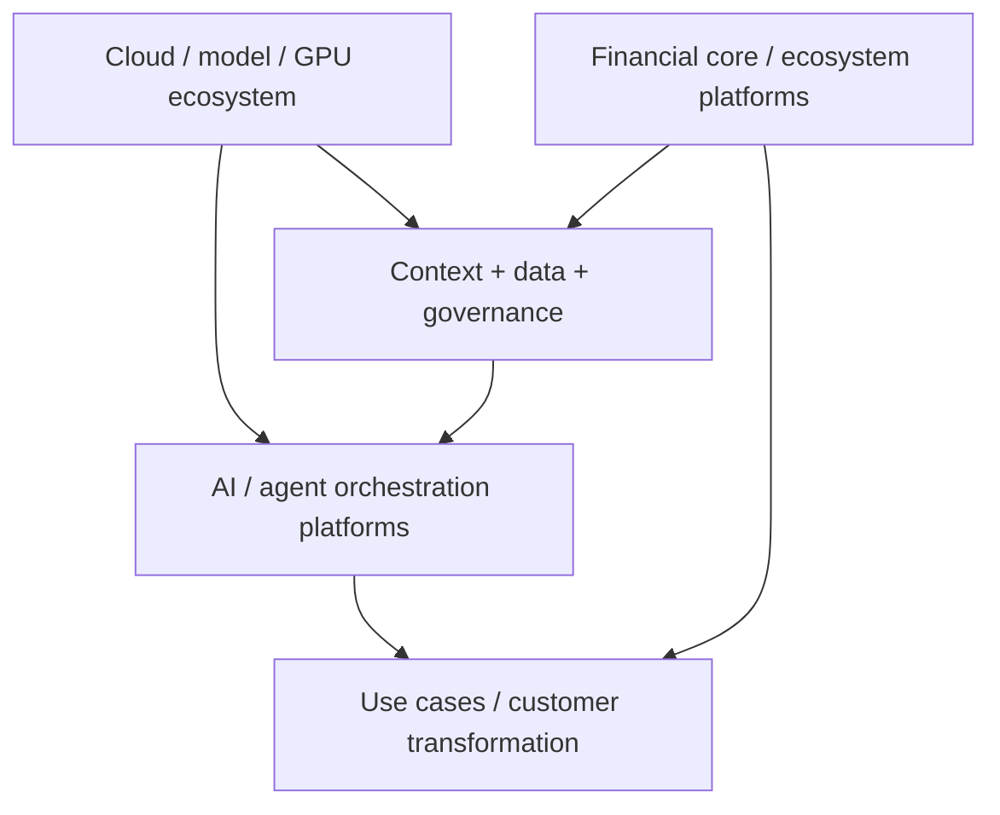
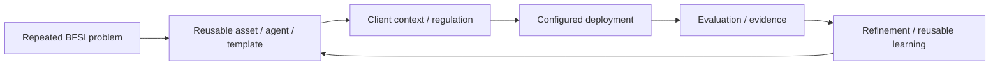
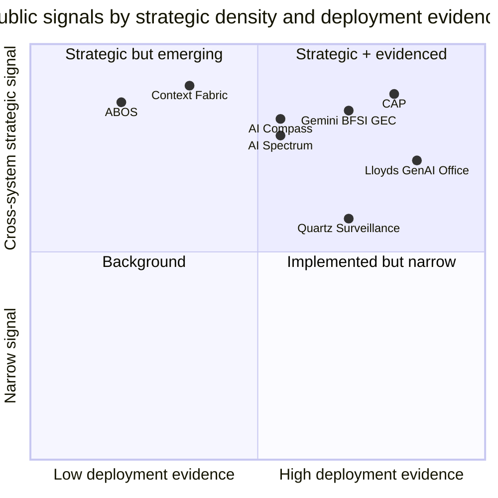

# Public-Evidence Inference Layer — TCS BFSI AI Operating Model

[[index|← Home]] · [[tcs/public-ai-initiative-index]] · [[atlas/architecture-atlas]] · [[people/public-voices]] · [[bfsi/use-case-atlas]] · [[sources/source-radar]]

> **Purpose:** extract higher-order structure from multiple independent public TCS sources without presenting inference as internal fact. Every inference below has an evidence chain, confidence level and falsifier.

## Method



**Rule:** facts can be promoted directly. Inferences remain explicitly labelled as inferences until stronger public evidence appears.

---

# Inference 1 — TCS BFSI AI is publicly structured as a domain-specific AI system, not a generic horizontal AI practice

**Confidence:** `high`

### Evidence chain

1. TCS publicly identifies a **Data & Analytics group inside its BFSI business unit**. Prab Pitchandi is named as Vice President & Global Head; Prasad Chitta is named as Chief Architect leading AI and analytics strategy for BFSI.  
   Source: https://www.tcs.com/what-we-do/industries/banking/white-paper/context-fabric-backbone-agentic-ai-bfsi
2. TCS publicly identifies an **Advanced Quantz & Analytics / Data Science** capability in BFSI, led by Jatinder Singh Sidhu.  
   Source: https://www.tcs.com/what-we-do/industries/banking/white-paper/driving-ai-investment-roi-bfsi-industry
3. TCS has a **BFSI Innovation Lab in Bengaluru** housing a Google Cloud Gemini Experience Center specifically for financial-services AI co-creation.  
   Source: https://www.tcs.com/who-we-are/newsroom/news-alert/tcs-partners-with-google-cloud-accelerate-ai-driven-fnnovation-financial-services-industry
4. TCS publicly describes a **CDO AI ML Lab in London** as an ecosystem for co-creating data-science solutions for global financial-services organizations.  
   Source: https://www.tcs.com/content/tcs/global/en/what-we-do/industries/banking/white-paper/data-mesh-implementation-bfsi
5. TCS operates BFSI-specific products/platforms including **TCS BaNCS, Quartz, AI Spectrum for BFSI and CAP**.

### Derived hypothesis

The public footprint is consistent with a **verticalized BFSI AI model** in which domain/data/quant capability, industry labs and BFSI platforms are first-class components rather than simple consumers of a central generic AI team.



### Falsifier / missing evidence

A public TCS source establishing that all BFSI AI work is centrally controlled by a single horizontal AI organization with BFSI groups acting only as consumers would weaken this inference. No such public evidence is currently captured.

---

# Inference 2 — The dominant 2025–2026 strategic transition is “AI pilots → governed enterprise production”

**Confidence:** `very high`

### Evidence chain

- TCS published **“The End of AI Pilots: A Shift to Enterprise AI in BFSI.”**  
  Source: https://www.tcs.com/what-we-do/industries/banking/white-paper/end-of-ai-pilots-shift-to-enterprise-ai-bfsi
- AWS Financial Services Symposium 2026 session: **“From POC to Production: Scaling Agentic AI in Financial Services.”**  
  Source: https://www.tcs.com/who-we-are/events/tcs-at-aws-financial-services-symposium-2026
- CAP public page states **60+ wins and 30+ live implementations** and emphasizes governance, observability, reusable agents and enterprise integration.  
  Source: https://www.tcs.com/what-we-do/industries/insurance/solution/cognitive-automation-platform-transform-banking
- TCS GenAI for BFSI and Context Fabric repeatedly emphasize enterprise guardrails, human oversight, context, data readiness and regulated execution.

### Derived hypothesis

The public differentiation TCS is pushing is no longer “can we build an LLM PoC?” but **can we industrialize AI safely across enterprise BFSI workflows?**



### Falsifier

If future public TCS material de-emphasizes production, governance, reusable agents and scale in favor of isolated model experimentation, this inference should be downgraded.

---

# Inference 3 — TCS' public BFSI AI architecture is intentionally polyglot and ecosystem-oriented

**Confidence:** `high`

### Evidence chain

- TCS GenAI for BFSI explicitly uses **polyglot architecture** language.  
  Source: https://www.tcs.com/what-we-do/industries/banking/genai-insurance-banking-financial-services
- TCS AI WisdomNext publicly positions itself as orchestration across multiple models, agents, data sources and platforms.  
  Source: https://www.tcs.com/what-we-do/services/artificial-intelligence/solution/enterprise-generative-ai-adoption-wisdomnext
- BFSI/public partnerships span **Google Cloud/Gemini, AWS, NVIDIA, Anthropic, Mistral and Microsoft**.
- AI Spectrum for BFSI uses NVIDIA components while Gemini Experience Centers use Google Cloud/Gemini; AWS events show AWS-based fraud/wealth solutions; Anthropic is positioned for regulated industries including financial services.

### Derived hypothesis

TCS' public architecture direction is compatible with **vendor plurality**: TCS-owned orchestration/domain/context assets sit above or beside multiple model/cloud ecosystems rather than forcing a single-model stack.



### Falsifier

A future public TCS announcement of exclusive/single-vendor architectural dependency across BFSI AI would weaken this abstraction.

---

# Inference 4 — “Context” is being elevated to a strategic control layer, not treated as prompt engineering

**Confidence:** `very high`

### Evidence chain

The Context Fabric white paper explicitly separates:
- process/task context
- regulatory obligations
- enterprise policy
- semantic knowledge
- data/tool context
- historical examples
- governance

It places this layer between enterprise data and agentic automation.

Source: https://www.tcs.com/what-we-do/industries/banking/white-paper/context-fabric-backbone-agentic-ai-bfsi

### Derived hypothesis

Within TCS' public BFSI architecture language, **context engineering is becoming an enterprise architecture problem** spanning semantics, data, policy, tools and controls — not simply RAG or longer prompts.

### Why this inference matters to the knowledge graph

When scanning new TCS public material, “context” should be decomposed into:



### Falsifier

If TCS replaces the concept with simple document retrieval/prompt patterns in subsequent architecture documents, downgrade this inference.

---

# Inference 5 — Responsible AI is being embedded as an architecture layer because BFSI scale creates business risk, not merely compliance overhead

**Confidence:** `very high`

### Evidence chain

- TCS published **A Blueprint for Responsible AI in BFSI**.  
  Source: https://www.tcs.com/what-we-do/industries/banking/white-paper/responsible-ai-blueprint-bfsi
- CAP includes guardrails, PII controls, hallucination controls, behavior policies and observability.
- AI Compass emphasizes explainable, responsible and traceable AI, guardrails and audit logging.
- Risk Live 2026 agenda emphasizes governance, model monitoring, bias, auditability and human oversight.

### Derived hypothesis

TCS' public BFSI AI stack treats governance as part of the **runtime/control plane** and product design, not a document created after model development.



---

# Inference 6 — Innovation labs act as public co-creation interfaces between domain knowledge, partners and client problems

**Confidence:** `high`

### Evidence chain

- Bengaluru BFSI Innovation Lab hosts the BFSI Gemini Experience Center and is explicitly described as a place where clients can **discover, co-create, innovate and prototype**.
- London CDO AI ML Lab is publicly described as an ecosystem for **co-creating comprehensive data science solutions for global financial-services organizations**.
- TCS' “End of AI Pilots” white paper describes AI innovation labs as a place to consolidate tools, data and governance mechanisms for experimentation/MVP development.

Sources:
- https://www.tcs.com/who-we-are/newsroom/news-alert/tcs-partners-with-google-cloud-accelerate-ai-driven-fnnovation-financial-services-industry
- https://www.tcs.com/content/tcs/global/en/what-we-do/industries/banking/white-paper/data-mesh-implementation-bfsi
- https://www.tcs.com/what-we-do/industries/banking/white-paper/end-of-ai-pilots-shift-to-enterprise-ai-bfsi

### Derived hypothesis

A public-facing co-creation lifecycle can be abstracted as:



### Falsifier

This is a public operating-pattern inference, not proof that every TCS BFSI engagement uses this lifecycle.

---

# Inference 7 — Public BFSI AI capability appears to split into at least four reusable abstraction layers

**Confidence:** `high`

### Layer A — Domain/core transaction platforms

- TCS BaNCS
- Quartz

### Layer B — AI/automation platforms

- Cognitive Automation Platform
- AI WisdomNext
- AI Spectrum for BFSI

### Layer C — Context, data and governance

- Context Fabric
- AI-ready MDM/data architecture
- Responsible AI / risk governance

### Layer D — Industry use-case packages / client transformation

- lending/onboarding/fraud/AML
- wealth advisory
- claims/customer service
- trade surveillance/tokenization
- public customer GenAI offices and transformation programs



This abstraction is useful for classifying new public material consistently.

---

# Inference 8 — The public expert network reveals distinct but overlapping knowledge centers

**Confidence:** `high`

### Public evidence clusters

**Data / analytics / AI architecture**
- Prab Pitchandi — Data & Analytics, BFSI
- Prasad Chitta — Chief Architect; AI and analytics strategy for BFSI
- Indra Chourasia — Industry Advisor, Data & Analytics

**Advanced quant / data science / ML engineering**
- Jatinder Singh Sidhu — Advanced Quantz & Analytics and Data Science
- Baljeet Saini — Data Science & ML Engineering, AQuA
- Sreeja Ashok / Vikrant Karale — public authors in AQuA/data-science material

**BFSI business / regional executive surface**
- Susheel Vasudevan — BFSI Americas
- Shankar Narayanan — BFSI UK/EMEA/APAC on cited GenAI material

**Product-platform surface**
- TCS BaNCS product leaders/authors, including Subrato Bhattacharya on ABOS public material

### Derived hypothesis

The public knowledge network is **multi-center**: AI/data architecture, quant/data science, industry leadership, cloud ecosystems and product-platform groups repeatedly intersect around BFSI AI.

This is **not** an internal reporting-line claim.

Related: [[people/public-voices]]

---

# Inference 9 — Reusability is a recurring economic mechanism in the public TCS AI story

**Confidence:** `high`

Evidence appears across:
- CAP: pre-built/reusable agents and platform-led scale
- WisdomNext: reusable agents/workflow templates, model comparison/orchestration
- AI Spectrum: reusable BFSI AI framework
- BaNCS: pre-built agents embedded around transaction lifecycle use cases
- innovation labs: co-creation that can feed repeatable solution assets

### Derived hypothesis

A plausible public-value loop is:



This explains why public TCS material repeatedly stresses domain-trained agents, configurable no-code interfaces, templates, context and platform economics rather than bespoke model building alone.

---

# Inference 10 — The “deep context” advantage comes from intersections, not isolated facts

The most informative nodes are those where several public evidence families converge.



> Coordinates are editorial classification aids, **not TCS metrics**.

## Highest-density intersections currently visible publicly

1. **Agentic AI + regulation + context + governance**
2. **BFSI domain platforms + reusable agents**
3. **AI-ready data + semantics + enterprise context**
4. **Model/cloud plurality + TCS orchestration**
5. **Innovation lab/co-creation + platform reuse + productionization**
6. **Risk/compliance + explainability + auditability**
7. **BaNCS/Quartz modernization + AI augmentation**

These intersections should receive disproportionate attention in future public-source collection because they connect multiple strategic layers.

---

## Evidence discipline for future inference

Use this template whenever a higher-order conclusion is added:

```text
Inference:
Confidence: low | medium | high | very-high

Evidence:
1. source + fact
2. source + fact
3. source + fact

Derived pattern:
...

Alternative explanation:
...

Falsifier / missing evidence:
...

Last validated:
YYYY-MM-DD
```

## Related

- [[atlas/architecture-atlas]]
- [[people/public-voices]]
- [[tcs/public-language-glossary]]
- [[bfsi/use-case-atlas]]
- [[events/public-event-watch]]
- [[sources/source-radar]]
