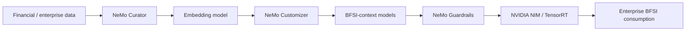
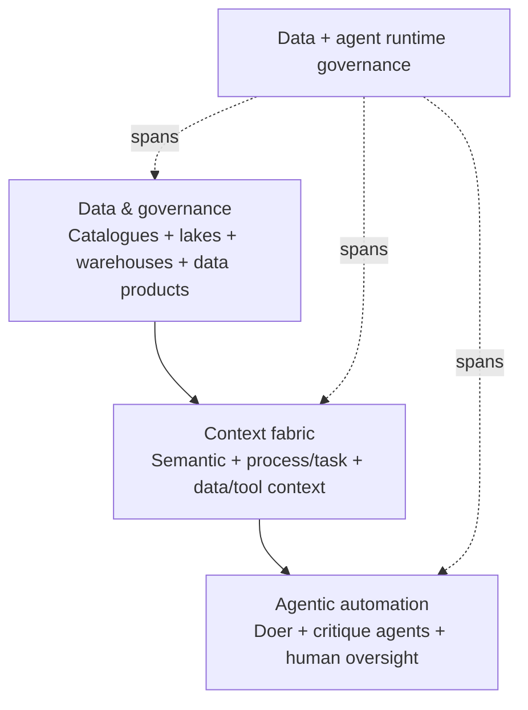
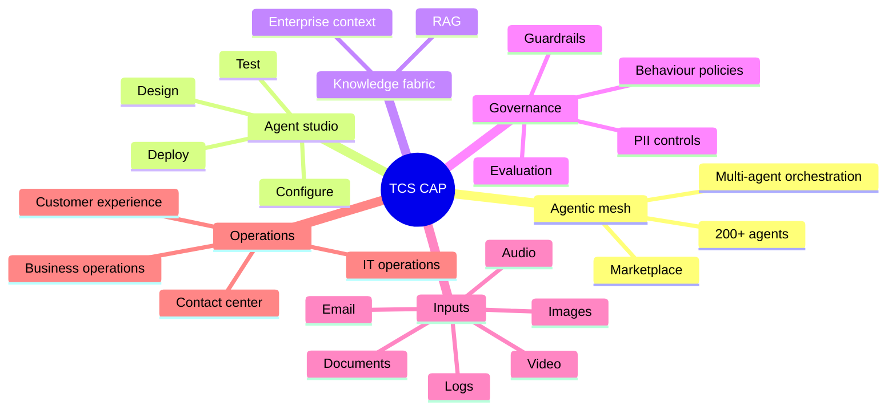
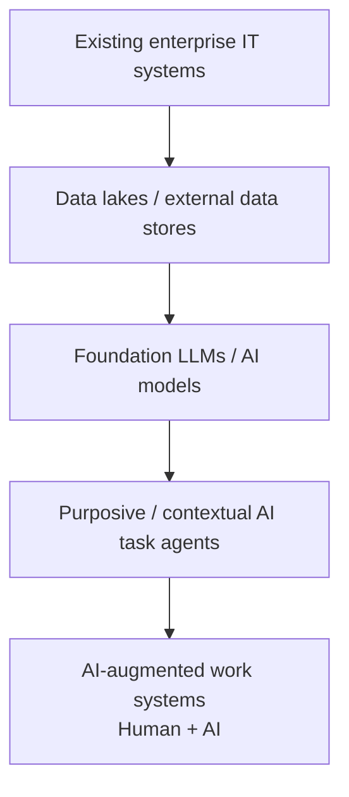
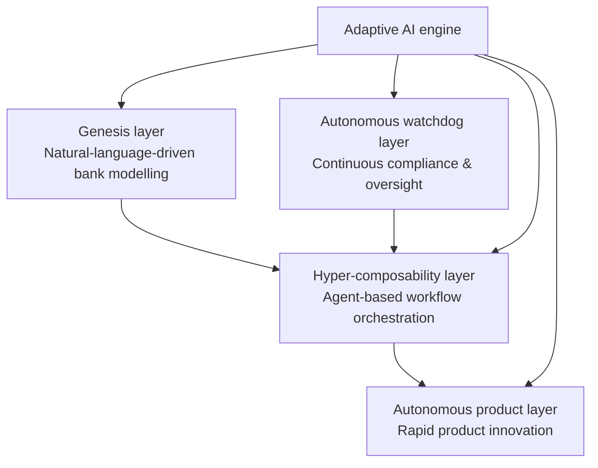
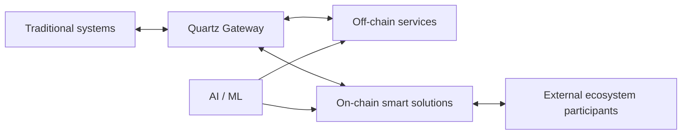

# Public Visual Reference Library — TCS AI + BFSI

[[index|← Home]] · [[atlas/architecture-atlas]] · [[media/watchlist]] · [[tcs/public-language-glossary]]

> A locator for **official public TCS figures, architecture diagrams, infographics and visual research assets**. This repository does not re-host copyrighted TCS artwork. Where useful, a Mermaid study reconstruction is provided and clearly labelled as an editorial reconstruction.

## Visual index

| Visual | Official source | What the visual exposes |
|---|---|---|
| **TCS AI Spectrum for BFSI framework** | [TCS AI Spectrum for BFSI](https://www.tcs.com/what-we-do/industries/banking/solution/tcs-ai-spectrum-for-bfsi) | NVIDIA-backed pipeline from data preparation through customization, safety and inference |
| **Key elements of agentic AI architecture — Figure 1** | [Context Fabric white paper](https://www.tcs.com/what-we-do/industries/banking/white-paper/context-fabric-backbone-agentic-ai-bfsi) | Agentic automation + context fabric + data/governance architecture |
| **Process context fabric sample — Table 1** | [Context Fabric white paper](https://www.tcs.com/what-we-do/industries/banking/white-paper/context-fabric-backbone-agentic-ai-bfsi) | Process, regulation, policies, workflows and exception context |
| **Data context fabric sample — Table 2** | [Context Fabric white paper](https://www.tcs.com/what-we-do/industries/banking/white-paper/context-fabric-backbone-agentic-ai-bfsi) | Data/tool context and governance |
| **TCS Cognitive Automation Platform infographic** | [CAP solution page](https://www.tcs.com/what-we-do/industries/insurance/solution/cognitive-automation-platform-transform-banking) | Platform modules, agentic orchestration and transformation capabilities |
| **TCS AI Architecture for BFSI — Figure 5** | [Generative AI in Finance](https://www.tcs.com/what-we-do/industries/banking/white-paper/generative-ai-finance-insurance-industry) | Enterprise systems → data/models → task agents → AI-augmented work systems |
| **ABOS layered architecture** | [ABOS article](https://www.tcs.com/what-we-do/products-platforms/tcs-bancs/articles/redefining-banking-intelligence-abos) | Genesis, hyper-composability, autonomous product, autonomous watchdog and adaptive AI concepts |
| **ABOS / Future of Finance journal artwork and tables** | [BaNCS Research Journal Issue 16 PDF](https://www.tcs.com/content/dam/global-tcs/en/pdfs/what-we-do/platforms/TCS-BaNCS/research-journal/tcs-bancs-research-journal-issue16.pdf) | AI-centric BaNCS thought leadership and banking architecture tables |
| **Quartz architecture / solution brochures** | [Quartz](https://www.tcs.com/what-we-do/products-platforms/quartz) | DLT + AI, gateway, smart solutions and coexistence model |
| **Quartz for Markets 2025 brochure** | [PDF](https://www.tcs.com/content/dam/global-tcs/en/pdfs/what-we-do/platforms/tcs-quartz/solution/2025-quartz-markets.pdf) | Tokenized/traditional market infrastructure and Quartz positioning |

---

## TCS AI Spectrum for BFSI framework

**Official visual:** scroll to **“TCS AI Spectrum for BFSI”** on the [solution page](https://www.tcs.com/what-we-do/industries/banking/solution/tcs-ai-spectrum-for-bfsi).

The page explicitly identifies an NVIDIA-based flow involving:

**Study reconstruction only.** See [[atlas/architecture-atlas#4-tcs-ai-spectrum-for-bfsi--nvidia-backed-composite-ai-path]].

---

## Context Fabric — Figure 1

**Official visual:** **“Figure 1: Key elements of agentic AI architecture”** on the [Context Fabric white paper](https://www.tcs.com/what-we-do/industries/banking/white-paper/context-fabric-backbone-agentic-ai-bfsi).

TCS' own description of the figure identifies three levels:

1. **Agentic automation layer** — doer agents, critique agents, feedback, human oversight.
2. **Context fabric layer** — semantic layer connecting process/task context to data/tools context.
3. **Data and governance platform** — catalogues, lakes, warehouses and data products.

A vertical governance concept spans the layers.

---

## Context Fabric — process and data context samples

On the same [Context Fabric white paper](https://www.tcs.com/what-we-do/industries/banking/white-paper/context-fabric-backbone-agentic-ai-bfsi), inspect:

<strong>Table 1 — Process context fabric sample</strong>

The surrounding text says process context must include regulatory requirements, enterprise policies, domain knowledge, workflows, business logic, exceptions and overrides. This matters because BFSI agent behaviour varies by process and policy context rather than operating against one static prompt.

<strong>Table 2 — Data context fabric sample</strong>

The surrounding text describes data catalogues/sources, governance policies, role/activity-based access, tool specifications, semantic knowledge and historical examples used to validate task completion.

---

## TCS Cognitive Automation Platform infographic

**Official visual:** **“An overview of TCS Cognitive Automation Platform”** on the [CAP page](https://www.tcs.com/what-we-do/industries/insurance/solution/cognitive-automation-platform-transform-banking).

The page's surrounding public specification includes:

- agentic mesh
- agent marketplace with **200+ pre-built reusable domain-trained agents**
- agent studio / agent builder
- command-center orchestration
- event-driven triggers
- multi-step goal-driven workflows
- knowledge fabric / RAG
- responsible AI guardrails
- multimodal capabilities
- process observability
- on-premises / hyperscaler deployment

---

## TCS AI Architecture for BFSI — Figure 5

**Official visual:** **“Figure 5 — TCS AI Architecture for BFSI”** in [Generative AI in Finance: Opening up a Sea of Possibilities](https://www.tcs.com/what-we-do/industries/banking/white-paper/generative-ai-finance-insurance-industry).

TCS describes a multi-layer architecture where existing enterprise systems underpin data/model layers, contextual task agents sit above them, and AI-augmented work systems combine AI with human employees.

---

## ABOS public layered model

**Official source:** [Redefining Banking Intelligence with ABOS](https://www.tcs.com/what-we-do/products-platforms/tcs-bancs/articles/redefining-banking-intelligence-abos)

The public page and BaNCS journal identify the following named layers/components:

**Evidence status:** public BaNCS thought leadership / product concept. Do not infer named deployments from the architecture article alone.

---

## Quartz visual system

**Official sources:**

- [Quartz — The Smart Ledgers](https://www.tcs.com/what-we-do/products-platforms/quartz)
- [Quartz Smart Solutions](https://www.tcs.com/what-we-do/products-platforms/quartz/solution/quartz-smart-solutions-dlt-friendly-ready-to-use)
- [Quartz for Markets](https://www.tcs.com/what-we-do/products-platforms/quartz/solution/tcs-quartz-for-market-traditional-tokenized-asset-solutions)
- [Quartz for Markets 2025 PDF](https://www.tcs.com/content/dam/global-tcs/en/pdfs/what-we-do/platforms/tcs-quartz/solution/2025-quartz-markets.pdf)

The recurring Quartz visual idea is coexistence rather than wholesale replacement:

---

## Video thumbnails as visual anchors

These are externally hosted YouTube thumbnails linked directly to public videos; no image files are stored in this repository.

### Unified Workbench

### AI WisdomNext

### TCS BaNCS transformation

See [[media/watchlist]] for descriptions and provenance.
