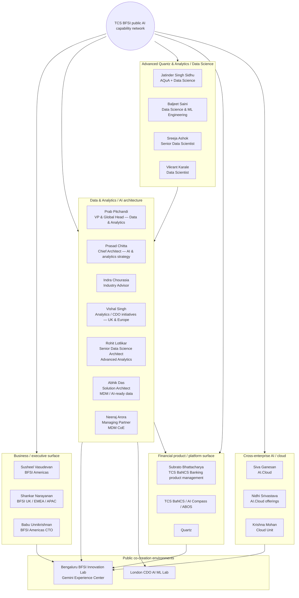
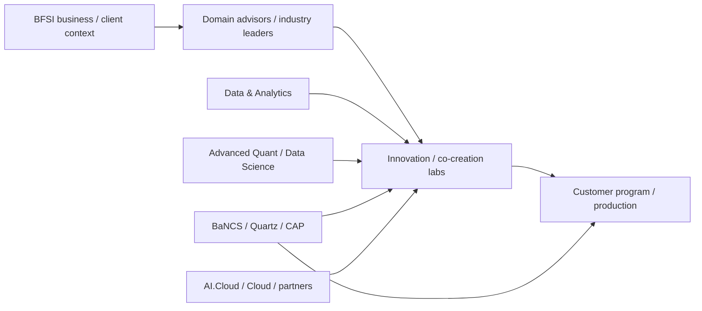

# Public Capability Network — TCS BFSI AI, Data, Quant & Platforms

[[index|← Home]] · [[people/public-voices]] · [[intelligence/public-operating-model-inference]] · [[atlas/architecture-atlas]] · [[bfsi/use-case-atlas]]

> A **public thematic network**, not an internal organization chart. Nodes come from TCS-authored biographies, public product/journal authorship, event speaker pages and selected public professional-profile matches. Edges mean “publicly connected through topic, document, product, event or capability” — **not a reporting relationship**.

## Network overview

---

## Public scale signal — BFSI Analytics & Insights

A TCS public BFSI Analytics & Insights ebook described the capability as a **deep-domain-focused data and analytics unit with ~15K multi-skilled consultants** supporting banking, insurance and capital-markets customers.

It described an end-to-end service surface spanning:
- consulting and advisory
- modernization
- transformation
- advanced quant and analytics
- data-led innovation
- decision intelligence
- CDO AI/ML Lab-led co-creation

**Evidence status:** `historical-public-capability-snapshot` — the PDF is an older public TCS asset and the headcount must not be treated as a current 2026 number without a newer source.

**Source:** [TCS BFSI Analytics & Insights ebook PDF](https://www.tcs.com/content/dam/global-tcs/en/pdfs/what-we-do/industries/banking/abstract/bfsi-analytics-and-insights-ebook-revised.pdf)

This older public asset is valuable because it reveals that the current agentic/GenAI wave sits on top of a much larger pre-existing BFSI analytics/data/quant capability rather than appearing from nowhere.

---

# Data & Analytics / AI architecture cluster

## Prab Pitchandi

**Current public TCS wording in cited 2026 pages:** Vice President & Global Head, Data & Analytics, TCS BFSI.

**Repeated public themes:**
- capital markets
- risk management
- advanced analytics / AI
- BFSI data strategy
- context fabric
- AI investment ROI
- front-to-back transformation
- regulatory programs

**Primary sources:**
- [Context Fabric](https://www.tcs.com/what-we-do/industries/banking/white-paper/context-fabric-backbone-agentic-ai-bfsi)
- [4-pillar AI investment ROI framework](https://www.tcs.com/what-we-do/industries/banking/white-paper/driving-ai-investment-roi-bfsi-industry)
- [Private-capital AI / alpha](https://www.tcs.com/what-we-do/industries/capital-markets/white-paper/private-capital-firms-ai-generate-alpha)

**Public LinkedIn profile located:** https://uk.linkedin.com/in/prab-pitchandi

---

## Prasad Chitta

**Public TCS role:** Chief Architect, Data & Analytics Group, BFSI; TCS explicitly says he **leads AI and analytics strategy for the BFSI sector**.

**Repeated public themes:**
- responsible AI
- adaptive AI
- regulatory compliance
- enterprise AI architecture
- context fabric
- digital transformation

**Primary sources:**
- [Context Fabric](https://www.tcs.com/what-we-do/industries/banking/white-paper/context-fabric-backbone-agentic-ai-bfsi)
- [A Blueprint for Responsible AI in BFSI](https://www.tcs.com/what-we-do/industries/banking/white-paper/responsible-ai-blueprint-bfsi)

**Interpretation boundary:** this establishes public subject-matter leadership, not an internal reporting hierarchy.

---

## Indra Chourasia

**Public TCS role:** Industry Advisor in BFSI Data & Analytics / Analytics & Insights.

**Repeated public themes:**
- banking / financial services / capital markets advisory
- AI reliability and governance
- quantitative modelling
- regulatory reporting
- data monetization
- private-capital AI

**Primary sources:**
- [TCS author page](https://www.tcs.com/insights/authors/indrachourasia)
- [Augmenting the reliability of AI in financial services](https://www.tcs.com/what-we-do/industries/banking/white-paper/ai-financial-services-risk-governance)
- [AI in private capital](https://www.tcs.com/what-we-do/industries/capital-markets/white-paper/private-capital-firms-ai-generate-alpha)

**Public LinkedIn profile located:** https://in.linkedin.com/in/indra-chourasia-bfsi-business-architect

---

## Vishal Singh

**Public role on cited TCS material:** analytics / Chief Data Officer initiatives leadership for UK and Europe within BFSI.

**Critical public context:** TCS states that Vishal played a key role in building the **CDO AI ML Lab in London**, described as an ecosystem for co-creating comprehensive data-science solutions for global financial-services organizations.

**Sources:**
- [Data mesh for innovation and growth in BFSI](https://www.tcs.com/content/tcs/global/en/what-we-do/industries/banking/white-paper/data-mesh-implementation-bfsi)
- [Data Mesh Architecture PDF](https://www.tcs.com/content/dam/global-tcs/en/pdfs/insights/whitepapers/data-mesh-architecture-business-innovation-agility.pdf)

---

## Dr. Rohit Lotlikar

**Public TCS role:** Senior Data Science Architect in the **Advanced Analytics Practice of the Data & Analytics Group of TCS' BFSI business unit**.

**TCS-published background:** more than 25 years across data science, machine learning and related technologies; works with BFSI clients on complex advanced-analytics engagements.

**Public topic signal:**
- AI investment ROI
- production AI lifecycle
- PoC-to-production transition
- human-in-the-loop design
- continuous AI quality monitoring
- guardrails and explainability
- centralized AI-CoE operating models

**Primary source:** [How Banks Can Improve Artificial Intelligence ROI](https://www.tcs.com/what-we-do/industries/banking/white-paper/banks-financial-services-improve-ai-roi)

Related: [[research/ai-roi-lifecycle-and-coe]]

---

## Abhik Das

**Public TCS role:** Solution Architect in the Data & Analytics Group of TCS' BFSI business unit.

**TCS-published topic context:**
- enterprise master data management
- customer-360
- large-scale MDM modernization
- MDM architecture
- operating-model transformation
- AI-ready data foundations

**Primary source:** [Modern MDM: AI-ready Data to Scale Enterprise AI in BFSI](https://www.tcs.com/what-we-do/industries/banking/white-paper/modern-mdm-ai-ready-enterprise-data-bfsi)

Related: [[research/modern-mdm-ai-ready-data-bfsi]]

---

## Neeraj Arora

**Public TCS role:** Managing Partner in the Data & Analytics Group of TCS' BFSI business unit. The cited page explicitly states that he **leads the MDM CoE for the BFSI sector**.

**TCS-published topic context:**
- MDM consulting
- MDM architecture
- program management
- enterprise MDM transformation
- AI-ready data
- data governance

**Primary source:** [Modern MDM: AI-ready Data to Scale Enterprise AI in BFSI](https://www.tcs.com/what-we-do/industries/banking/white-paper/modern-mdm-ai-ready-enterprise-data-bfsi)

**Interpretation boundary:** “leads the MDM CoE” is source-published professional context; it does not establish private reporting lines, staffing, customers or project assignments.

Related: [[research/modern-mdm-ai-ready-data-bfsi]]

---

# Advanced Quantz & Analytics / Data Science cluster

## Jatinder Singh Sidhu

**Public TCS role:** head of the Advanced Quantz & Analytics and Data Science groups of TCS' BFSI business unit.

**Public focus:** advanced analytics and financial/quantitative engineering solutions for TCS and BFSI clients.

**Sources:**
- [4-pillar AI investment ROI framework](https://www.tcs.com/what-we-do/industries/banking/white-paper/driving-ai-investment-roi-bfsi-industry)
- [AI for volatility risk management](https://www.tcs.com/what-we-do/industries/banking/white-paper/leveraging-ai-volatility-risk-management-financial-markets)
- [AI models/tools for portfolio management](https://www.tcs.com/what-we-do/industries/capital-markets/white-paper/ai-models-tools-better-portfolio-management)

---

## Baljeet Saini

**Public TCS role:** Chief Architect for Data Science & ML Engineering in the Advanced Quant & Analytics (AQuA) group of TCS BFSI.

**TCS-published focus:** enterprise-scale AI/ML platforms, quantitative solutions, data-driven architectures and engineering-first AI adoption for global financial institutions.

**Source:** [Leveraging AI for Volatility Risk Management in Financial Markets](https://www.tcs.com/what-we-do/industries/banking/white-paper/leveraging-ai-volatility-risk-management-financial-markets)

---

## Sreeja Ashok

**Public TCS role:** senior data scientist in AQuA.

**TCS-published specialization:** algorithmic trading, risk management and predictive modelling.

**Source:** [AI Models and Tools for Better Portfolio Management](https://www.tcs.com/what-we-do/industries/capital-markets/white-paper/ai-models-tools-better-portfolio-management)

---

## Vikrant Karale

**Public TCS role:** data scientist in AQuA.

**TCS-published application areas:** AI/ML applications including loan-default prediction and portfolio optimization.

**Source:** [AI Models and Tools for Better Portfolio Management](https://www.tcs.com/what-we-do/industries/capital-markets/white-paper/ai-models-tools-better-portfolio-management)

---

# Public co-creation / innovation environments

## Bengaluru BFSI Innovation Lab + Google Cloud Gemini Experience Center

**Status:** `live-public-facility`

TCS says the Gemini Experience Center was launched at its **BFSI Innovation Lab in Bengaluru** to let financial institutions discover, co-create, innovate and prototype AI applications.

Publicly named areas include:
- customer servicing
- business-decision workflows
- back-office operations
- regulatory compliance
- software-development lifecycle acceleration
- TCS BaNCS on Google Cloud

**Source:** [TCS + Google Cloud BFSI Gemini Experience Center](https://www.tcs.com/who-we-are/newsroom/news-alert/tcs-partners-with-google-cloud-accelerate-ai-driven-fnnovation-financial-services-industry)

A July 2026 TCS announcement separately confirms the Bengaluru BFSI GEC as one of three India Gemini Experience Centers at that time.

**Source:** [Kolkata Gemini Experience Center announcement](https://www.tcs.com/who-we-are/newsroom/press-release/tcs-google-cloud-launch-gemini-experience-center-kolkata)

---

## London CDO AI ML Lab

**Status:** `publicly-described-co-creation-lab`

TCS public biographies describe the lab as an ecosystem for co-creating comprehensive data-science solutions for global financial-services organizations.

**Source:** [Data mesh for innovation and growth in BFSI](https://www.tcs.com/content/tcs/global/en/what-we-do/industries/banking/white-paper/data-mesh-implementation-bfsi)

---

# Product/platform cluster

## Subrato Bhattacharya

**Public TCS BaNCS title:** Head, Product Management, Banking, TCS BaNCS.

**Public topic:** author of ABOS / “Redefining Banking Intelligence,” which describes a fully agentic AI-driven bank operating platform concept.

**Sources:**
- [ABOS article](https://www.tcs.com/what-we-do/products-platforms/tcs-bancs/articles/redefining-banking-intelligence-abos)
- [ABOS PDF](https://www.tcs.com/content/dam/global-tcs/en/pdfs/what-we-do/platforms/TCS-BaNCS/research-journal/tcs-bancs-research-journal-16-redefining-banking-intelligence.pdf)

---

# Cross-enterprise AI / cloud cluster

Public BFSI GenAI material names **Siva Ganesan** (AI.Cloud) and **Nidhi Srivastava** (AI.Cloud offerings) as executive champions, while TCS/Google Cloud financial-services material names **Krishna Mohan** as Vice President and Global Head, Cloud Unit.

This indicates a public intersection between BFSI vertical capability and broader TCS AI/cloud capability, but does not establish reporting lines.

Sources:
- [Generative AI in Finance](https://www.tcs.com/what-we-do/industries/banking/white-paper/generative-ai-finance-insurance-industry)
- [TCS + Google Cloud BFSI](https://www.tcs.com/who-we-are/newsroom/news-alert/tcs-partners-with-google-cloud-accelerate-ai-driven-fnnovation-financial-services-industry)

---

## Topic-cluster matrix

| Public cluster | Representative public people/assets | Repeated topics |
|---|---|---|
| BFSI business/executive | Susheel Vasudevan, Shankar Narayanan, Babu Unnikrishnan | scaled transformation, strategy, cloud/AI, regulated production |
| Data & Analytics | Prab Pitchandi, Prasad Chitta, Indra Chourasia, Vishal Singh, Rohit Lotlikar, Abhik Das, Neeraj Arora | AI strategy, context, governance, data architecture, MDM, AI-ready data, production lifecycle, risk, capital markets |
| AQuA / Data Science | Jatinder Sidhu, Baljeet Saini, Sreeja Ashok, Vikrant Karale | quant engineering, ML engineering, risk modelling, portfolio optimization |
| Product/platform | BaNCS, AI Compass, ABOS, Quartz, Subrato Bhattacharya | transaction platforms, embedded AI/agents, market infrastructure |
| Cross-enterprise AI/cloud | AI.Cloud, Cloud Unit, WisdomNext, partner ecosystems | orchestration, models, cloud, governance, enterprise AI |
| Co-creation environments | Bengaluru BFSI Innovation Lab/GEC, London CDO AI ML Lab | prototype, co-create, evaluate, domain + partner integration |

---

## Derived public abstraction

**Inference status:** `high-confidence-public-pattern`, not an internal org chart. See [[intelligence/public-operating-model-inference]].

## Collection discipline

- Add a person only when TCS publicly names their relevant role/topic or an exact public professional profile is confidently matched.
- Preserve title wording and source date.
- Historical titles remain historical.
- Never infer private reporting lines, project assignment, compensation, contact details, personal relationships or political alignment.
- Use professional-network signals to enrich topic maps, not to reconstruct private employee behavior.