# Public TCS BFSI + AI Voices — Authors, Speakers & Executive Champions

[[index|← Home]] · [[media/watchlist]] · [[events/public-event-watch]] · [[tcs/public-language-glossary]] · [[atlas/architecture-atlas]]

> This is **not an internal organization chart or employee directory**. It records only people whom TCS itself publicly names as authors, speakers, executive champions, or leaders on relevant public pages, together with the topics attached to those pages.

## Public topic map

```mermaid
flowchart TB
  BFSI[TCS BFSI public AI discourse]
  SV[Susheel Vasudevan\nBFSI Americas]
  SN[Shankar Narayanan\nBFSI UK / EMEA / APAC]
  PC[Prasad Chitta\nBFSI AI & analytics architecture]
  PP[Prab Pitchandi\nBFSI Data & Analytics]
  IC[Indra Chourasia\nBFSI Data & Analytics advisory]
  BU[Babu Unnikrishnan\nBFSI Americas CTO]
  SG[Siva Ganesan\nAI.Cloud]
  NS[Nidhi Srivastava\nAI.Cloud offerings]
  SB[S. Baskar\nOpen Finance, BFSI]
  SUB[Subrato Bhattacharya\nTCS BaNCS Banking product management]
  KM[Krishna Mohan\nCloud Unit]
  PG[Partha Pratim Ghosh\nBFSI Risk Practice]
  SJ[Sukriti Jalali\nBFSI Innovation]
  VV[Vijayaraghavan Venkatraman\nBFSI Risk Management & Regulatory Compliance]
  SD[Sanjukta Dhar\nBFSI Risk Advisory / FinCrime]
  AW[Aditya Walimbe\nBFSI Chief Architect / emerging technology]
  AA[Annamalai Anbukkarasu\nBFSI Digital & Emerging Technologies]

  BFSI --> SV
  BFSI --> SN
  BFSI --> PC
  BFSI --> PP
  BFSI --> IC
  BFSI --> BU
  BFSI --> SG
  BFSI --> NS
  BFSI --> SB
  BFSI --> SUB
  BFSI --> KM
  BFSI --> PG
  BFSI --> SJ
  BFSI --> VV
  BFSI --> SD
  BFSI --> AW
  BFSI --> AA
```

---

## Susheel Vasudevan

**Public TCS title on current cited pages:** President – BFSI Americas, TCS.

**Why the name appears in the public knowledge graph:** TCS repeatedly features him in financial-services AI/cloud events, partnership announcements and BFSI architecture material.

### Public topics attached to his appearances

- operationalising AI at scale in regulated financial services
- cloud + AI in BFSI
- TCS / Google Cloud financial-services innovation
- AWS financial-services transformation
- enterprise GenAI architecture for BFSI

### Sources

- [TCS at AWS Financial Services Symposium 2026](https://www.tcs.com/who-we-are/events/tcs-at-aws-financial-services-symposium-2026)
- [TCS + Google Cloud — AI-driven innovation in financial services](https://www.tcs.com/who-we-are/newsroom/news-alert/tcs-partners-with-google-cloud-accelerate-ai-driven-fnnovation-financial-services-industry)
- [Generative AI in Finance — Executive Champions](https://www.tcs.com/what-we-do/industries/banking/white-paper/generative-ai-finance-insurance-industry)
- [TCS at NVIDIA GTC 2026](https://www.tcs.com/who-we-are/events/tcs-at-nvidia-gtc-2026)

Related: [[events/public-event-watch]] · [[tcs/ai-partnerships]]

---

## Shankar Narayanan

**Public TCS title on cited BFSI architecture material:** President & Business Head, BFSI – UK, EMEA & APAC, TCS.

**Public topic context:** listed by TCS among executive champions on its GenAI-in-finance architecture material.

Source: [Generative AI in Finance: Opening up a Sea of Possibilities](https://www.tcs.com/what-we-do/industries/banking/white-paper/generative-ai-finance-insurance-industry)

---

## Babu Unnikrishnan

**Public TCS title on cited material:** Chief Technology Officer, BFSI – Americas, TCS.

**Public topic context:** executive champion attached to TCS' GenAI architecture discussion for financial services.

Source: [Generative AI in Finance](https://www.tcs.com/what-we-do/industries/banking/white-paper/generative-ai-finance-insurance-industry)

---

## Prab Pitchandi

**Public TCS title on the Context Fabric page:** Vice President & Global Head of the Data & Analytics group in TCS' BFSI business unit.

**TCS-published background on that page:** specialization in capital markets and risk management; work at the intersection of advanced analytics, AI and BFSI; experience with front-to-back transformations and regulatory programs.

**Public topic anchors:**
- agentic AI in BFSI
- context fabric
- data + analytics
- capital markets
- risk management

Source: [Context Fabric – The Backbone of Agentic AI in BFSI](https://www.tcs.com/what-we-do/industries/banking/white-paper/context-fabric-backbone-agentic-ai-bfsi)

Related: [[atlas/architecture-atlas#2-context-fabric--architecture-reconstructed-from-tcs-figure-1]]

---

## Prasad Chitta

**Public TCS title on the Context Fabric page:** Chief Architect, Data & Analytics Group, TCS BFSI business unit.

**TCS-published role statement:** leads AI and analytics strategy for the BFSI sector; specializes in responsible/adaptive AI, regulatory compliance and digital transformation for global financial institutions.

**Public topic anchors:**
- BFSI AI architecture
- responsible AI
- adaptive AI
- regulatory compliance
- context fabric

Source: [Context Fabric](https://www.tcs.com/what-we-do/industries/banking/white-paper/context-fabric-backbone-agentic-ai-bfsi)

---

## Indra Chourasia

**Public TCS role on the Context Fabric page:** Industry Advisor in the Data & Analytics group of TCS' BFSI business unit.

**TCS-published topic context:** designs solution offerings and drives thought leadership/client engagements across banking, financial services and capital markets.

Source: [Context Fabric](https://www.tcs.com/what-we-do/industries/banking/white-paper/context-fabric-backbone-agentic-ai-bfsi)

---

## Vijayaraghavan Venkatraman

**Public current TCS title on Risk Live North America 2026:** Global Head - BFSI Risk Management & Regulatory Compliance, TCS.

**Historical TCS title in the 2021 Smart Risk Enterprise paper:** Global Head, Risk Management and Regulatory Compliance at TCS' BFSI business unit.

TCS' public author biography says his experience spans banking, risk management and regulatory compliance, including:

- risk transformation
- data-science-led innovation
- RegTech-based compliance implementations
- solution design and framework development
- risk/compliance innovation
- thought leadership
- domain competence development

### Public topic anchors

- smart / intelligent risk enterprise
- AI and agentic intelligence in risk & compliance
- AI governance and monitoring
- model risk, bias and unintended consequences
- auditability and transparency
- regulatory alignment and risk appetite
- human judgment / oversight
- risk transformation and RegTech

### Sources

- [TCS at Risk Live North America 2026](https://www.tcs.com/who-we-are/events/tcs-at-risk-live-north-america-2026)
- [Building a Smart Risk Enterprise in Financial Institutions — TCS PDF](https://www.tcs.com/content/dam/global-tcs/en/pdfs/insights/whitepapers/smart-risk-management-banking.pdf)

Related: [[research/smart-risk-enterprise-to-agentic-risk-intelligence]] · [[bfsi/risk-compliance-ai]]

**Evidence boundary:** the repeated public title/topic evidence establishes long-running external subject-matter leadership; it does not establish private reporting lines or ownership of specific client projects.

---

## Partha Pratim Ghosh

**Public TCS role on cited material:** consultant in the Risk Practice of TCS' BFSI business unit.

**TCS-published topic context:** large-scale risk transformation with experience spanning market risk, credit risk, financial crime, model risk and risk data management.

**Public AI topic anchors:**
- Responsible AI in financial-crime compliance
- AI governance
- explainability and auditability
- model risk
- KYC / AML / sanctions / fraud
- decision-level audit evidence

Source: [Responsible AI in Financial Crime: Global Compliance and Governance](https://www.tcs.com/what-we-do/industries/banking/white-paper/responsible-ai-financial-crime-global-compliance-governance)

Related: [[research/responsible-ai-financial-crime-governance]] · [[bfsi/risk-compliance-ai]]

---

## Sukriti Jalali

**Public TCS role on cited material:** innovation partner with TCS' BFSI business unit.

**TCS-published topic context:** technology-enabled business transformation across digital and innovation streams; public thought leadership spanning BFSI, digital transformation, IoT, blockchain and AI.

**Public AI topic anchors:**
- insurance claims transformation
- composite AI
- AI agents
- assist → augment → transform operating model
- enterprise knowledge fabric
- human-centric claims automation

Source: [Reimagining the Claims Processing Function with AI Agents](https://www.tcs.com/what-we-do/industries/insurance/white-paper/ai-agents-insurance-claims-function)

---

## Sanjukta Dhar

**Public TCS role on cited material:** Senior Consultant in the Risk Advisory Practice in TCS' BFSI business unit.

The public author biography associates her with FinCrime technology and risk/regulatory programs including OFSAA EPM, risk-finance integration, FRTB standardized approach, VaR back-testing, BCBS 239 and SR 11/7.

**Public AI topic anchors:**
- AI-agent adoption in regulated financial services
- FinCrime / risk advisory
- KYC / AML and customer due diligence
- agent controls and human accountability
- phased agent adoption

Source: [AI Agents: The Next Frontier of Financial Services Transformation](https://www.tcs.com/what-we-do/industries/banking/white-paper/ai-agents-financial-services-transformation)

Related: [[research/ai-agents-phased-adoption-bfsi]]

---

## Aditya Walimbe

**Public TCS role on cited material:** Senior Consultant and Chief Architect with TCS' BFSI unit.

**TCS-published topic context:** architecture, emerging-technology consulting, delivery and supporting large customers as a digital partner.

**Public AI topic anchors:**
- AI-agent architecture
- enterprise agent platform
- evolutionary architecture
- orchestration and observability
- emerging technology in BFSI

Source: [AI Agents: The Next Frontier of Financial Services Transformation](https://www.tcs.com/what-we-do/industries/banking/white-paper/ai-agents-financial-services-transformation)

Related: [[research/ai-agents-phased-adoption-bfsi]]

---

## Annamalai Anbukkarasu (Anbu)

**Public TCS role on cited material:** Global Head of Digital and Emerging Technologies in TCS' BFSI business unit.

**TCS-published topic context:** technology transformation, domain, relationship management, strategy, practice and CoE development, plus global delivery experience.

**Public AI topic anchors:**
- digital and emerging technologies in BFSI
- AI-agent adoption strategy
- enterprise scaling
- practice / CoE development

Source: [AI Agents: The Next Frontier of Financial Services Transformation](https://www.tcs.com/what-we-do/industries/banking/white-paper/ai-agents-financial-services-transformation)

Related: [[research/ai-agents-phased-adoption-bfsi]]

**Evidence boundary:** this preserves only the public professional role and topics attached to the TCS source; it does not infer private reporting lines, account ownership or project assignments.

---

## Siva Ganesan

**Public TCS title on cited BFSI GenAI material:** Senior Vice President and Head, AI.Cloud, TCS.

**Public topic context:** listed as an executive champion on TCS' GenAI architecture material for BFSI.

Source: [Generative AI in Finance](https://www.tcs.com/what-we-do/industries/banking/white-paper/generative-ai-finance-insurance-industry)

---

## Nidhi Srivastava

**Public TCS title on cited material:** Vice President and Head of Offerings, AI.Cloud, TCS.

**Public topic context:** executive champion on the TCS GenAI-in-finance architecture page.

Source: [Generative AI in Finance](https://www.tcs.com/what-we-do/industries/banking/white-paper/generative-ai-finance-insurance-industry)

---

## S. Baskar

**Public TCS title on cited material:** Head, Open Finance, BFSI, TCS.

**Public topic context:** executive champion attached to TCS' GenAI-in-finance material.

Source: [Generative AI in Finance](https://www.tcs.com/what-we-do/industries/banking/white-paper/generative-ai-finance-insurance-industry)

---

## Subrato Bhattacharya

**Public title in TCS BaNCS Research Journal:** Head, Product Management, Banking, TCS BaNCS.

**Public topic anchor:** author of the “Redefining Banking Intelligence” material describing ABOS / a fully agentic AI-driven bank operating platform.

Sources:
- [ABOS article](https://www.tcs.com/what-we-do/products-platforms/tcs-bancs/articles/redefining-banking-intelligence-abos)
- [Dedicated ABOS PDF](https://www.tcs.com/content/dam/global-tcs/en/pdfs/what-we-do/platforms/TCS-BaNCS/research-journal/tcs-bancs-research-journal-16-redefining-banking-intelligence.pdf)

Related: [[atlas/architecture-atlas#7-abos--public-fully-agentic-banking-operating-platform-concept]]

---

## Krishna Mohan

**Public title on TCS/Google Cloud financial-services announcement:** Vice President and Global Head, Cloud Unit, TCS.

**Public topic context:** TCS/Google Cloud financial-services collaboration and Gemini-based AI innovation.

Source: [TCS Partners with Google Cloud to Accelerate AI-Driven Innovation in Financial Services](https://www.tcs.com/who-we-are/newsroom/news-alert/tcs-partners-with-google-cloud-accelerate-ai-driven-fnnovation-financial-services-industry)

---

## Public voice ↔ topic cross-reference

| Public person | Banking | Insurance | Capital markets | AI architecture | Data/analytics | Cloud/ecosystem | Risk/compliance |
|---|:---:|:---:|:---:|:---:|:---:|:---:|:---:|
| Susheel Vasudevan | ✓ | ✓ | ✓ | ✓ |  | ✓ | ✓ |
| Shankar Narayanan | ✓ | ✓ | ✓ | ✓ |  |  |  |
| Babu Unnikrishnan | ✓ |  | ✓ | ✓ |  |  |  |
| Prab Pitchandi | ✓ |  | ✓ | ✓ | ✓ |  | ✓ |
| Prasad Chitta | ✓ | ✓ | ✓ | ✓ | ✓ |  | ✓ |
| Indra Chourasia | ✓ |  | ✓ | ✓ | ✓ |  | ✓ |
| Vijayaraghavan Venkatraman | ✓ | ✓ | ✓ | ✓ | ✓ |  | ✓ |
| Partha Pratim Ghosh | ✓ |  | ✓ | ✓ | ✓ |  | ✓ |
| Sukriti Jalali |  | ✓ |  | ✓ |  |  |  |
| Sanjukta Dhar | ✓ |  | ✓ | ✓ |  |  | ✓ |
| Aditya Walimbe | ✓ | ✓ | ✓ | ✓ |  |  | ✓ |
| Annamalai Anbukkarasu | ✓ | ✓ | ✓ | ✓ |  |  |  |
| Siva Ganesan | cross-BFSI | cross-BFSI | cross-BFSI | ✓ |  | ✓ |  |
| Nidhi Srivastava | cross-BFSI | cross-BFSI | cross-BFSI | ✓ |  | ✓ |  |
| S. Baskar | ✓ |  |  | ✓ |  |  |  |
| Subrato Bhattacharya | ✓ |  |  | ✓ |  |  | ✓ |
| Krishna Mohan | ✓ | ✓ | ✓ |  |  | ✓ |  |

**Table discipline:** check marks indicate topics attached to the cited public material, not an inferred internal responsibility matrix.

## Collection rule

Add people here only when a primary TCS source publicly attaches them to a relevant document, product, event, interview or initiative. Record the public title **as stated by the source and at the source's time**. Do not add personal contact information, private details, inferred reporting lines or internal org structure.