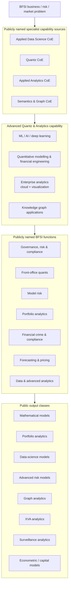
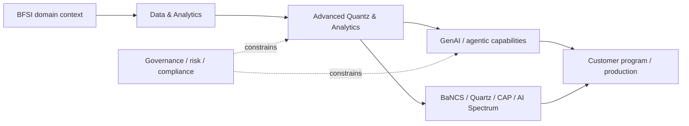

# TCS Advanced Quantz & Analytics — Public Capability Map

[[index|← Home]] · [[people/public-capability-network]] · [[bfsi/risk-compliance-ai]] · [[bfsi/use-case-atlas]] · [[media/visual-reference-library]]

> Evidence status: `product-capability`. This note reconstructs only what TCS publicly states on its current Advanced Quantz & Analytics solution page. It is not an internal organization chart, staffing model or customer-deployment claim.

## Why this source matters

The current TCS public page for **Advanced Quantz & Analytics** exposes a unusually dense view of the BFSI analytics/quant capability beneath the broader GenAI and agentic-AI layer. TCS describes it as a front-office-focused offering combining business contextualization, quantitative engineering, data science, deep-learning AI/ML and LLM models, while also spanning enterprise-wide analytics and back-office optimization.

Primary source: https://www.tcs.com/what-we-do/industries/banking/solution/advanced-quantz-analytics-application

## Public capability surface

TCS explicitly names the following capability groups on the page:

- **advanced machine learning and data science (ML-AI)**
- **quantitative modeling and financial engineering**
- **enterprise-wide analytics** spanning cloud and advanced visualization from incubation to scaling
- **deep-learning knowledge-graph applications** for complex enterprise use cases

The page further states that these are strengthened through four public CoE signals:

1. **Applied Data Science Center of Excellence**
2. **Quantz Center of Excellence**
3. **Applied Analytics Center of Excellence**
4. **Semantics and Graph Center of Excellence**

These names are retained exactly as public capability labels. They do not establish private reporting lines, headcount or internal hierarchy.

## Reconstructed public capability architecture

**Editorial reconstruction only.** It maps named elements from the public TCS page; it is not a reproduced TCS internal architecture.

## Public use-case surface

The page explicitly connects the offering to use cases including:

- trade and market surveillance
- fraud detection
- ML-based data quality
- 360-degree persona analytics
- pricing models and simulators
- incremental-alpha models
- predictive claims analytics
- LLM-based underwriting extraction and scoring
- model risk
- portfolio analytics
- financial crime and compliance
- forecasting and pricing

The public figure description also places the capability across retail/private banking, corporate and investment banking, asset/investment management, insurance and payments, and mentions sell-side, buy-side, trading venues and regulatory/market-infrastructure contexts.

## Figure 1 — official public visual locator

The same TCS page contains **Figure 1**, described as a graphic showing how Advanced Quantz & Analytics can transform the BFSI landscape. Its accessibility text is unusually useful because it enumerates the venues, functions and outputs connected to the offering.

Official source / visual locator:
https://www.tcs.com/what-we-do/industries/banking/solution/advanced-quantz-analytics-application

Do not re-host the TCS artwork. Use the source page plus the Mermaid reconstruction above for study.

## Relationship to the broader public BFSI AI stack

This page strengthens a public pattern already visible elsewhere in the graph:

The important public signal is that TCS' current agentic/GenAI story sits alongside a mature quant, data-science, risk-modelling and graph-analytics capability rather than replacing it.

## Evidence boundaries

- `product-capability`: the page establishes what TCS publicly offers.
- The four CoEs are public capability labels, not evidence of current staffing or reporting structure.
- Named use cases are capability statements unless a separate public case study establishes production deployment.
- References to regulators/central banks in the figure description indicate applicability/context only; they do not imply regulator endorsement or customer deployment.

## Related

[[people/public-capability-network]] · [[bfsi/risk-compliance-ai]] · [[bfsi/capital-markets-ai]] · [[bfsi/use-case-atlas]] · [[media/visual-reference-library]]
