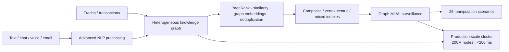

# TCS Advanced Quantz & Analytics — APAC Exchange Market-Surveillance Evidence

[[index|← Home]] · [[bfsi/capital-markets-ai]] · [[bfsi/risk-compliance-ai]] · [[media/visual-reference-library]] · [[intelligence/public-operating-model-inference]]

> Evidence status: **`public-case-study / deployed`**, with the customer kept anonymous exactly as TCS publishes it: **“Leading APAC Exchange.”** This note does not attempt to infer the exchange’s identity.

## Source and date discipline

Primary source: TCS-hosted **Advanced Quantz & Analytics** eBook/PDF:  
https://www.tcs.com/content/dam/global-tcs/en/pdfs/what-we-do/industries/banking/abstract/advanced-quantz-analytics-eBook.pdf

Current solution page:  
https://www.tcs.com/what-we-do/industries/banking/solution/advanced-quantz-analytics-application

The PDF is publicly hosted by TCS. Its retrieved public artifact does not expose a precise publication date in the document text used for this note, so no event/publication date is invented. The artifact was re-verified on **2026-09-10**.

## What TCS publicly says was implemented

TCS describes a **Leading APAC Exchange** seeking a 360-degree surveillance capability to detect market and trade manipulation using advanced knowledge-graph techniques over hidden relationship patterns.

The public case-study material says the solution combined:

- structured trading/transaction data
- unstructured text, chat/voice and email data
- advanced NLP processing
- a heterogeneous knowledge graph spanning communication, trading and payment-transfer relationships
- vertex-centrality/PageRank algorithms
- vertex similarity
- graph embeddings
- vertex deduplication
- composite, vertex-centric and mixed indexes for exact, full-text, numerical-range and geospatial search

This is unusually concrete implementation evidence because TCS publishes both the analytics methods and production-scale architecture characteristics.

## Published results and production characteristics

TCS reports:

- **25 manipulation scenarios** covered through a graph-based ML/AI application
- an enterprise-wide unified data/graph model
- scalable ontology and integrated data sources
- **100M+ vertices** and **2B+ edges**
- a **<200 ms** low-latency/high-throughput environment
- **200M nodes in the production cluster**
- **70 asset types / schema definitions**
- a test cluster with **200M+ nodes**

The architecture/design section names:

- HPE Ezmeral Data Fabric and Lake
- Scala-based distributed-computing / MPP framework
- Elasticsearch, SOLR and Lucene indexing
- automated Airflow data-science pipelines
- H2O.ai AutoML capabilities

These are TCS-published implementation details for the anonymous case and should not be generalized to every TCS surveillance implementation.

## Why this matters to the public intelligence graph

This fills a gap between product-level surveillance claims and concrete implementation evidence. The public graph previously captured Quartz Surveillance as a product capability and broader TCS capital-markets AI positioning. This AQuA case provides a separate, implementation-level example of **graph ML/AI applied to market-abuse surveillance at production scale**.

It also demonstrates that TCS’ public BFSI AI capability is not limited to GenAI/agentic AI. A distinct quantitative/data-science layer remains visible across:

- graph analytics
- ML engineering
- quantitative modelling
- market/risk analytics
- surveillance
- production data-science pipelines

This supports—but does not by itself prove—the repository’s existing derived inference that TCS’ public BFSI AI model is vertically structured around multiple capability centers rather than one generic GenAI layer.

## Editorial architecture reconstruction

The following Mermaid is a **study reconstruction from public TCS text**, not an internal TCS architecture diagram.

## Evidence boundaries

- Customer identity remains anonymous; do not reverse-identify it.
- `deployed` is justified by TCS explicitly describing a **production cluster** and published operating characteristics.
- The source does not establish that the implementation uses Quartz Surveillance, CAP, AI WisdomNext, AI Spectrum, Context Fabric, BaNCS AI Compass or any agentic-AI product. No such linkage is inferred.
- The stated scale and performance figures are TCS-published claims, not independently validated benchmarks.
- The public artifact demonstrates historical/current public capability evidence but does not prove that every architectural component remains unchanged today.

## Related

[[bfsi/capital-markets-ai]] · [[bfsi/risk-compliance-ai]] · [[tcs/tcs-bfsi-ai-offerings]] · [[media/visual-reference-library]] · [[people/public-capability-network]]
