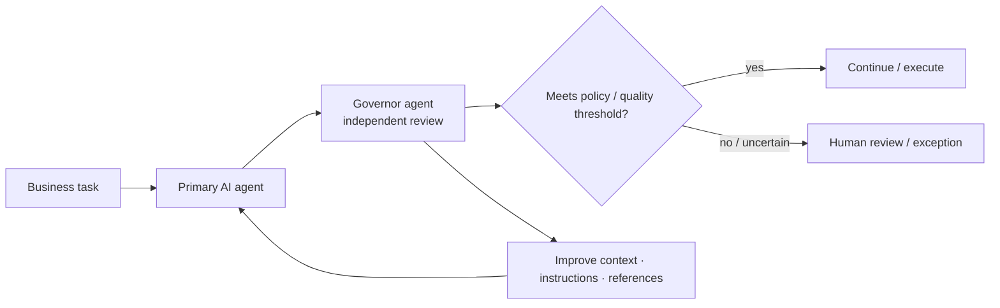
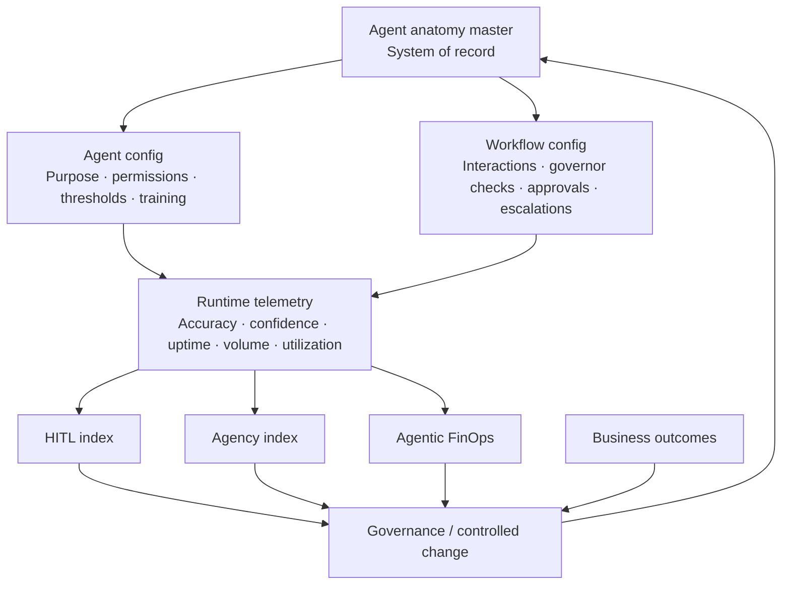

# TCS Agentic AI — Business Observability Control Plane

[[index|← Home]] · [[ai/agentic-ai-bfsi-architecture]] · [[bfsi/risk-compliance-ai]] · [[research/responsible-ai-bfsi-unified-governance-blueprint]] · [[intelligence/public-operating-model-inference]]

> **Evidence class:** `thought-leadership / public-article-example`  
> **Publisher:** Tata Consultancy Services (TCS)  
> **Publication date:** not stated on the public page; do not infer one from crawl/index dates  
> **Public source:** https://www.tcs.com/insights/blogs/business-observability-agentic-ai-driven-operations  
> **Confidence:** high for the published operating-model concepts; not proof of a named customer deployment.

## Why this source matters

TCS' public article **“Business Observability for Agentic AI-driven Operations”** publishes a concrete operating model for measuring and governing AI agents after they begin participating in end-to-end enterprise workflows.

Instead of limiting observability to technical latency or model accuracy, the article proposes linking **agent autonomy, risk, cost, human intervention and business outcomes** in one operating discipline.

This is highly relevant to BFSI because the author is publicly described by TCS as specializing in scalable AI solutions for enterprise and BFSI domains, and the control concepts map directly to regulated workflows where autonomy, approval thresholds and exception handling must be visible.

## Published agent-level metrics

TCS says a business observability studio should track agent performance through outcome-linked dimensions including:

- effectiveness and reliability
- **AI agent agency index**
- confidence and accuracy
- uptime
- utilization / capacity
- value contribution
- governance performance

### AI agent agency index

The **agency index** is presented as a measure of how much autonomy an agent actually has relative to the enterprise's intended operating model. TCS says it should reflect:

- mandatory human approvals beyond defined thresholds
- exception-driven human handoffs
- readiness for a more AI-driven operating model

The key control idea is that autonomy is not binary. Target autonomy should vary according to **risk appetite, operational criticality, technology maturity and customer expectations**, then be measured against actual behavior.

## Governor-agent maker/checker pattern

For critical work, TCS describes pairing a primary agent with a **governor agent** that independently reviews and validates the primary agent's output.

This creates a public AI analogue of the traditional maker/checker control pattern:

**Diagram status:** editorial reconstruction from TCS' public article. It is not an internal TCS architecture diagram.

TCS says governor-agent performance can be evaluated through the issues it identifies and the risk it prevents; the resulting findings can then be used to improve the primary agent's context, instructions and reference material.

## Workflow-level observability

TCS distinguishes individual-agent metrics from **agentic-workflow performance**. In multi-agent/human workflows, it says observability should track decisions, handoffs and exceptions across the full process.

### Human-in-the-loop index

The public article defines a **HITL index** spanning:

- mandatory handoffs / approvals
- exception-driven handoffs

The proposed maturity pattern is to reduce exception-based intervention as agents become more reliable, while reducing mandatory intervention only deliberately as confidence and governance permit.

This is an important boundary: TCS is not describing autonomy as “remove humans.” It describes autonomy as a measurable operating variable controlled through thresholds and business/risk objectives.

## Autonomy must correlate with business outcomes

A core public recommendation is to compare the **AI agency index with business metrics** rather than treating increased autonomy as success by itself.

The article uses finance-process examples such as Accounts Payable and Accounts Receivable, linking AI autonomy to measures including Days Sales Outstanding (DSO), Days Payable Outstanding (DPO) and cash-to-cash cycle performance.

The implication is explicit: if higher agency does not improve business outcomes, the operating model should be investigated and corrected.

## Agentic FinOps

TCS also makes AI cost an observability concern. It recommends tracking costs across:

- inference
- fine-tuning
- prompt engineering
- cloud infrastructure
- MLOps
- human-in-the-loop effort

Costs should be measured at both **agent and workflow levels**. The article also links capacity/utilization management to avoiding unmanaged or obsolete agents that continue consuming resources.

This adds an economic control plane to the more familiar security/governance control plane.

## Agent anatomy master — system of record for agents

One of the strongest architecture concepts in the article is an **agent anatomy master**, described as a single system of record for agent and workflow configurations.

Published agent configuration dimensions include:

- purpose
- access to enterprise systems
- performance thresholds
- training coverage
- volumes
- accuracy
- confidence
- training modules

Published workflow configuration dimensions include:

- interactions among agents
- governor checks
- approval thresholds
- escalation rules

TCS says these configurations should stay aligned with enterprise policies and observed performance, with observability supporting timely updates, impact simulation and controlled change.

### Editorial operating-model reconstruction

**Diagram status:** editorial reconstruction of concepts published in the TCS article; not an internal TCS system diagram.

## Cross-source intelligent debugging

This article materially extends the public TCS agent-control story already documented elsewhere:

1. **Context Fabric** supplies process/data/regulatory context and supports human oversight.
2. **CAP** publishes agent governance, observability, guardrails and orchestration capabilities.
3. **AI-agent phased-adoption paper** says observability, evaluation, registries, governance and FinOps mature as agent ecosystems scale.
4. **Responsible-AI BFSI blueprint** unifies regulations, standards, frameworks and platforms and recommends controlled environments, including AI agents governing AI.
5. **This business-observability article** adds measurable runtime constructs: agency index, governor-agent checks, HITL index, agent/workflow cost, capacity and an agent configuration system of record.

The pattern is therefore becoming more operationally specific:

**inventory/configuration → permissions/thresholds → runtime telemetry → independent agent checking → human handoff → autonomy measurement → cost measurement → business outcome measurement → controlled change.**

## Inference discipline

This source strengthens an existing repository inference around **runtime governance and observability becoming a first-class control plane for enterprise agents**. It does not by itself justify a new TCS-internal architecture claim.

Do **not** infer that:

- “agent anatomy master” is a separately sold TCS product;
- every CAP or WisdomNext deployment implements the exact metrics in this article;
- a named BFSI client uses the described governor-agent or agency-index design;
- higher agency should automatically be pursued in high-risk financial workflows.

## Public professional author

TCS identifies **Neeti Gupta** as **AVP, AI Program in Enterprise Cognitive Business Operations and an AI Evangelist**, with public expertise in AI-driven product strategy, scalable outcome-focused AI solutions, governance frameworks, operational transformation and BFSI domains.

Only the professional title and topic relationship published by TCS are recorded here; no reporting-line, project-assignment or private organizational inference is made.

## Related

[[ai/agentic-ai-bfsi-architecture]] · [[bfsi/risk-compliance-ai]] · [[research/ai-agents-phased-adoption-bfsi]] · [[research/responsible-ai-bfsi-unified-governance-blueprint]] · [[tcs/tcs-bfsi-ai-offerings]]
