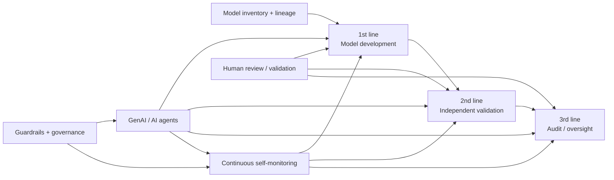

# Agentic AI in Bank Model Risk Management — Three Lines of Defense

[[index|← Home]] · [[bfsi/risk-compliance-ai]] · [[research/bfsi-ai-reading-room]] · [[ai/agentic-ai-bfsi-architecture]]

> Evidence class: `thought-leadership`. This note summarizes a public TCS banking white paper. It is **not** evidence that a named bank has deployed the described model-risk architecture or that regulators endorse a TCS product.

## Primary source

**TCS — “How AI is Transforming Model Risk Management in Banks”**  
Public source available/retrieved: 2026-09-10  
Original URL: https://www.tcs.com/what-we-do/industries/banking/white-paper/ai-transforming-model-risk-management-banks

Public author: **Trivikram Choudhary**, described on the TCS page as a model risk consultant in the Data & Analytics Group of TCS' BFSI business unit, with public specialization across model development/validation, customer acquisition, AML, stress testing and liquidity models.

## Why this source is high-density

The paper moves beyond generic “AI for risk” language and maps GenAI/AI agents to the conventional bank **three lines of defense** model-risk-management lifecycle:

1. **First line — model development**
   - model-document drafting
   - feature and data-lineage identification
   - model-iteration summaries
   - benchmark-model generation using alternative methodologies
   - automated model-performance summaries
2. **Second line — independent model validation**
   - proactive scans for unauthorized model use
   - model-inventory/tiering/use changes
   - validation-report drafting
   - documentation-vs-lifecycle-guideline checks
   - challenger/benchmark models
   - alternative-scenario / stress-test support
3. **Third line — audit and oversight**
   - audit-report drafting
   - undocumented code/document change detection
   - audit-trail summarization
4. **Across all three lines — proactive compliance**
   - continuous agentic scanning for anomalies, policy breaches and regulatory misalignment

The TCS table labels several of these interventions as high-impact, including documentation, data-lineage inconsistency detection, benchmark-model generation, unauthorized-use scanning, validation reports, audit reports, change identification and continuous self-monitoring.

## Public target-state signal

TCS explicitly describes a shift from **periodic model reviews toward continuous / near-real-time oversight**. The paper says agentic systems could support faster model-drift detection, adaptive intervention and AI-enabled validation routines operating alongside production systems.

A useful architecture-level abstraction is therefore:

**Diagram status:** editorial reconstruction of the public TCS paper; it is **not** an internal TCS architecture diagram.

## Risk-based productionization sequence

The paper also publishes a concrete adoption sequence rather than advocating immediate full autonomy:

**low-risk use case → secure scoped GenAI solution → HITL evaluation → root-cause/remediation loop → time-bounded monitored deployment → expansion to medium/high-risk areas only after controls are proven.**

TCS specifically calls for:

- defined scope and objectives
- data integration
- human-in-the-loop checkpoints
- guardrails
- expert review and contextual validation
- documented errors and root-cause analysis
- prompt/workflow/compliance remediation
- monitored performance metrics and feedback
- stronger guardrails and continuous monitoring as materiality rises

This makes the source especially relevant to the repository's status-transition lens: it is a public recipe for moving model-risk AI from **pilot/low-risk augmentation toward higher-materiality operation**, not evidence that this transition has already occurred at a specific institution.

## Cross-source debugging connection

This paper strengthens an already recurring public TCS control-plane pattern found across [[bfsi/risk-compliance-ai]]:

**inventory/context → AI/agent execution → human validation → guardrails → traceability → continuous monitoring → adaptive intervention.**

The distinctive contribution here is that the pattern is mapped directly onto the bank model-risk lifecycle and its three lines of defense, including model inventory, code/document change detection, lineage, challenger models and model drift.

### Evidence boundary

- `thought-leadership`, not `deployed`.
- No named bank implementation is identified.
- No production architecture, model provider, agent framework or transaction volume is published.
- References to SR 11-7 / SS1/23 provide regulatory context; they do not constitute regulator endorsement of TCS, GenAI, or agentic AI.
- Future-state language about autonomous reasoning, self-learning and agent-orchestrated processes is retained as a TCS viewpoint rather than converted into current-state fact.

## Related

[[bfsi/risk-compliance-ai]] · [[research/bfsi-ai-reading-room]] · [[ai/agentic-ai-bfsi-architecture]] · [[intelligence/public-operating-model-inference]]
