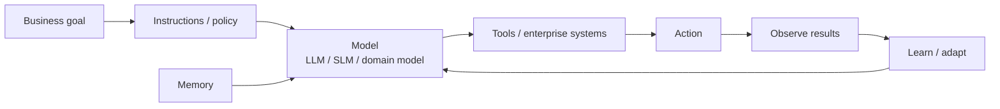
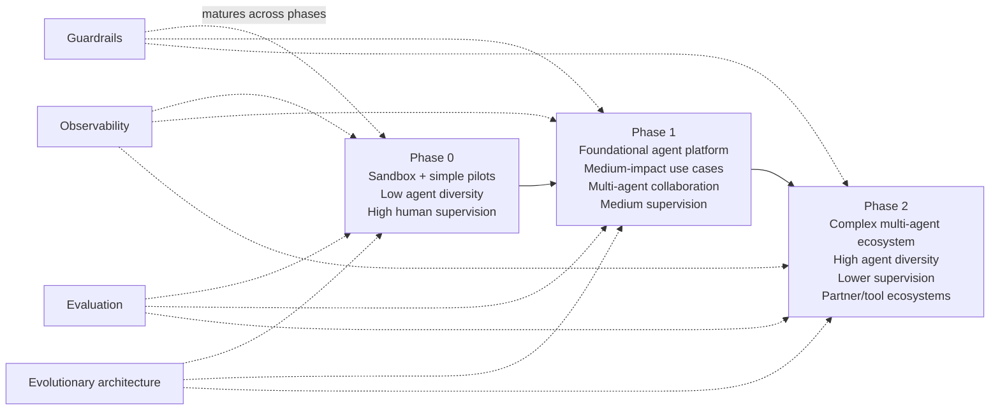
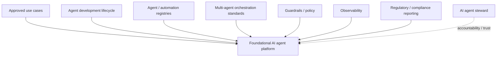
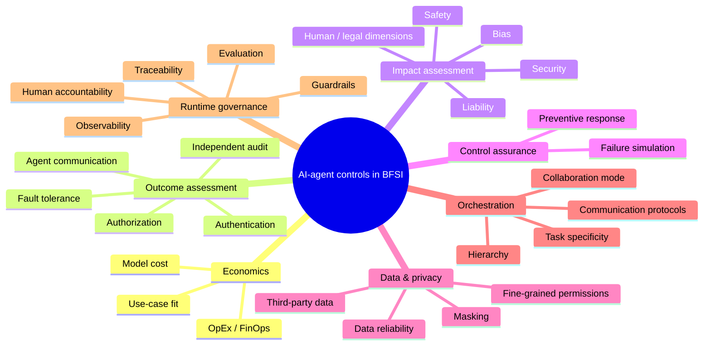

# AI Agents in Financial Services — Phased Adoption, Platform and Control Model

[[index|← Home]] · [[research/bfsi-ai-reading-room]] · [[atlas/architecture-atlas]] · [[bfsi/use-case-atlas]] · [[bfsi/risk-compliance-ai]] · [[people/public-voices]]

> **Evidence type:** `thought-leadership / architecture / operating-model`
>
> **Primary source:** https://www.tcs.com/what-we-do/industries/banking/white-paper/ai-agents-financial-services-transformation
>
> **Publication-date discipline:** the retrieved public page does not expose a reliable publication date. This note therefore does not invent one.

## Why this source matters

This is one of the clearest public TCS descriptions of **how a financial institution should evolve from isolated AI-agent experiments to an enterprise multi-agent operating model**. It is valuable because it connects use-case selection, platform architecture, governance, observability, economics and human accountability in one source.

The paper distinguishes **AI agents** from the broader **agentic AI** capability framework: individual agents can reason, plan and act with tools; agentic AI is the wider system in which multiple agents can be orchestrated with greater autonomy and adaptability.

## Public TCS agent model

TCS describes agent behaviour using a reason–act–observe–learn pattern and identifies the core building blocks as:

- models
- tools
- instructions
- memory

The paper also explicitly allows different model classes to act as the agent “brain”: LLMs, SLMs and industry/domain-specific models. That is consistent with the broader public TCS preference for polyglot/composite AI rather than a single-model architecture.

**Editorial study reconstruction only; not an internal TCS architecture diagram.**

## Where TCS says agents are a better fit

The paper argues that agents should not be used merely because they are fashionable. It explicitly says deterministic workflows, BPM or RPA may be sufficient for simpler processes.

It identifies stronger agent-fit characteristics such as:

- complex multi-step execution
- dynamic goal-oriented decisions
- evolving rules
- large volumes of structured and unstructured data
- high-speed processing where continuous human intervention is impractical

Public examples include:

| Area | Public examples in the TCS paper |
|---|---|
| Lending | loan origination, underwriting, SME credit assessment |
| Customer due diligence | KYC, AML, profiling, watchlist screening, risk scoring |
| Risk | early-warning signals, alternative-data creditworthiness, stress simulation, fraud detection/remediation |
| Investment banking | volatility analysis, trade-booking and hedge suggestions |
| Investment management | research, strategy intelligence, buy/sell recommendations, personalized advisory |
| Compliance | document/contract analysis, legal-risk identification and summaries |
| Customer / sales | next-best action, personalized communications, lifecycle optimization |
| High-speed markets | high-frequency-trading scenarios |

See [[bfsi/use-case-atlas]].

---

# Three-phase public adoption model

The most valuable artifact is **Figure 1: “Phased strategy for adoption of AI agents.”** TCS describes three maturity phases, labelled Phase 0, Phase 1 and Phase 2.

**Editorial reconstruction of the public figure description.**

## Phase 0 — controlled experimentation

TCS recommends:

- a sandbox environment
- a low-customer-impact / low-regulatory-impact process
- business + technology stakeholder buy-in
- pilots across multiple agent frameworks/tools
- value demonstration
- basic business and technical metrics
- enterprise-specific decision trees for agent-use-case selection
- guardrails and observability proportional to the use case

## Phase 1 — foundational enterprise agent platform

This is the architectural inflection point. TCS explicitly recommends:

- building a **foundational AI agent platform** from Phase 0 learnings/components
- scaling medium-impact use cases
- regulatory/compliance reporting
- moving to **multi-agent collaboration**
- establishing orchestration standards
- a scalable agent-development lifecycle
- **registries for agents and automation**
- stronger observability and guardrails
- identifying an **AI agent steward** to promote trust and acceptance

## Phase 2 — multi-agent ecosystem at scale

TCS' target phase adds:

- complex use cases
- feedback/self-learning optimization
- **FinOps** for cost control / model selection
- trusted partner agents
- agent and tool marketplaces
- observability of multi-agent behaviour
- LLMs/agents evaluating other agents
- infrastructure optimization such as caching and load balancing
- movement toward groups of agents achieving business goals with minimal human intervention

A crucial qualifier remains: the same paper says **human supervision remains necessary** and an accountable steward should ultimately remain responsible.

---

# Public control model

The paper is unusually explicit about the controls needed before financial-services agents can scale.

TCS also explicitly references lifecycle risk management across **design, development, deployment, operations/monitoring, and test/evaluation/verification/validation (TEVV)**.

## Important public distinction: autonomy ≠ absence of accountability

The paper describes increasing agent diversity and decreasing direct human supervision as maturity increases, but explicitly rejects unconstrained autonomy for financial services. Its stated direction is closer to:

This reinforces the existing public pattern in [[intelligence/public-operating-model-inference]] that BFSI agentic AI is being framed as a **governed production system**, not as unconstrained autonomous agents.

---

# Public authors / professional topic anchors

The TCS page publicly identifies:

### Sanjukta Dhar
Senior consultant in the Risk Advisory Practice in TCS' BFSI business unit. The source associates her with FinCrime technology and risk/regulatory programs including risk-finance integration, FRTB, VaR back-testing, BCBS 239 and SR 11/7.

### Aditya Walimbe
Senior consultant and chief architect with TCS BFSI; the page associates him with architecture, emerging-technology consulting, delivery and digital-partner responsibilities.

### Annamalai Anbukkarasu (Anbu)
Publicly described as Global Head of Digital and Emerging Technologies in TCS' BFSI business unit, with background spanning technology transformation, strategy, practice and CoE development.

See [[people/public-voices]].

## Evidence boundary

This paper is **thought leadership**, not proof that the three-phase model is the internal operating model of every TCS BFSI engagement or that every named use case is deployed. The architecture diagrams in this note are editorial study reconstructions of public text/figure descriptions.