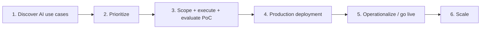
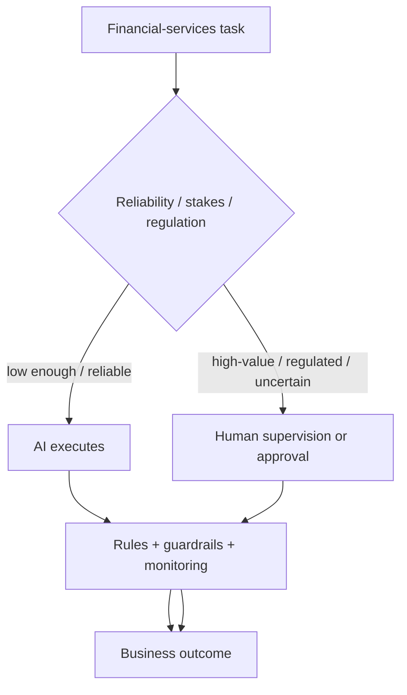
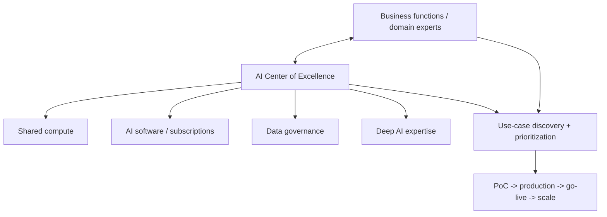
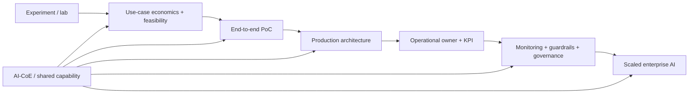

# How Banks Can Improve AI ROI — Lifecycle + AI-CoE Public Signal

[[index|← Home]] · [[research/bfsi-ai-reading-room]] · [[people/public-capability-network]] · [[intelligence/public-operating-model-inference]] · [[media/visual-reference-library]]

**Evidence type:** `thought-leadership / operating-model / production-AI lifecycle`  
**Primary source:** https://www.tcs.com/what-we-do/industries/banking/white-paper/banks-financial-services-improve-ai-roi

> This note captures what TCS publicly states. It does **not** claim that the recommended client-side AI-CoE structure is TCS' internal organization chart.

## Why this paper matters

This is unusually useful because it describes the operational mechanics between **AI idea** and **scaled financial-services production**, rather than stopping at model architecture or use-case lists.

TCS describes six lifecycle stages:

1. use-case discovery
2. use-case prioritization
3. PoC scoping, execution and evaluation
4. production deployment
5. operationalization / go-live
6. scale-up

**Diagram status:** editorial Mermaid reconstruction of the lifecycle described in the TCS page and its Figure 1; it is not a re-host of TCS artwork.

## Public production-AI requirements surfaced by the paper

Across the lifecycle, the paper explicitly emphasizes:

- end-to-end workflow integration, not isolated model accuracy
- computing cost, security and regulatory compliance during PoC evaluation
- explicit decisions about tasks that AI can perform alone versus tasks requiring human oversight
- real-user exposure to live workloads during PoC evaluation
- comprehensive production testing including edge cases
- explainability as a prerequisite for user trust
- continuous quality monitoring and human review of sampled outputs
- periodic model fine-tuning and guardrail adjustment
- flexible architecture to absorb product, workflow, regulation and model changes
- an optional business-logic/rule layer above the core LLM for faster adaptation
- a named overall owner at go-live
- KPI redesign when AI changes the human task boundary
- continuing guardrail improvement after production

## Human-in-the-loop decision model

The TCS paper gives high-value loan approval as an example where human review should remain in the loop, while more deterministic extraction/checking tasks may admit higher automation.

## AI-CoE operating-model recommendation

At the scale stage, TCS recommends that financial-services firms establish a centralized **AI Center of Excellence (AI-CoE)** using internal talent or a hybrid team that includes external consultants.

The paper says the AI-CoE should:

- oversee AI projects
- foster experience sharing
- centrally manage shared AI compute
- centrally manage software subscriptions
- centrally manage data-governance policies
- engage business stakeholders to identify and shortlist use cases
- operationalize selected use cases through the lifecycle
- concentrate deep AI skills in the CoE while domain expertise remains close to business functions

**Interpretation boundary:** this is TCS-authored advice for banks and financial institutions. It is useful evidence about how TCS publicly conceptualizes scalable AI operating models, but it must not be presented as proof of TCS' own internal reporting structure.

## Capability-network signal

### Dr. Rohit Lotlikar

TCS publicly identifies the author as:

**Senior Data Science Architect, Advanced Analytics Practice, Data & Analytics Group, TCS BFSI business unit.**

The public biography says he has more than 25 years of experience across data science, machine learning and related technologies and works on complex advanced-analytics engagements with BFSI clients.

This adds another explicit public node underneath the wider BFSI Data & Analytics / advanced-analytics capability surface already documented in [[people/public-capability-network]].

## Relationship to other public TCS material

This paper strengthens—but does not independently prove—the broader public pattern already visible across:

- [[research/bfsi-ai-reading-room#2-the-end-of-ai-pilots-a-shift-to-enterprise-ai-in-bfsi|The End of AI Pilots]] — innovation labs, AI-ready data, governance and enterprise adoption
- [[research/bfsi-ai-reading-room#7-a-4-pillar-framework-to-drive-ai-investment-roi-in-bfsi|4-pillar AI investment ROI framework]] — people, technology, data and domain
- [[atlas/architecture-atlas#2-context-fabric--architecture-reconstructed-from-tcs-figure-1|Context Fabric]] — context + governance for production agentic AI
- [[research/bfsi-ai-reading-room#5-tcs-cognitive-automation-platform|Cognitive Automation Platform]] — reusable agents, orchestration, observability and guardrails

### Derived public pattern

**Inference status:** `high-confidence-public-pattern`; still not an internal organization chart.

## What to look for in future public evidence

- named TCS BFSI implementations explicitly using this six-stage lifecycle
- customer case studies mentioning centralized AI-CoEs
- repeated use of “overall owner,” KPI redesign, guardrail lifecycle or centralized shared AI resources
- stronger connections between BFSI innovation labs and production-transition teams
- explicit mapping between Data & Analytics, AQuA/Data Science and reusable platform groups during productionization

## Source discipline

Primary source only: https://www.tcs.com/what-we-do/industries/banking/white-paper/banks-financial-services-improve-ai-roi
