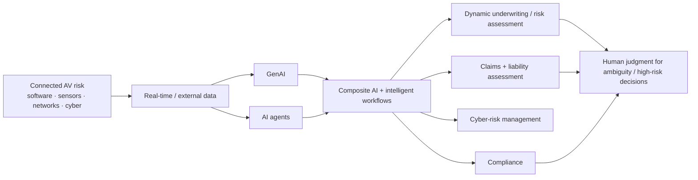
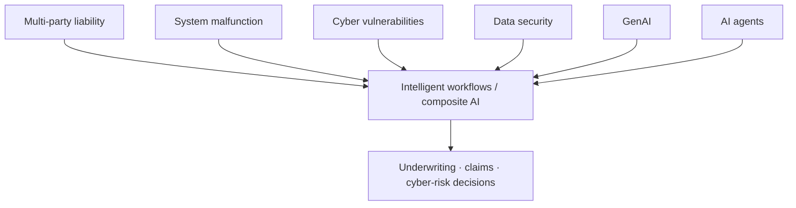
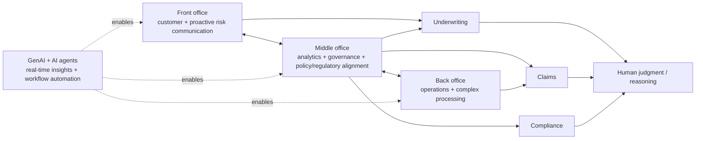

# Autonomous Vehicle Insurance — GenAI, Agents and Connected Cyber Risk

[[index|← Home]] · [[bfsi/insurance-ai]] · [[bfsi/risk-compliance-ai]] · [[media/visual-reference-library]] · [[people/public-voices]]

> **Evidence status:** `thought-leadership / architecture`. This note records what TCS publicly describes in its white paper **Adopting Generative and Agentic AI in Autonomous Vehicle Insurance**. It is not evidence of a named production deployment.

**Primary source:** https://www.tcs.com/what-we-do/industries/insurance/white-paper/generative-agentic-autonomous-vehicle-insurance

**Publication-date discipline:** the retrieved TCS page does not expose a reliable publication date. Do not invent one.

---

## Why this source matters

The paper extends the public TCS insurance-AI graph from conventional claims automation into a connected-risk environment where the insured asset itself is an AI/software/cyber-physical system.

TCS argues that autonomous vehicles change the insurance problem because liability may shift away from a single human driver toward a distributed technology ecosystem involving OEMs, software providers, sensors, networks and other third parties. The public paper connects this shift to underwriting, pricing, claims, cyber insurance, regulatory compliance and operations.

The four risk classes explicitly emphasized are:

1. **multi-party liability**
2. **system malfunction**
3. **cyber vulnerabilities**
4. **data security**

The paper says conventional historical driver-centric models are poorly suited to systemic software/sensor/network failures, distributed liability and rapidly changing cyber exposure.

---

## Public AI response model

TCS proposes combining **GenAI + AI agents + composite AI + intelligent workflows** to support dynamic profiling, automated analysis and decision support across AV insurance.

**Diagram status:** editorial reconstruction of the public TCS paper, not an internal TCS architecture diagram.

The paper explicitly frames these capabilities as a way to improve emerging-risk assessment, reduce manual intervention, accelerate decision-making and support proactive resilience. Those are thought-leadership claims, not measured deployment outcomes.

---

## Figure 1 — expanding AV cyberthreat surface

TCS' **Figure 1: The expanding cyberthreat landscape for AVs** identifies attack surfaces including:

- infrastructure breach
- charging-station hacks
- cloud breach
- data theft
- network breach
- device compromise
- sensor/camera tampering
- vehicle-control systems

This matters for insurance because the risk object is no longer only the driver/vehicle. It becomes an interconnected software, infrastructure and data ecosystem.

---

## Figure 2 — GenAI + agents for AV cyber risk

TCS' **Figure 2: How GenAI and AI agents can assist in overcoming cyber risks in AV insurance** maps AI support across the four major risk classes: multi-party liability, system malfunction, cyber vulnerabilities and data security.

A useful study abstraction is:

**Study reconstruction only.**

---

## Figure 3 — front, middle and back office powered by AI

The paper's strongest operating-model signal is **Figure 3: Front-, middle-, and back-office operations powered by AI**.

TCS' surrounding text describes:

- **front office** evolving toward proactive risk communication and coordination across insurers, manufacturers and policyholders;
- **middle office** acting as the analytical and governance layer, checking that AI-supported outputs align with policies and regulatory requirements;
- **back office** moving from routine transactions toward more complex activities as automation matures;
- **GenAI and AI agents** acting across the layers for engagement, underwriting, claims and compliance;
- **humans** increasingly concentrating on tasks needing judgment and reasoning.

**Diagram status:** editorial reconstruction from TCS' public description, not an internal architecture.

---

## Structural reading

This paper reinforces several existing public TCS patterns:

### 1. Composite AI rather than one-model thinking

TCS again frames value as a combination of AI techniques and workflows rather than one foundation model. This is consistent with [[bfsi/insurance-ai]] and the wider composite-AI vocabulary in the graph.

### 2. Human judgment moves upward, not necessarily out

The paper says routine work can increasingly be automated while underwriters and adjusters concentrate on work requiring judgment. This aligns with the existing TCS public pattern of **greater autonomy + explicit human accountability**.

### 3. Governance is embedded in operations

The middle-office description is notable: governance is not presented only as an external review function; it is part of the operational architecture that checks AI outputs against policy and regulation.

### 4. Risk becomes ecosystem-shaped

Autonomous-vehicle insurance makes the risk boundary expand from policyholder behaviour into OEM, software, sensor, cloud, network, charging and infrastructure dependencies. That is a useful public example of why financial-services AI increasingly needs context-rich and multi-source risk models.

---

## Public authors / capability signals

The TCS page publicly identifies:

- **Adiel Karthak** — heads the Property and Casualty Centre of Excellence in TCS' BFSI business unit; TCS associates his work with consulting-led engagements, domain-driven transformation, operating models, innovation and solution design.
- **Ankur Agarwal** — heads the Property and Casualty Insurance BPS Practice in TCS' BFSI business unit; TCS associates his work with large-scale operations/transformation across P&C insurance, mortgage and retail banking.
- **Meenu Mittal** — heads Business Process Services in TCS' BFSI business unit; TCS describes experience spanning banking, insurance, operations, risk management and regulatory-compliance examinations.

These are **source-published professional roles and topic associations only**. They do not establish private reporting lines, account ownership or project assignments.

---

## Evidence boundary

What the source establishes:

- TCS publicly advocates GenAI and AI-agent use in autonomous-vehicle insurance.
- TCS publicly maps AV cyber risk to underwriting, claims and compliance.
- TCS publicly describes front/middle/back-office integration and an analytical/governance middle-office role.
- TCS publicly names the three authors and their professional roles.

What it does **not** establish:

- a named customer deployment;
- production metrics;
- a TCS-owned AV-insurance product;
- an internal TCS delivery architecture;
- private organizational relationships.

## Related

[[bfsi/insurance-ai]] · [[bfsi/risk-compliance-ai]] · [[media/visual-reference-library]] · [[people/public-voices]] · [[research/bfsi-ai-reading-room]]
