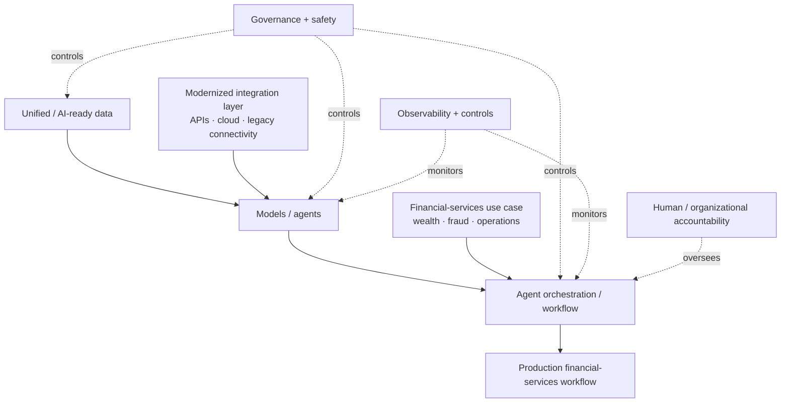

# AWS Financial Services Symposium 2026 — Agentic AI Productionization

[[index|← Home]] · [[events/public-event-watch]] · [[media/watchlist]] · [[tcs/ai-partnerships]] · [[bfsi/use-case-atlas]]

> Public-source study of the May 7, 2026 AWS Financial Services Symposium in New York, focused on what the TCS + AWS + Anthropic + CardWorks material establishes about moving financial-services agents from proof of concept to production. This note does **not** infer private customer architectures or undisclosed TCS deployments.

## Evidence summary

| Date | Source | Evidence class | Public fact | Confidence |
|---|---|---|---|---|
| May 7, 2026 | AWS Financial Services Symposium, New York | `official-event / ecosystem-corroboration` | AWS independently dates the symposium and says TCS, Anthropic and CardWorks participated in the cross-event discussion on moving AI agents from experimentation to production at scale. | High |
| 2026 event page | TCS | `completed-public-event / public-demo / product-announcement` | TCS says it unveiled two AWS-based financial-services solutions: one for wealth-management advisory and one for fraud detection. | High |
| May 7, 2026 | TCS + Anthropic + CardWorks panel | `public-event / thought-leadership` | The public panel is titled **From POC to Production: Scaling Agentic AI in Financial Services**. | High |
| May 7, 2026 | TCS + AWS fireside | `public-event / thought-leadership` | Susheel Vasudevan of TCS and Scott Mullins of AWS discussed operationalizing AI at scale in a highly regulated financial-services environment. | High |

## Primary sources

- TCS event page: https://www.tcs.com/who-we-are/events/tcs-at-aws-financial-services-symposium-2026
- AWS event recap, published June 4, 2026: https://aws.amazon.com/blogs/industries/rethink-everything-highlights-from-the-2026-aws-financial-services-symposium/

## What changed versus the existing TCS-only event evidence

The TCS event page already establishes the public product and panel signals. The AWS recap adds **independent ecosystem corroboration** and a precise event date: **May 7, 2026, New York City**.

More importantly, AWS reports that leaders from **TCS, Anthropic and CardWorks** converged on the same productionization problem: moving financial-services AI from experimentation into operational systems requires more than model capability.

AWS summarizes the top blockers discussed as:

- integration complexity
- AI-ready data
- cross-functional alignment
- centralized governance

AWS then distills three cross-event takeaways:

1. **Governance and safety are prerequisites, not afterthoughts.** For agents, AWS specifically highlights purpose-built observability and controls from day one.
2. **Modernization unlocks AI.** Legacy-system modernization is framed as the foundation for production capabilities that older architecture cannot readily support.
3. **Unified data powers the system.** A shared enterprise data foundation is described as more valuable than optimizing around any single model.

These are AWS's public recap conclusions. They should not be rewritten as formal TCS product requirements unless TCS states them separately.

## TCS-specific public signals

### Two AWS-based BFSI solutions

TCS says it unveiled two new solutions on AWS:

- **wealth-management advisory**
- **fraud detection**

Evidence status: `announced / product-capability`.

The event page does not provide sufficient public evidence to mark either solution as a named-customer `pilot`, `deployed`, or `live` implementation.

### Agentic-AI productionization panel

TCS identifies **Anthropic** and **CardWorks** alongside TCS in **From POC to Production: Scaling Agentic AI in Financial Services**.

Evidence status: `public-event / thought-leadership`.

The presence of CardWorks in the panel should not be transformed into a claim that TCS implemented a CardWorks agentic system unless a separate primary source explicitly attributes such implementation to TCS.

### Operationalizing AI at scale

TCS publicly identifies:

- **Susheel Vasudevan**, President – BFSI Americas, TCS
- **Scott Mullins**, General Manager / Worldwide Financial Services leader, AWS (title wording varies by source/date)

The session is explicitly about the operational conditions required to scale AI in a regulated industry.

## Cross-source architecture interpretation

The combined public evidence supports the following **editorial reconstruction** of the productionization concerns discussed across the event. It is **not an internal TCS or AWS architecture diagram**.



## Intelligent-debugging result

### Status transition

The event is useful because it sits explicitly on the boundary:

```text
PoC / experimentation
        ↓
productionization constraints
        ↓
AI-ready data + integration modernization
        ↓
governance + observability + controls
        ↓
production / scale
```

The event does **not** by itself prove that the two TCS AWS solutions have completed this transition.

### Partner-stack interpretation

Public roles supported by the event evidence:

- **AWS** — cloud / financial-services platform environment and production infrastructure context
- **Anthropic** — agent/model ecosystem and agent deployment discussion
- **TCS** — BFSI transformation, solution engineering, orchestration/implementation and operating-model discussion
- **CardWorks** — financial-services practitioner/customer-side panel participant in the productionization discussion

This mapping is deliberately source-bounded. It is not a claim that all four parties jointly operate one production architecture.

### Pattern impact

This source strengthens an existing repository pattern rather than creating a new inference:

**production agentic AI in BFSI repeatedly converges on data readiness + modernization/integration + governance + observability + human/organizational accountability.**

That pattern is consistent with other public TCS BFSI material and with regulatory-control themes already captured in [[regulations/india-ai-bfsi]]. Because this event is primarily one ecosystem event family, no new higher-order operating-model inference is promoted from this note alone.

## Evidence boundaries

- `announced / product-capability`: the two TCS AWS solutions for wealth advisory and fraud detection.
- `completed-public-event`: AWS Financial Services Symposium, May 7, 2026.
- `thought-leadership / public-event`: TCS + Anthropic + CardWorks productionization panel and TCS + AWS operationalization discussion.
- **Not established:** named production customer for either TCS AWS solution.
- **Not established:** TCS ownership of any specific CardWorks production agent system.
- **Not established:** an internal joint TCS/AWS/Anthropic/CardWorks reference architecture.

## Related

[[events/public-event-watch#aws-financial-services-symposium-2026]] · [[media/watchlist#aws-financial-services-symposium-2026]] · [[tcs/ai-partnerships]] · [[bfsi/use-case-atlas]] · [[intelligence/public-operating-model-inference]]
