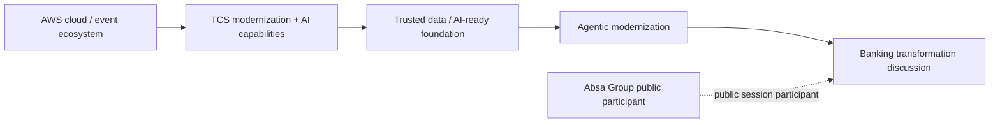

# AWS Summit Johannesburg 2026 — Absa banking AI + agentic modernization signal

[[index|← Home]] · [[events/public-event-watch]] · [[tcs/ai-partnerships]] · [[bfsi/banking-ai]] · [[media/watchlist]]

## Why this matters

This completed public event adds a useful **named-bank / ecosystem / agentic-modernization** signal to the TCS BFSI AI graph.

It does **not** establish that Absa has deployed a specific TCS agentic-AI product. The public evidence supports only the narrower claims below.

## Event

- **Event:** AWS Summit Johannesburg 2026
- **Date:** August 19, 2026
- **Location:** Gallagher Convention Centre, Johannesburg
- **Evidence classes:** `completed-public-event / official-post / public-demo / product-capability / ecosystem-corroboration`
- **TCS event page:** https://www.tcs.com/who-we-are/events/tcs-at-aws-summit-johannesburg-2026
- **AWS event page:** https://aws.amazon.com/events/summits/johannesburg/
- **Official TCS regional post:** https://www.linkedin.com/posts/tata-consultancy-services-middle-east-africa_awssummit-tcsmea-innovation-activity-7495866071048949760-o2Ft
- **Official TCS AI & Advanced Tech post stream:** https://www.linkedin.com/showcase/tcs-ai-and-advancedtech/

## Verified public facts

### 1. TCS positioned the summit around AI-ready modernization and agentic transformation

TCS' event page describes the public journey as:

**infrastructure modernization → AI-ready cloud/data/platform foundations → AI-powered innovation → agentic intelligence → measurable business outcomes**.

The page explicitly says TCS and AWS were demonstrating how enterprises can move beyond isolated pilots toward enterprise-scale transformation using cloud, data, AI and agentic intelligence.

The TCS page also advertises:

- live demonstrations and industry-specific solutions
- Adaptive AI Cloud Suite on AWS for legacy/workload modernization
- AI-ready foundations through cloud, data and platform modernization
- agentic, AI-led process transformation for faster decisions and productivity

This is `product-capability / public-demo / public-event positioning`, not production customer evidence.

## 2. Named-bank public session: Absa Group

An official **Tata Consultancy Services – Middle East & Africa** post identifies a summit breakout session titled **“Next-Gen Banking with Data and AI.”**

The post publicly names:

- **Robert Benvenuti — Chief Information Officer, Data & Applied Artificial Intelligence, Absa Group**
- **Ranjit Sinha — Unit Head & Global Client Director – BFSI, TCS**
- **Vinoth Subramanian — Head – Banking and Financial Services Unit, Africa, TCS**

The session is described as sharing perspectives on how **trusted data, cloud and AI can help financial institutions drive innovation and unlock business value at scale**.

### Evidence boundary

This establishes a **named-bank public event relationship and joint banking-AI discussion**. It does **not** establish that Absa uses TCS BaNCS, Cognitive Automation Platform, AI WisdomNext, AI Spectrum for BFSI, Agentic VM Migration, or another TCS AI product.

No deployment status, architecture, model stack, production KPI or contract scope should be inferred from the event participation.

## 3. TCS + AWS co-launch: TCS Agentic VM Migration

The same official TCS regional post states that TCS and AWS **co-launched TCS Agentic VM Migration** at the summit.

The public post identifies:

- **Ashish Vyas — Head, Strategic Solutions, CoE, TCS**
- **Brian Bohan — Director, Partner Strategy & Growth, AWS**

and says the solution was showcased around AI-powered modernization and governance.

The official TCS AI & Advanced Tech post also describes the capability as helping enterprises accelerate legacy modernization through AI-powered automation and governance.

### Scope discipline

This is a **cross-industry modernization capability** shown in a BFSI-heavy event context. Public sources do not establish that Agentic VM Migration is a banking-specific product or that Absa has deployed it.

Do not merge this capability with TCS BaNCS, AI WisdomNext, Cognitive Automation Platform, AI Spectrum for BFSI, Quartz or Context Fabric without a source explicitly doing so.

## 4. Independent AWS event corroboration

AWS independently confirms:

- the summit date: **August 19, 2026**
- the event focus on cloud and AI innovation
- agenda coverage spanning data, agentic AI, migration/modernization and customer showcases
- that the summit included 80+ sessions and an AWS for Industries zone

AWS' event page does not independently establish the Absa/TCS session claims or the product relationship above; those remain attributed to the official TCS regional posts.

## Cross-source debugging

### Public operating pattern strengthened

This event adds another public instance of the recurring sequence:

**modernize infrastructure → establish trusted data → build AI-ready foundations → introduce agentic automation → scale business outcomes**.

The pattern is consistent with other public TCS/AWS and TCS BFSI material, but this single event does not justify a new higher-order inference by itself.

### Named-bank evidence status

Absa should be represented as:

`named-bank / completed-public-event / joint-public-session`

not as:

`pilot`, `deployed`, `public-case-study`, or `customer implementation`.

### Partner-stack interpretation

The public stack relationship visible here is:

> **Editorial reconstruction only.** This diagram is a study aid based on public event language. It is not an internal TCS, AWS or Absa architecture.

## Contradiction / overreach checks

- No source establishes that Absa deployed Agentic VM Migration.
- No source establishes that Absa uses TCS BaNCS or another named TCS BFSI platform at this event.
- No source establishes that the TCS/AWS capability shown is the same as AWS Transform.
- No production KPI, model provider or runtime architecture is public in the cited material.
- Event participation must not be interpreted as procurement, endorsement or implementation evidence.

## Source set

1. TCS event page — AWS Summit Johannesburg 2026  
   https://www.tcs.com/who-we-are/events/tcs-at-aws-summit-johannesburg-2026
2. AWS Summit Johannesburg 2026 official page  
   https://aws.amazon.com/events/summits/johannesburg/
3. TCS Middle East & Africa official LinkedIn post — event recap / Absa session / Agentic VM Migration launch  
   https://www.linkedin.com/posts/tata-consultancy-services-middle-east-africa_awssummit-tcsmea-innovation-activity-7495866071048949760-o2Ft
4. TCS AI & Advanced Tech official LinkedIn page / post stream  
   https://www.linkedin.com/showcase/tcs-ai-and-advancedtech/

## Related

[[events/public-event-watch]] · [[tcs/ai-partnerships]] · [[bfsi/banking-ai]] · [[atlas/architecture-atlas]] · [[media/watchlist]]
