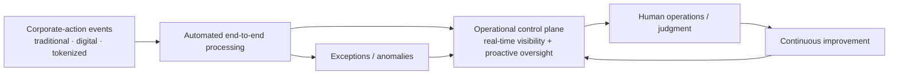

# TCS BaNCS Corporate Actions — From Exception Queues to Operational Control Planes

[[index|← Home]] · [[bfsi/capital-markets-ai]] · [[events/public-event-watch]] · [[intelligence/public-operating-model-inference]]

> Public-source study only. This note records what TCS and ISITC publicly state; it does not infer internal customer architecture or claim that every institution in the deployment footprint uses every AI capability.

## Evidence snapshot

**Event:** ISITC 32nd Annual Securities Operations Summit  
**Dates:** March 29–31, 2026  
**Location:** Boston, Massachusetts  
**TCS forum:** March 30, 2026, 3:15–3:35 PM  
**Evidence class:** `deployed / product-capability / completed-public-event`  
**TCS source:** https://www.tcs.com/who-we-are/events/tcs-bancs-isitc-annual-securities-operations-summit-2026  
**Independent event source:** https://isitc.org/events/2026/32nd-annual-securities-operations-summit/

## Material public facts

TCS BaNCS publicly described its Corporate Actions solution at the summit as an **AI-enabled intelligent solution deployed at more than 60 leading financial institutions**.

The same source says the solution provides automated end-to-end processing across multiple corporate-action event types and product types and supports **traditional, digital and tokenized asset forms**.

The deployment statement is important but must be read narrowly: it establishes a 60+ institution footprint for the **AI-enabled Corporate Actions solution as a whole**. It does not establish that every institution has activated the same AI functionality, nor does it identify the institutions or their individual AI operating states.

## Architecture / operating-model signal

TCS titled its March 30 innovation forum:

**“Moving from Exception Queues to Operational Control Planes in Corporate Actions.”**

The public description says firms are looking beyond exception queues toward a control-plane model intended to provide:

- real-time visibility
- proactive oversight
- continuous improvement across the corporate-actions lifecycle

This is a more specific capital-markets control-plane signal than generic automation language. It shifts the public target model from simply processing exceptions to supervising the lifecycle continuously.

### Editorial reconstruction



**Diagram status:** editorial reconstruction of the public TCS event language; it is **not** an internal TCS architecture diagram.

## Cross-source debugging

ISITC independently confirms that its March 29–31 summit focused on AI, digital assets, T+1, regulatory change and securities-operations transformation. Its broader agenda included a session on **AI at Scale** describing the industry shift from exception handling toward predictive analytics and production AI in securities operations.

That context independently validates the event/date/topic environment, but it does **not** independently verify TCS' 60+ deployment count; that numerical claim remains attributed to TCS.

### Status interpretation

```text
Corporate Actions platform
        ↓
AI-enabled product capability
        ↓
60+ financial-institution solution footprint (TCS-reported)
        ↓
public control-plane operating-model language
```

Do **not** rewrite this chain as “TCS has 60+ live AI-agent deployments in corporate actions.” The public source does not establish that.

## Intelligence effect

This materially strengthens an existing repository pattern rather than creating a new higher-order inference:

**workflow automation → lifecycle visibility → operational control plane → proactive oversight → continuous improvement.**

The wording converges with other TCS public material in investment operations and risk/compliance around orchestration, embedded controls, governance and continuous monitoring. However, this single TCS product/event source is not sufficient on its own to create a new operating-model inference.

## Related

[[bfsi/capital-markets-ai]] · [[events/public-event-watch]] · [[bfsi/risk-compliance-ai]] · [[atlas/architecture-atlas]] · [[intelligence/public-operating-model-inference]]
