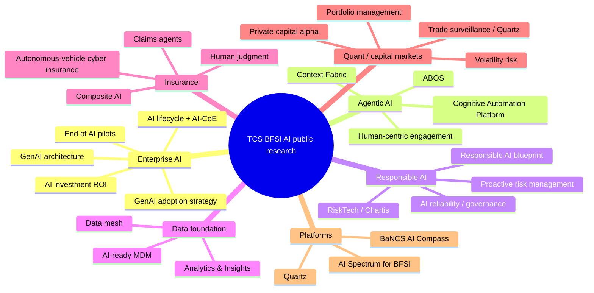
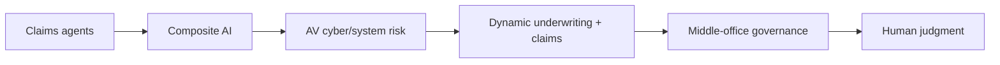

# TCS BFSI AI — Public Research Reading Room

[[index|← Home]] · [[atlas/architecture-atlas]] · [[intelligence/public-operating-model-inference]] · [[people/public-capability-network]] · [[media/watchlist]]

> Curated public TCS research selected for **information density and abstraction value**. Each entry records what the source actually reveals, so the collection remains more useful than a bookmark dump.

## Research map

---

# Tier A — Core documents

These are the highest-density public sources for understanding the current TCS BFSI AI vocabulary and architecture.

## 1. Context Fabric — The Backbone of Agentic AI in BFSI

**Priority:** ⭐⭐⭐⭐⭐  
**Evidence type:** `thought-leadership / architecture`  
**Open:** https://www.tcs.com/what-we-do/industries/banking/white-paper/context-fabric-backbone-agentic-ai-bfsi

### Why this document is structurally important

It makes “context” a first-class enterprise layer for agentic AI and explicitly connects:
- process/task context
- regulations
- enterprise policy
- semantic/ontology context
- data/tool context
- governance
- doer agents
- critique/compliance agents
- human oversight

### Named public authors

- Prab Pitchandi
- Prasad Chitta
- Indra Chourasia

### Cross-links

[[atlas/architecture-atlas#2-context-fabric--architecture-reconstructed-from-tcs-figure-1]] · [[people/public-capability-network]] · [[tcs/public-language-glossary#context-fabric]]

---

## 2. The End of AI Pilots: A Shift to Enterprise AI in BFSI

**Priority:** ⭐⭐⭐⭐⭐  
**Evidence type:** `thought-leadership / operating model`  
**Open:** https://www.tcs.com/what-we-do/industries/banking/white-paper/end-of-ai-pilots-shift-to-enterprise-ai-bfsi

### What it reveals

The public TCS argument is that BFSI needs to move beyond scattered AI pilots into an enterprise approach. The paper discusses:
- AI innovation labs
- use-case identification/prioritization
- MVP-based execution
- AI-ready data
- tools/data/governance consolidated for experimentation
- transition from innovation to enterprise adoption

### High-density public use-case signal

TCS explicitly names high-value functions such as:
- customer service
- risk/compliance
- regulatory reporting
- fund performance

### Inference connection

This paper is central evidence for [[intelligence/public-operating-model-inference#inference-2--the-dominant-20252026-strategic-transition-is-ai-pilots--governed-enterprise-production]].

---

## 3. A Blueprint for Responsible AI in BFSI

**Priority:** ⭐⭐⭐⭐⭐  
**Evidence type:** `thought-leadership / governance`  
**Open:** https://www.tcs.com/what-we-do/industries/banking/white-paper/responsible-ai-blueprint-bfsi

### What it reveals

TCS frames responsible AI as a strategic requirement for enterprise BFSI adoption and calls for a unified approach combining:
- regulatory policies
- standards
- frameworks
- platforms
- governance across AI lifecycle

Public risk examples include:
- unfair lending
- data breaches
- regulatory penalties
- trust erosion
- financial instability

### Named public author

Prasad Chitta — publicly described by TCS as leading AI and analytics strategy for the BFSI sector.

Related: [[bfsi/risk-compliance-ai]] · [[people/public-capability-network#prasad-chitta]]

---

## 4. Generative AI in Finance: Opening up a Sea of Possibilities

**Priority:** ⭐⭐⭐⭐⭐  
**Evidence type:** `thought-leadership / architecture`  
**Open:** https://www.tcs.com/what-we-do/industries/banking/white-paper/generative-ai-finance-insurance-industry

### What it reveals

- enterprise-wide AI rather than isolated solutions
- industry-led, data-fueled, ecosystem-enabled foundation
- validation/transparency requirements
- regulatory, compliance and privacy considerations early in development
- a public **TCS AI Architecture for BFSI** figure
- purposive/contextual task agents above models/data and below AI-augmented work systems

### Public executive champions on the page

- Shankar Narayanan
- Susheel Vasudevan
- Babu Unnikrishnan
- Siva Ganesan
- Nidhi Srivastava
- S. Baskar

Related: [[atlas/architecture-atlas#8-genai-for-bfsi-operating-model--public-tcs-framing]] · [[people/public-voices]]

---

## 5. TCS Cognitive Automation Platform

**Priority:** ⭐⭐⭐⭐⭐  
**Evidence type:** `product-capability + public-case-study metrics`  
**Open:** https://www.tcs.com/what-we-do/industries/insurance/solution/cognitive-automation-platform-transform-banking

### Public capability density

- agentic mesh
- agent marketplace
- 200+ pre-built reusable domain-trained agents
- agent studio/builder
- event-driven triggers
- knowledge fabric / RAG
- responsible-agentic-AI guardrails
- multimodal inputs
- governance, observability and evaluation
- business + IT operations

### Public scale/evidence claims

The page states 60+ wins and 30+ live implementations and includes anonymous BFSI case examples. Treat all outcome metrics as **TCS-published claims**.

Related: [[atlas/architecture-atlas#3-tcs-cognitive-automation-platform--public-capability-topology]] · [[bfsi/public-implementations]]

---

## 6. TCS AI Spectrum for BFSI

**Priority:** ⭐⭐⭐⭐  
**Evidence type:** `product-capability / composite AI`  
**Open:** https://www.tcs.com/what-we-do/industries/banking/solution/tcs-ai-spectrum-for-bfsi

### What it reveals

TCS explicitly frames **Composite AI** as predictive AI + GenAI and describes an NVIDIA-backed path using:
- NeMo Curator
- embedding models
- NeMo Customizer
- NeMo Guardrails
- NIM
- TensorRT

Related: [[atlas/architecture-atlas#4-tcs-ai-spectrum-for-bfsi--nvidia-backed-composite-ai-path]]

---

# Tier B — Data, architecture and operating model

## 7. A 4-pillar Framework to Drive AI Investment ROI in BFSI

**Priority:** ⭐⭐⭐⭐  
**Open:** https://www.tcs.com/what-we-do/industries/banking/white-paper/driving-ai-investment-roi-bfsi-industry

### Public capability-network signal

Authors/public biographies include:
- Jatinder Singh Sidhu — head of Advanced Quantz & Analytics and Data Science groups in TCS BFSI
- Prab Pitchandi — VP & Global Head, Data & Analytics, TCS BFSI

This makes the paper useful not only for ROI concepts but for understanding publicly visible intersections between advanced quant/data-science and the wider BFSI Data & Analytics group.

Related: [[people/public-capability-network]]

---

## 7A. How Banks Can Improve Artificial Intelligence ROI

**Priority:** ⭐⭐⭐⭐⭐  
**Evidence type:** `thought-leadership / operating-model / production-AI lifecycle`  
**Open:** https://www.tcs.com/what-we-do/industries/banking/white-paper/banks-financial-services-improve-ai-roi

### Why this is unusually useful

TCS explicitly describes a six-stage lifecycle from use-case discovery through prioritization, PoC, production deployment, go-live and scale. The paper is especially valuable because it exposes what TCS publicly treats as necessary for moving AI beyond a successful demo:

- end-to-end workflow integration
- security and regulatory-compliance evaluation during PoC
- explicit human-vs-AI task boundaries
- production edge-case testing
- explainability and user trust
- continuous quality monitoring and human sampling
- guardrail adjustment and model fine-tuning
- flexible architecture for regulation/model/workflow changes
- operational ownership and KPI redesign at go-live
- centralized scaling through an AI Center of Excellence

### AI-CoE signal

The paper recommends that financial-services firms establish a centralized **AI Center of Excellence (AI-CoE)** that oversees AI projects, shares experience, manages common compute/software/data-governance resources and concentrates deep AI skills while business functions retain domain expertise.

**Interpretation boundary:** this is TCS-authored advice for client operating models, not evidence of TCS' own internal reporting structure.

### Named public author

Dr. Rohit Lotlikar — Senior Data Science Architect in the Advanced Analytics Practice of the Data & Analytics Group of TCS' BFSI business unit.

Deep note: [[research/ai-roi-lifecycle-and-coe]] · visual: [[media/visual-reference-library#ai-project-lifecycle--figure-1]]

---

## 8. Modern MDM: AI-ready Data to Scale Enterprise AI in BFSI

**Priority:** ⭐⭐⭐⭐  
**Open:** https://www.tcs.com/what-we-do/industries/banking/white-paper/modern-mdm-ai-ready-enterprise-data-bfsi

### What it reveals

TCS treats trusted/AI-ready data, MDM, governance and customer/business context as foundations for scaling enterprise AI. This source is important for preventing an overly model-centric understanding of TCS' AI positioning.

Related: [[intelligence/public-operating-model-inference#inference-4--context-is-being-elevated-to-a-strategic-control-layer-not-treated-as-prompt-engineering]]

---

## 9. Data Mesh for Innovation and Growth in BFSI

**Priority:** ⭐⭐⭐⭐  
**Open:** https://www.tcs.com/content/tcs/global/en/what-we-do/industries/banking/white-paper/data-mesh-implementation-bfsi

### Unique public operating-model signal

The public author biography for Vishal Singh says he played a key role in building the **CDO AI ML Lab in London**, described as an ecosystem for co-creating data-science solutions for global financial-services organizations.

This is a valuable public clue about the long-standing lab/co-creation layer behind newer agentic-AI programs.

Related: [[people/public-capability-network#london-cdo-ai-ml-lab]]

---

## 10. TCS BFSI Analytics & Insights ebook

**Priority:** ⭐⭐⭐⭐  
**Evidence type:** `historical public capability snapshot`  
**PDF:** https://www.tcs.com/content/dam/global-tcs/en/pdfs/what-we-do/industries/banking/abstract/bfsi-analytics-and-insights-ebook-revised.pdf

### Why preserve this older source

It publicly described BFSI Analytics & Insights as a deep-domain-focused unit with **~15K multi-skilled consultants** at that publication point and lists:
- consulting/advisory
- modernization/transformation
- advanced quant/analytics
- decision intelligence
- data-led innovation
- CDO AI ML Lab co-creation

**Do not treat ~15K as a current 2026 headcount.** It is useful as historical capability depth.

Related: [[people/public-capability-network#public-scale-signal--bfsi-analytics--insights]]

---

# Tier B — Agentic financial-platform evolution

## 11. TCS BaNCS AI Compass

**Priority:** ⭐⭐⭐⭐⭐  
**Evidence type:** `announced product capability`  
**Open:** https://www.tcs.com/who-we-are/newsroom/press-release/tcs-bancs-ai-upgrade-new-core-tool-supercharge-innovation

### Publicly named use cases

Banking:
- onboarding
- credit underwriting
- tailored multi-channel query resolution

Securities services:
- tax-treatment prediction
- dividend vs interest classification
- missing-data detection in events
- complex-document ingestion/interpretation

### Public controls

- responsible AI
- explainability/traceability
- guardrails
- audit logging
- human understanding/trust
- no-code configurable interface for agents

### External public validation signal

The announcement includes a quote from Jennifer Smith, EVP & CTO, Zions Bancorporation, describing the potential value for TCS BaNCS users.

Related: [[tcs/tcs-bfsi-ai-offerings]] · [[bfsi/use-case-atlas]]

---

## 12. ABOS — Redefining Banking Intelligence

**Priority:** ⭐⭐⭐⭐⭐  
**Evidence type:** `thought-leadership/product concept`  
**Open:** https://www.tcs.com/what-we-do/products-platforms/tcs-bancs/articles/redefining-banking-intelligence-abos

### Named architecture layers

- Genesis layer
- Hyper-composability layer
- Autonomous product layer
- Autonomous watchdog layer
- Adaptive AI engine

The public article calls ABOS a **fully agentic AI-driven bank operating platform** concept.

Related: [[atlas/architecture-atlas#7-abos--public-fully-agentic-banking-operating-platform-concept]] · [[tcs/public-language-glossary#abos]]

---

## 13. Agentic AI for Human-centric Engagement in Financial Services

**Priority:** ⭐⭐⭐⭐  
**Open:** https://www.tcs.com/what-we-do/products-platforms/tcs-bancs/articles/agentic-ai-human-centric-engagement-financial-services

### High-value public example

TCS states that a leading financial institution in India implemented AI agents that:
- detect onboarding friction
- switch users to a faster KYC validation path
- dynamically sequence lending, investment or insurance offers based on context/intent

Customer identity remains unnamed in the source and must remain unnamed here.

Related: [[bfsi/use-case-atlas#kyc--onboarding]]

---

# Tier B — Risk / governance

## 14. Augmenting the Reliability of AI in Financial Services

**Priority:** ⭐⭐⭐⭐  
**Open:** https://www.tcs.com/what-we-do/industries/banking/white-paper/ai-financial-services-risk-governance

### Public focus

- AI risk
- regulatory guidelines
- risk-management standards
- tolerance limits
- foundational governance framework
- reliability and trust

Authors include Indra Chourasia, Sivagurunathan Ranganathan and Prab Pitchandi.

---

## 15. AI in Risk Management — A Game Changer for Banks and Insurers

**Priority:** ⭐⭐⭐⭐  
**Open:** https://www.tcs.com/what-we-do/industries/banking/white-paper/ai-in-risk-management-a-game-changer-for-banks-and-insurers

Companion TCS/Chartis research:
- https://www.tcs.com/insights/global-studies/risktech-role-risk-management-bfsi-industry
- https://www.tcs.com/insights/global-studies/risktech-role-mitigate-emerging-risks-banking
- https://www.tcs.com/insights/global-studies/risktech-risk-management-capital-market-firms
- https://www.tcs.com/insights/global-studies/risktech-role-insurance-risk-management

Related: [[bfsi/risk-compliance-ai]]

---

# Tier C — Quant / capital markets specialization

## 16. Leveraging AI for Volatility Risk Management in Financial Markets

**Priority:** ⭐⭐⭐⭐  
**Open:** https://www.tcs.com/what-we-do/industries/banking/white-paper/leveraging-ai-volatility-risk-management-financial-markets

### Public capability-network value

This page names:
- Baljeet Saini — Chief Architect, Data Science & ML Engineering, AQuA
- Jatinder Singh Sidhu — head of AQuA and Data Science groups

The biographies explicitly connect enterprise-scale ML engineering, quantitative solutions and financial engineering to the BFSI capability surface.

---

## 17. AI Models and Tools for Better Portfolio Management

**Priority:** ⭐⭐⭐⭐  
**Open:** https://www.tcs.com/what-we-do/industries/capital-markets/white-paper/ai-models-tools-better-portfolio-management

Public authors include:
- Sreeja Ashok — algorithmic trading, risk management, predictive modelling
- Vikrant Karale — loan-default prediction, portfolio optimization
- Jatinder Singh Sidhu — AQuA/Data Science leadership

Related: [[people/public-capability-network#advanced-quantz--analytics--data-science-cluster]]

---

## 18. The Role of AI in Generating Alpha in Private Capital Firms

**Priority:** ⭐⭐⭐  
**Open:** https://www.tcs.com/what-we-do/industries/capital-markets/white-paper/private-capital-firms-ai-generate-alpha

Authors include Indra Chourasia and Prab Pitchandi, showing the Data & Analytics cluster extending into private-capital investment workflows.

---

# Tier C — Insurance specialization

## 19. Adopting Generative and Agentic AI in Autonomous Vehicle Insurance

**Priority:** ⭐⭐⭐⭐  
**Evidence type:** `thought-leadership / architecture / connected-risk operating model`  
**Open:** https://www.tcs.com/what-we-do/industries/insurance/white-paper/generative-agentic-autonomous-vehicle-insurance

### Why it is structurally useful

This source shifts the insurance problem from driver-centric actuarial history toward a connected cyber-physical risk system. TCS explicitly maps autonomous-vehicle insurance risk across:

- multi-party liability
- system malfunction
- cyber vulnerabilities
- data security

It then combines **GenAI, AI agents, composite AI and intelligent workflows** for dynamic profiling, automated analysis, underwriting, claims, cyber-risk management and compliance.

### Operating-model signal

The paper's Figure 3 is especially useful because TCS describes the **middle office as an analytical and governance layer** that aligns AI-supported outputs with policy and regulatory requirements, while the front office becomes more proactive around risk communication and the back office moves toward complex processing. Humans remain focused on work requiring judgment and reasoning.

### Public figures

- Figure 1 — expanding AV cyberthreat landscape
- Figure 2 — GenAI + agents across AV cyber-risk classes
- Figure 3 — front/middle/back-office operations powered by AI

### Named public authors

- Adiel Karthak — head, Property and Casualty Centre of Excellence, TCS BFSI
- Ankur Agarwal — head, Property and Casualty Insurance BPS Practice, TCS BFSI
- Meenu Mittal — head, Business Process Services, TCS BFSI

Deep note: [[research/autonomous-vehicle-insurance-agentic-ai]] · visuals: [[media/visual-reference-library#autonomous-vehicle-insurance--figures-13]] · domain: [[bfsi/insurance-ai]].

---

# Consumption paths

## Architecture-first path

## Governance-first path

## Data/ML-first path

## Productionization-first path

## Insurance connected-risk path

## Banking-platform-first path

## Related

[[atlas/architecture-atlas]] · [[bfsi/use-case-atlas]] · [[people/public-capability-network]] · [[media/watchlist]] · [[intelligence/public-operating-model-inference]]