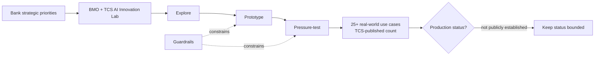

# BMO + TCS AI Innovation Lab — public evidence study

[[index|← Home]] · [[bfsi/public-implementations]] · [[bfsi/banking-ai]] · [[intelligence/public-operating-model-inference]]

> Evidence discipline: this note records only public professional / official material. The lab and 25+ use-case figure are public; no production status, architecture, project ownership or internal relationship is inferred beyond what sources explicitly state.

## Evidence summary

### TCS Financial Services and Insurance — 25 March 2026

**Evidence class:** `official-post / named-customer co-innovation / implementation-development evidence`  
**Source:** https://www.linkedin.com/posts/tcs-financial-services-and-insurance_futureofbanking-aifirst-aiinfinancialservices-activity-7442578858551332864-UmHX

TCS publicly states that it hosted Bank of Montreal (BMO) leadership to mark the launch of an **AI Innovation Lab**, described as a co-innovation hub intended to accelerate BMO's AI journey.

The post says BMO and TCS teams use the lab to:

- explore high-priority AI use cases aligned with bank priorities
- prototype those use cases
- pressure-test them
- work with dedicated teams and guardrails
- use a pragmatic, outcome-driven development model

TCS further states that this collaboration had already helped deliver **more than 25 real-world use cases**.

### BMO public professional corroboration — 9 March 2026

**Evidence class:** `customer-professional corroboration / official-professional-post`  
**Source:** https://www.linkedin.com/posts/geoff-langdon-tor_ai-technology-offshore-activity-7436745720516354052-MwYK

A public post by **Geoff Langdon of BMO** independently corroborates the opening of the **BMO AI Innovation Lab** at the TCS Chennai campus. The post describes the lab as a place where BMO-TCS account practitioners can develop skills in new and emerging AI technologies.

This independently supports the existence/opening and BMO-TCS co-innovation context of the lab. It does **not** independently validate the TCS-published 25+ use-case count or establish production deployment of those use cases.

### BMO public AI operating context — current public site

**Evidence class:** `customer-public-context`  
**Source:** https://ai.bmo.com/

BMO's public AI site states that the bank is applying AI across client experience, team augmentation and business automation, including **agentic solutions in client services and credit decisioning**. It also publishes responsible-AI principles covering accountability, human oversight, fairness, transparency, explainability, privacy, reliability and security.

This source establishes BMO's broader current AI direction and governance posture. It does **not** attribute those individual BMO AI capabilities to TCS unless another public source explicitly makes that connection.

## Status classification

| Item | Status | Reason |
|---|---|---|
| BMO + TCS AI Innovation Lab | `official-post / named-customer co-innovation` | Both TCS and a public BMO professional corroborate the lab opening. |
| 25+ real-world AI use cases | `implementation-development evidence` | TCS says the collaboration helped deliver 25+ real-world use cases, but does not state that they are all production-live. |
| Individual use-case deployment | `unknown` | Public sources do not enumerate the 25+ cases or disclose their production state. |
| Agentic AI at BMO | `customer-public-context` | BMO says it deploys agentic solutions in client service and credit decisioning, but the public BMO page does not attribute those solutions to TCS. |

## Intelligent-debugging interpretation

The evidence shows a concrete named-bank **co-innovation mechanism** rather than only a generic consulting relationship:

**Diagram status:** editorial reconstruction of public source language; it is **not** an internal TCS or BMO architecture diagram.

## Cross-source pattern

This case reinforces an existing public TCS productionization pattern:

**co-innovation environment → prioritized use cases → rapid prototyping → pressure testing + guardrails → reusable / enterprise-grade AI candidates → productionization only when separately evidenced.**

It aligns with other public TCS evidence around Gemini Experience Centers, AI accelerators and financial-services PoC-to-production discussions, but this note does not collapse those programs into one architecture or operating model.

## Evidence boundary / non-claims

Do **not** infer from these sources that:

- all 25+ use cases are deployed in production
- all 25+ use cases are agentic AI
- TCS built every AI system referenced on BMO's public AI site
- a specific BMO business unit owns the lab beyond what public sources state
- any unpublished BMO project, architecture, model, data set, team structure, reporting relationship or commercial arrangement exists

## Why this matters

This is a high-value named-bank signal because it documents a repeatable public mechanism for converting strategic banking AI priorities into tested use cases under guardrails. It is stronger than event-demo evidence, while remaining below `deployed` until a source explicitly establishes production operation for specific use cases.

## Related

[[bfsi/public-implementations]] · [[bfsi/banking-ai]] · [[events/public-event-watch]] · [[tcs/public-ai-initiative-index]] · [[intelligence/public-operating-model-inference]]
