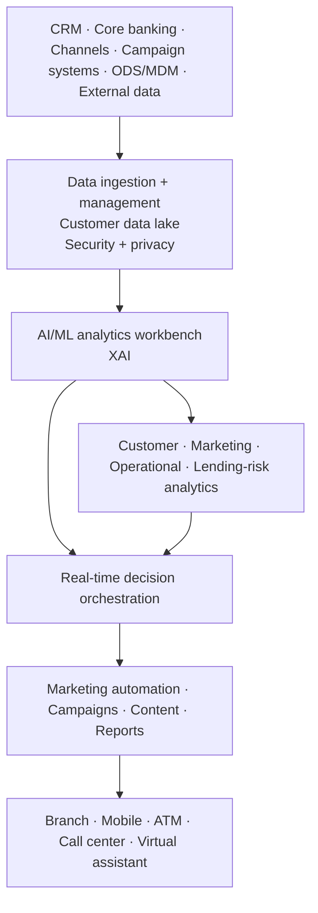

# TCS Customer Intelligence & Insights — Banking AI Evolution

[[bfsi/banking-ai]] · [[bfsi/public-implementations]] · [[media/visual-reference-library]] · [[media/watchlist]]

> Public-source study only. This note separates the **named historical CI&I deployments** from the **current CI&I product architecture** and does not assume the newer agentic capabilities were deployed at those customers.

## Evidence chain

### 1. Five Star Bank — announcement to public implementation evidence — `announced -> public-case-study / deployed`

**Initial announcement:** 11 August 2022  
**TCS source:** https://www.tcs.com/who-we-are/newsroom/press-release/five-star-bank-partners-tcs-drive-digital-transformation-enhance-customer-experience  
**Later public project page:** https://bold-awards.com/project/tcs-customer-intelligence-insights/  
**Project PDF:** https://bold-awards.com/wp-content/uploads/2023/12/Draft-application-for-The-BOLD-Award_CII_Final.pdf

TCS' August 2022 press release announced that **Five Star Bank** would use TCS Customer Intelligence & Insights (CI&I) for contextual customer intelligence, lending-risk analytics and hyper-personalized banking. The announced scope included:

- AI/ML-driven 360-degree customer analytics
- sentiment and churn scores
- customer segmentation and personas
- contextual next-best offers and actions
- KPI-based alerts around customer thresholds
- periodic loan monitoring
- predictive early warning for probability of default and early payoff
- real-time contextual engagement and omnichannel personalization

The 2022 release is forward-looking implementation evidence and should therefore be treated as `announced`, not as proof that all functionality was already operating on that date.

A later public BOLD Awards project artifact materially upgrades the status evidence. It says Five Star Bank **successfully uses** CI&I for banking and describes concrete results from the engagement. The project states that AI-driven analytics uncovered an approximately **4,000-customer** segment that had previously been overlooked/underserved, including side-hustle and micro-business customers, and surfaced a roughly **$10,000** financing threshold as meaningful for that segment's liquidity/credit needs.

The artifact also describes the collaboration as helping the bank identify hidden customer segments, determine lending risk, address attrition blind spots and tailor products/services to small and micro businesses. This is therefore classified here as `public-case-study / deployed` evidence for the historical CI&I analytics implementation.

**Metric discipline:** the artifact separately cites a potential **8–10% SMB churn rate** from studies. That percentage is contextual motivation, **not** a measured Five Star Bank outcome and is not recorded as one.

**Architecture boundary:** this historical case establishes deployed AI-driven analytics/customer intelligence. It does **not** establish that Five Star Bank is using the current CI&I product's newer GenAI or patented multi-agent orchestration capabilities.

The project artifact links two short Five Star Bank CI&I videos and a CI&I banking product overview; these are indexed in [[media/watchlist]].

---

### 2. Scotwest Credit Union — deployed predictive AI/ML — `deployed`

**Date:** 16 January 2023  
**Primary source:** https://www.tcs.com/who-we-are/newsroom/press-release/scotwest-credit-union-partners-with-tcs

TCS announced that Scotwest Credit Union had enhanced its customer experience using **TCS Customer Intelligence & Insights (CI&I)** integrated with **TCS BaNCS Cloud for Banking**.

The implementation publicly included predictive models for:

- probability of default
- early payoff / prepayment risk
- contextual next-product recommendations
- loan top-up recommendations

TCS tied the implementation to customer retention, customer lifetime value, loan recovery, interest-rate optimization, liquidity management and reduction of lending risk.

This is named-customer deployment evidence, but the source predates TCS' current GenAI / multi-agent CI&I positioning.

---

### 3. Current CI&I platform page — `product-capability`

**Primary source:** https://www.tcs.com/what-we-do/products-platforms/tcs-customer-intelligence-insights

TCS currently describes CI&I as an **AI-powered, real-time customer data analytics solution** that combines:

- patented multi-agent orchestration
- Generative AI
- machine learning
- enterprise-specific knowledge
- real-time interactions
- proactive engagement
- customer-lifetime-value optimization

The current product page therefore exposes an architectural evolution from a predictive-analytics platform toward an agentic real-time decisioning layer.

---

### 4. CI&I for banking architecture — `product-capability / official-figure`

**Primary source:** https://www.tcs.com/what-we-do/products-platforms/tcs-customer-intelligence-insights/solutions/tcs-customer-intelligence-insights-personalized-banking

TCS' banking-specific page contains **Figure 1 — Architecture of TCS Customer Intelligence & Insights for banking customer analytics and CDP software**.

The page's public figure description exposes these layers/components:

- customer touchpoints: branches, mobile, ATMs, call centers, virtual assistants
- customer analytics
- marketing analytics
- operational analytics
- lending-risk analytics
- TCS Connected Intelligence Platform
- data ingestion and management
- data security and privacy
- customer data lake
- AI/ML analytics workbench with **XAI**
- **real-time decisions orchestration**
- data services
- containerized deployment
- downstream marketing automation, email marketing, campaign management, content management, reports and visualization
- upstream data from CRM, core banking, customer channels, campaign systems, ODS/MDM and external data

**Visual handling:** the official artwork remains on the TCS page and is not re-hosted here.

## Editorial architecture reconstruction



**Diagram status:** editorial reconstruction from the public TCS banking CI&I page; it is **not** an internal TCS architecture diagram.

## Status-transition debugging

```text
2022 Five Star Bank announcement
Contextual AI/ML analytics + lending risk + personalization
        ↓
2023 public project evidence
Five Star Bank successfully using CI&I; ~4,000-customer segment uncovered

2023 Scotwest named deployment
Predictive AI/ML + recommendations + BaNCS integration
        ↓
current CI&I product architecture
Real-time data + XAI + decision orchestration
        ↓
current CI&I product positioning
GenAI + patented multi-agent orchestration + enterprise knowledge
```

This is a **public product-evolution observation**, not evidence that either historical customer moved through every later product stage.

## Why this matters

The combined Five Star Bank and Scotwest evidence gives CI&I a stronger historical production baseline than product marketing alone: TCS publicly tied the platform to concrete banking workflows spanning **credit-risk early warning, customer segmentation, retention and contextual next-best action** before the current GenAI/agentic positioning appeared.

The current CI&I architecture then adds XAI, real-time decision orchestration, GenAI and patented multi-agent orchestration. The higher-order public pattern is therefore:

**predictive customer/risk analytics -> contextual decisioning -> real-time orchestration -> agentic customer intelligence.**

That pattern is consistent with broader TCS public vocabulary around context, orchestration, guardrails and agentic workflows. It is not promoted here as proof that a named customer has deployed the current multi-agent layer.

## Falsifier / future watch

The customer status should be upgraded to **current agentic deployment** only if TCS or a named customer publishes evidence that CI&I's present GenAI / multi-agent capabilities are operating in production. Until then:

- Five Star Bank = `public-case-study / deployed` historical AI-driven CI&I analytics
- Scotwest = `deployed` historical predictive AI/ML CI&I + BaNCS integration
- current CI&I multi-agent / GenAI = `product-capability`

## Related

[[bfsi/banking-ai]] · [[bfsi/public-implementations]] · [[tcs/public-ai-initiative-index]] · [[ai/agentic-ai-bfsi-architecture]] · [[media/watchlist]]
