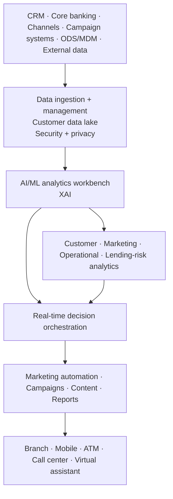

# TCS Customer Intelligence & Insights — Banking AI Evolution

[[bfsi/banking-ai]] · [[bfsi/public-implementations]] · [[media/visual-reference-library]]

> Public-source study only. This note separates the **named 2023 Scotwest deployment** from the **current CI&I product architecture** and does not assume the newer agentic capabilities were deployed at Scotwest.

## Evidence chain

### 1. Scotwest Credit Union — deployed predictive AI/ML — `deployed`

**Date:** 16 January 2023  
**Primary source:** https://www.tcs.com/who-we-are/newsroom/press-release/scotwest-credit-union-partners-with-tcs

TCS announced that Scotwest Credit Union had enhanced its customer experience using **TCS Customer Intelligence & Insights (CI&I)** integrated with **TCS BaNCS Cloud for Banking**.

The implementation publicly included predictive models for:

- probability of default
- early payoff / prepayment risk
- contextual next-product recommendations
- loan top-up recommendations

TCS tied the implementation to customer retention, customer lifetime value, loan recovery, interest-rate optimization, liquidity management and reduction of lending risk.

This is named-customer deployment evidence, but the source predates TCS' current GenAI / multi-agent CI&I positioning.

---

### 2. Current CI&I platform page — `product-capability`

**Primary source:** https://www.tcs.com/what-we-do/products-platforms/tcs-customer-intelligence-insights

TCS currently describes CI&I as an **AI-powered, real-time customer data analytics solution** that combines:

- patented multi-agent orchestration
- Generative AI
- machine learning
- enterprise-specific knowledge
- real-time interactions
- proactive engagement
- customer-lifetime-value optimization

The current product page therefore exposes an architectural evolution from a predictive-analytics platform toward an agentic real-time decisioning layer.

---

### 3. CI&I for banking architecture — `product-capability / official-figure`

**Primary source:** https://www.tcs.com/what-we-do/products-platforms/tcs-customer-intelligence-insights/solutions/tcs-customer-intelligence-insights-personalized-banking

TCS' banking-specific page contains **Figure 1 — Architecture of TCS Customer Intelligence & Insights for banking customer analytics and CDP software**.

The page's public figure description exposes these layers/components:

- customer touchpoints: branches, mobile, ATMs, call centers, virtual assistants
- customer analytics
- marketing analytics
- operational analytics
- lending-risk analytics
- TCS Connected Intelligence Platform
- data ingestion and management
- data security and privacy
- customer data lake
- AI/ML analytics workbench with XAI
- real-time decisions orchestration
- data services
- containerized deployment
- downstream marketing automation, email marketing, campaign management, content management, reports and visualization
- upstream data from CRM, core banking, customer channels, campaign systems, ODS/MDM and external data

**Visual handling:** the official artwork remains on the TCS page and is not re-hosted here.

## Editorial architecture reconstruction



**Diagram status:** editorial reconstruction from the public TCS banking CI&I page; it is **not** an internal TCS architecture diagram.

## Status-transition debugging

```text
2023 named customer deployment
Predictive AI / ML + recommendations + BaNCS integration
        ↓
current CI&I product architecture
Real-time data + XAI + decision orchestration
        ↓
current CI&I product positioning
GenAI + patented multi-agent orchestration + enterprise knowledge
```

This is a **public product-evolution observation**, not evidence that Scotwest itself moved through every later stage.

## Why this matters

The CI&I evidence adds a distinct banking AI pattern to the repository: **customer intelligence is shifting from predictive scoring and recommendation engines toward real-time orchestration of customer decisions and interactions**. The product architecture combines data unification, explainable AI, decision orchestration and multi-channel activation rather than treating personalization as a standalone model.

That pattern is consistent with broader TCS public vocabulary around context, orchestration, guardrails and agentic workflows, but this note does not promote a new operating-model inference because the strongest evidence here comes from one product family plus one historical named deployment.

## Falsifier / future watch

The status should be upgraded only if TCS or a named customer publishes evidence that the current CI&I multi-agent / GenAI capabilities are operating in production. Until then:

- Scotwest = `deployed` predictive AI/ML implementation
- current CI&I multi-agent / GenAI = `product-capability`

## Related

[[bfsi/banking-ai]] · [[bfsi/public-implementations]] · [[tcs/public-ai-initiative-index]] · [[ai/agentic-ai-bfsi-architecture]]
