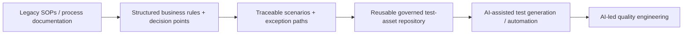

# Core Banking Modernisation — AI-ready Quality Engineering from Structured Process Knowledge

[[index|← Home]] · [[bfsi/banking-ai]] · [[bfsi/public-implementations]] · [[news/timeline]]

> **Evidence status:** `public-case-study / deployed-quality-engineering / ai-ready-foundation`. The customer is described publicly only as a **leading Canadian multinational bank**. This case does **not** establish a deployed GenAI/agentic-AI system; it establishes an implemented quality-engineering transformation whose structured assets are explicitly positioned by TCS as a foundation for later AI-assisted test generation and automation.

## Public source

- TCS case study: **SOP-driven Quality Engineering for Core Banking Modernisation**
- Published: **2 September 2026** on the TCS customer-stories index
- URL: https://www.tcs.com/what-we-do/industries/banking/case-study/sop-driven-quality-engineering-core-banking-modernisation
- Publisher: Tata Consultancy Services
- Source type: primary TCS customer case study

## What TCS publicly says was implemented

A leading Canadian multinational bank was modernising its **Transport Finance** business. TCS says the transformation covered approximately **300 standard operating procedures (SOPs)** and **20+ master processes**.

The implementation converted inconsistent legacy process documentation into structured and reusable test assets by:

- prioritising SOPs by business criticality, volume and complexity;
- checking completeness across inputs, outputs, decision points and exceptions;
- decomposing SOPs into explicit business rules and decision points;
- using decision trees and flow mapping to derive normal and exception-path scenarios;
- validating process accuracy, regulatory compliance and business rules with domain SMEs;
- building end-to-end traceability from SOP → decision point → scenario → test case;
- automating coverage checks so missing paths could be detected systematically rather than late in delivery.

## TCS-reported outcomes

TCS reports:

- **25% efficiency gains** across the master processes;
- **15–20% reduction in repeat processing and rework**;
- **5–6% reduction in defect leakage**;
- **100% traceability** from SOPs to test cases across business scenarios, decision paths and exception handling.

These figures are retained as **TCS-reported customer outcomes**. The customer is unnamed publicly and no identity is inferred.

## Why this belongs in the AI graph

The most important AI signal is not that AI generated the delivered test assets. TCS explicitly says the structured repository, templates, traceability frameworks and decision-point analysis create a **foundation for AI-assisted / AI-led quality engineering**, including future test generation and automation.

That adds a useful precursor stage to the repository's production-AI model:

**Diagram status:** editorial reconstruction of the public TCS case-study sequence. It is not an internal TCS architecture diagram.

## Cross-source debugging connection

This case extends the existing **AI-ready data** theme into **AI-ready process knowledge**. Across the repository, TCS public material repeatedly argues that production AI depends on preparing enterprise context before automation can scale: governed semantic data models structure business meaning; Context Fabric structures operational/regulatory context; this case structures SOP knowledge into machine-usable decision paths and traceable test assets.

That alignment is useful, but this single case does **not** create a new operating-model inference by itself. It is treated as supporting evidence for the broader existing pattern that AI productionization depends on governed, structured enterprise context.

## Evidence boundary

Do **not** upgrade this case to `deployed AI`, `agentic AI`, or `GenAI deployment` from the available source. The implemented work is SOP-driven quality engineering. TCS positions the resulting structured assets as the base for subsequent AI-assisted test generation and automation.

Do not infer the bank's identity from its Canadian, multinational, or Transport Finance descriptors.

## Related

[[bfsi/banking-ai]] · [[ai/agentic-ai-bfsi-architecture]] · [[intelligence/public-operating-model-inference]] · [[research/bfsi-ai-reading-room]]
