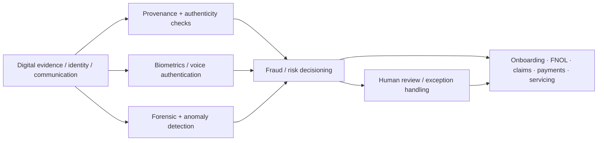

# Deepfakes and Synthetic Fraud in Insurance — TCS Public Signal (2026)

[[index|← Home]] · [[bfsi/insurance-ai]] · [[bfsi/risk-compliance-ai]] · [[bfsi/use-case-atlas]] · [[intelligence/public-operating-model-inference]]

> **Evidence class:** `thought-leadership / public-article-example`
>
> **Primary TCS source:** https://www.tcs.com/insights/blogs/deepfakes-synthetic-fraud-next-challenge-industry
>
> **Publication date:** 11 September 2026
>
> This note captures a public TCS insurance-risk viewpoint. It is **not** evidence of a named customer deployment, a TCS product launch, regulator endorsement, or a production architecture.

## What materially changed

TCS' September 2026 article broadens the insurance-fraud problem from conventional claims fraud into a **digital-evidence trust problem across the insurance value chain**.

The article says deepfakes and synthetic media can manipulate:

- images
- video
- audio
- documents and other digital evidence

and explicitly warns that the exposure is wider than claims processing. TCS identifies risk across:

- policy/customer onboarding
- claims and First Notice of Loss (FNOL)
- distribution / broker interactions
- payment instructions
- contact-centre and customer interactions

This makes the public control problem less about detecting a single fraudulent claim and more about deciding whether the evidence, identity, communication or instruction entering an automated workflow can be trusted.

## TCS-described risk scenarios

TCS describes several examples of how synthetic fraud can enter insurance operations:

1. **Synthetic identities during onboarding** — fabricated or manipulated identity evidence can be used to bypass policy-onboarding checks.
2. **Synthetic claims evidence** — generated or altered images, video, audio or documents can be submitted into increasingly digital claims journeys.
3. **Broker impersonation / bogus policies** — synthetic content can support impersonation and fraudulent distribution activity.
4. **Voice cloning / payment manipulation** — synthetic voice can be used to influence payment instructions or contact-centre interactions.

The article therefore treats deepfake risk as an **end-to-end operating-risk issue**, not a claims-only control.

## Public mitigation vocabulary

TCS' article names a layered response rather than a single detector:

- advanced AI for anomaly detection in digital evidence
- biometric checks during onboarding and FNOL
- stronger voice-authentication controls in contact centres
- content-provenance techniques
- forensic image analysis
- collaboration among insurers, technology providers and regulatory bodies
- sharing of research, detection methods and case studies

The article explicitly says there is **no single solution** to the problem.

## Independent industry fact check

TCS cites the Association of British Insurers (ABI). The underlying ABI release dated **17 November 2025** reports:

- **£1.16 billion** of fraudulent general-insurance claims detected in 2024
- **98,400+** fraud-related claims detected
- claim count up **12%** from 2023
- ABI states fraudsters are using increasingly sophisticated and agile approaches, aided by AI

Independent source: https://www.abi.org.uk/media-hub/news-post/fraudulent-insurance-claims-continue-to-top-1-billion

This corroborates the scale and AI-assisted-fraud direction cited by TCS, but it does **not** prove that the detected 2024 fraud total was caused by deepfakes or synthetic identities.

## Cross-source architecture implication — editorial reconstruction

**Diagram status:** editorial reconstruction of public TCS article concepts. It is not an internal TCS architecture diagram and does not imply that TCS has published or deployed this exact stack.

## Connection to existing public TCS patterns

This new article aligns with several already documented public TCS themes:

- **multimodal evidence processing** in TCS' insurance-claims agentic-AI paper;
- **human judgement / exception handling** for complex or suspicious claims;
- **governance, auditability and continuous monitoring** in TCS' broader BFSI responsible-AI material;
- **fraud investigation** as a public demonstration in the TCS–Google Cloud Mexico Gemini Experience Center;
- **risk/compliance governance and monitoring** in the planned Risk Live North America 2026 agenda.

The new contribution is the explicit framing of **synthetic media authenticity as a trust boundary before downstream automation or agentic decisioning**.

## Status-transition debugging

Current public status is:

**emerging fraud threat → TCS thought-leadership / control recommendations**

No public evidence located in this research pass establishes:

- a named TCS synthetic-fraud product;
- a named insurer using a TCS deepfake-detection capability;
- a pilot or production deployment;
- linkage to Cognitive Automation Platform, AI Spectrum, BaNCS AI Compass, Quartz, AI WisdomNext or Context Fabric;
- endorsement by ABI or a regulator of a TCS solution.

Those remain open evidence gaps.

## Higher-order inference decision

**No new operating-model inference promoted.**

This article provides one new TCS source plus independent fraud-scale corroboration, but it does not yet meet the repository rule requiring **3+ independent public evidence points** for a meaningful new higher-order inference.

### Watch hypothesis

If future public customer, regulator or partner evidence converges on provenance/authenticity controls before autonomous insurance workflows, a candidate inference to test would be:

> In AI-first insurance, evidence authenticity becomes a pre-decision control plane: identity, media and instruction provenance must be validated before agentic automation can safely scale.

This remains a **watch hypothesis**, not a fact or promoted inference.

## Public professional author

**Taufique Shaikh** — TCS publicly describes the author as a domain consultant with Property & Casualty insurance experience across US and UK markets, spanning new business, policy servicing, claims, underwriting support, operations and solution design.

This source establishes only the public title/topic relationship at the source date. No internal reporting line, project assignment or private relationship is inferred.

## Sources

- TCS, *Deepfakes and Synthetic Fraud: The Next Challenge in Insurance*, 11 September 2026: https://www.tcs.com/insights/blogs/deepfakes-synthetic-fraud-next-challenge-industry
- Association of British Insurers, *Fraudulent insurance claims continue to top £1 billion*, 17 November 2025: https://www.abi.org.uk/media-hub/news-post/fraudulent-insurance-claims-continue-to-top-1-billion

## Related

[[bfsi/insurance-ai]] · [[bfsi/risk-compliance-ai]] · [[research/autonomous-vehicle-insurance-agentic-ai]] · [[research/responsible-ai-financial-crime-governance]] · [[events/public-event-watch]]
