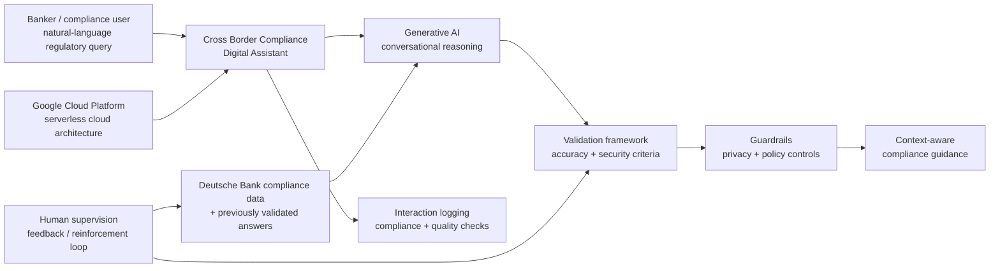

# Deutsche Bank + TCS — Cross Border Compliance Digital Assistant

[[bfsi/public-implementations]] · [[bfsi/risk-compliance-ai]] · [[bfsi/banking-ai]] · [[ai/agentic-ai-bfsi-architecture]]

> **Evidence class:** `public-case-study / deployed`  
> **Customer:** Deutsche Bank  
> **Domain:** banking · compliance · cross-border regulatory guidance  
> **Primary source:** https://www.tcs.com/what-we-do/industries/banking/testimonial/deutsche-bank-accelerates-compliance-ai-digital-assistant  
> **Official TCS post:** https://www.linkedin.com/posts/tcs-financial-services-and-insurance_ai-digitaltransformation-banking-activity-7444372784056754176-V-qv  
> **Publication-date discipline:** the retrieved TCS case-study page does not expose a reliable publication date, so no exact publication date is invented.

## What TCS publicly says was implemented

TCS says Deutsche Bank and TCS co-created a **Cross Border Compliance Digital Assistant** for Deutsche Bank's Compliance Technology function. The assistant is described as an AI-driven conversational platform for regulatory queries from bankers operating across regions.

The published solution blueprint includes:

- **Generative AI** for conversational compliance guidance
- **Google Cloud Platform**
- a **serverless cloud architecture**
- natural-language queries over regulatory/compliance knowledge
- context-aware responses
- a validation framework for accuracy and security criteria
- built-in guardrails
- reinforcement-learning / feedback loops
- privacy controls
- use of Deutsche Bank's latest compliance data and previously validated answers
- human supervision of the learning/feedback loop
- logging of interactions for compliance and quality checks

TCS describes the solution as deployed and says Deutsche Bank now has a scalable tool strengthening compliance capability and agility.

## Published result and metric boundary

TCS states that **during tests**, the digital assistant reduced the time required to find and return new and evolving regulatory policies from **more than a day to a few seconds**.

That wording matters:

- the case supports `deployed` status for the digital assistant itself;
- the **day-to-seconds** performance statement is specifically a **test result**, not a published steady-state production SLA;
- the source does not disclose production query volume, model name/version, retrieval architecture, accuracy percentage, cost, token economics, or geographic rollout scale.

## Named Deutsche Bank public voices in the case

TCS quotes **Cristian Bassi, Head of Europe Compliance, Deutsche Bank**, describing the assistant as an example of how the bank's Compliance & Anti-Financial Crime function is using AI to reimagine work and enhance controls.

TCS also quotes **Sanjay Tripathi, Global Head of AI & Cloud Transformation for Compliance Technology, Deutsche Bank**, describing TCS as a partner in rethinking compliance.

These are public professional/topic relationships only; no internal reporting structure or private relationship is inferred.

## Editorial architecture reconstruction

**Diagram status:** editorial reconstruction of components explicitly described on the public TCS case-study page. It is **not** an internal Deutsche Bank or TCS architecture diagram.

## Why this evidence is unusually valuable

This closes a high-value gap in the public TCS BFSI graph because it is simultaneously:

1. a **named global bank**;
2. a **risk/compliance workflow**, rather than a generic productivity use case;
3. an explicitly **GenAI** solution;
4. accompanied by public architecture/control detail;
5. described by TCS as deployed;
6. supported by named Deutsche Bank compliance/technology executives quoted in the TCS artifact.

It therefore provides stronger production-oriented evidence than a product page, event demo, unnamed analyst example, or future partnership announcement.

## Cross-source debugging implications

### Governance moves into the runtime path

The public workflow does not frame governance as a post-hoc policy layer. Accuracy/security validation, guardrails, privacy controls, interaction logging, validated answers and human-supervised feedback are described as part of the operating solution.

This reinforces the repository's existing public pattern:

**enterprise context → GenAI/agent capability → validation/guardrails → human oversight → traceability/logging → business action**.

### Context engineering is a production dependency

The assistant is not described as an unconstrained general-purpose chatbot. Its answers are grounded in the bank's current compliance data and previously validated answers. That independently reinforces the importance of enterprise context/knowledge grounding seen in TCS' public Context Fabric, CAP and AI-first banking material.

### Cloud partner role

For this specific named implementation, the public stack explicitly identifies **Google Cloud Platform** as the cloud layer. This is implementation-level evidence of Google Cloud in a TCS/Deutsche Bank compliance solution, but it should **not** be generalized into a claim that all TCS BFSI compliance or agentic-AI deployments use Google Cloud.

## Evidence boundaries

The source does **not** establish:

- that the assistant is agentic AI;
- that it uses TCS Cognitive Automation Platform, AI WisdomNext, AI Spectrum, BaNCS AI Compass, Quartz, or Context Fabric;
- which foundation model is used;
- autonomous execution of compliance decisions or transactions;
- production accuracy/error rates;
- production request volumes or latency SLA;
- regulator review or endorsement.

Do not connect those products or properties to this implementation without a future explicit public source.

## Source record

- Tata Consultancy Services — **Deutsche Bank Accelerates Compliance with AI-powered Digital Assistant**  
  https://www.tcs.com/what-we-do/industries/banking/testimonial/deutsche-bank-accelerates-compliance-ai-digital-assistant
- TCS Financial Services and Insurance — official LinkedIn post describing Deutsche Bank + TCS AI-powered compliance assistant  
  https://www.linkedin.com/posts/tcs-financial-services-and-insurance_ai-digitaltransformation-banking-activity-7444372784056754176-V-qv

## Related

[[bfsi/public-implementations]] · [[bfsi/risk-compliance-ai]] · [[bfsi/banking-ai]] · [[regulations/india-ai-bfsi]] · [[intelligence/public-operating-model-inference]]
