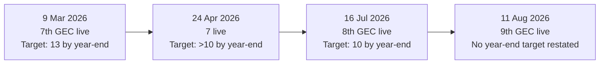
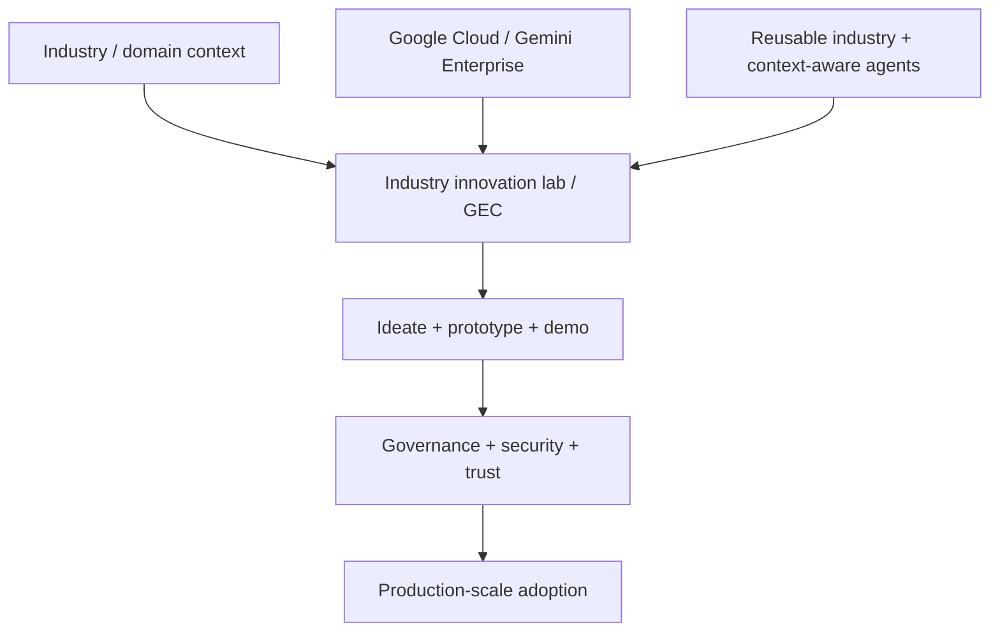

# TCS + Google Cloud Gemini Experience Centers — Public Scale & Status Map

[[index|← Home]] · [[tcs/ai-partnerships]] · [[people/public-capability-network]] · [[news/timeline]]

> Evidence boundary: this note reconstructs only what TCS has publicly stated about its Gemini Experience Center (GEC) network. It is not an internal site map, staffing model or project inventory.

## Why this matters

The GEC network is useful as an observable public signal for how TCS and Google Cloud are trying to operationalize AI adoption: clients are invited to **ideate, prototype, test, co-develop and scale** domain solutions rather than consume a generic model API in isolation.

For BFSI specifically, TCS has a dedicated GEC at its **BFSI Innovation Lab in Bengaluru**, and the later Mexico GEC publicly demonstrated **fraud investigation for financial institutions** and **automated insurance claims processing**.

## Public chronology

| Date | Public fact | Evidence label |
|---|---|---|
| 22 Aug 2025 | BFSI-specific GEC launched at TCS BFSI Innovation Lab, Bengaluru | `live` |
| 19 Dec 2025 | São Paulo opened as TCS' **6th** GEC globally | `live` |
| 9 Mar 2026 | Troy, Michigan opened as the **7th** GEC; TCS said it expected **13 globally by end-2026** | `live + planned` |
| 24 Apr 2026 | TCS described **7 live** centers and said it planned **more than 10 by end-2026** | `live + planned` |
| 16 Jul 2026 | Kolkata opened as the **8th** GEC; TCS said it planned a total of **10 by end-2026**, including four in India | `live + revised plan` |
| 11 Aug 2026 | Mexico City opened as the **9th** GEC globally and second in Latin America | `live` |

## Important public contradiction / plan revision

TCS' own public releases contain different year-end network targets:

### Interpretation discipline

The March statement of **13** and July statement of **10** cannot both represent the same unchanged year-end plan.

The safest reading is:

- March 9: 13 was the public target at that time.
- April 24: TCS softened/reframed the target as more than 10.
- July 16: the latest explicit numeric target in this evidence chain became 10.
- August 11: actual network count reached nine; no new target was stated.

Do **not** rewrite the older 13 target as a factual error. Preserve it as a superseded public plan unless a later TCS source explicitly explains the revision.

## Agent-scale signal

On April 24, 2026, TCS said it had built **more than 3,000 industry- and context-aware agents on Gemini Enterprise** that integrate into customer environments.

The August 11 Mexico announcement again described the center as equipped with **3,000+ industry- and context-aware AI agents** built by TCS with Gemini Enterprise.

This repeated number is evidence of a large reusable agent portfolio in TCS' public Google Cloud narrative. It is **not** evidence that every agent is production-deployed or BFSI-specific.

## BFSI-relevant public evidence

### Bengaluru BFSI GEC — 22 Aug 2025

TCS publicly described agentic-AI solution areas including:

- customer servicing
- business decision workflows
- back-office operations
- regulatory compliance
- TCS BaNCS on Google Cloud

Source: https://www.tcs.com/who-we-are/newsroom/news-alert/tcs-partners-with-google-cloud-accelerate-ai-driven-fnnovation-financial-services-industry

### Mexico GEC — 11 Aug 2026

Public demonstrations included:

- fraud investigation for financial institutions
- automated insurance claims processing
- generative-AI-powered data acceleration

Evidence status: `public-demo`, not named production deployment.

Source: https://www.tcs.com/who-we-are/newsroom/press-release/tcs-and-google-cloud-gemini-experience-center-mexico-drive-ai-adoption

## Company-wide autonomous-enterprise layer — 24 Apr 2026

TCS and Google Cloud announced a broader move from pilots toward autonomous AI operating models. TCS publicly named:

- **TCS Agentic AI Data Accelerator** — claimed to reduce data-transition cycles by up to 40%
- **TCS Physical AI Blueprint**
- **TCS Smart Factory Blueprint**
- **TCS AI SOC enabled by Google SecOps**

The source says these offerings are meant to help enterprises move from AI pilots to operational autonomy while maintaining governance, security and trust.

Source: https://www.tcs.com/who-we-are/newsroom/news-alert/tcs-deepens-partnership-google-cloud-power-ai-native-autonomous-enterprises

## Public operating-model abstraction

The GEC evidence fits a broader TCS pattern already visible elsewhere in the graph:

**Derived public observation:** TCS is using partner-backed experience centers as a visible **co-innovation and productionization interface** between hyperscaler AI technology, reusable TCS assets and vertical domain knowledge.

**Confidence:** high for the public operating pattern; low for any unobserved internal staffing or reporting structure.

**Alternative explanation:** GECs may primarily be customer-experience/showcase facilities rather than durable delivery units.

**Falsifier:** future TCS material explicitly describing GECs as demonstration-only facilities with no role in co-development or scaling would weaken this interpretation. Current TCS sources repeatedly use language such as ideate, prototype, co-create, test and scale.

## Sources

- 22 Aug 2025 — BFSI GEC Bengaluru: https://www.tcs.com/who-we-are/newsroom/news-alert/tcs-partners-with-google-cloud-accelerate-ai-driven-fnnovation-financial-services-industry
- 19 Dec 2025 — São Paulo, 6th GEC: https://www.tcs.com/who-we-are/newsroom/news-alert/tcs-opens-google-cloud-gemini-experience-center-sao-paulo
- 9 Mar 2026 — Troy, 7th GEC; 13-center target: https://www.tcs.com/who-we-are/newsroom/press-release/tcs-launches-gemini-experience-center-in-the-us-to-help-accelerate-ai-powered-manufacturing
- 24 Apr 2026 — autonomous-enterprise expansion; 3,000+ agents; >10-center plan: https://www.tcs.com/who-we-are/newsroom/news-alert/tcs-deepens-partnership-google-cloud-power-ai-native-autonomous-enterprises
- 16 Jul 2026 — Kolkata, 8th GEC; 10-center target: https://www.tcs.com/who-we-are/newsroom/press-release/tcs-google-cloud-launch-gemini-experience-center-kolkata
- 11 Aug 2026 — Mexico, 9th GEC; BFSI demos: https://www.tcs.com/who-we-are/newsroom/press-release/tcs-and-google-cloud-gemini-experience-center-mexico-drive-ai-adoption

## Related

[[tcs/ai-partnerships]] · [[tcs/tcs-ai-strategy]] · [[bfsi/banking-ai]] · [[bfsi/insurance-ai]] · [[news/timeline]]
