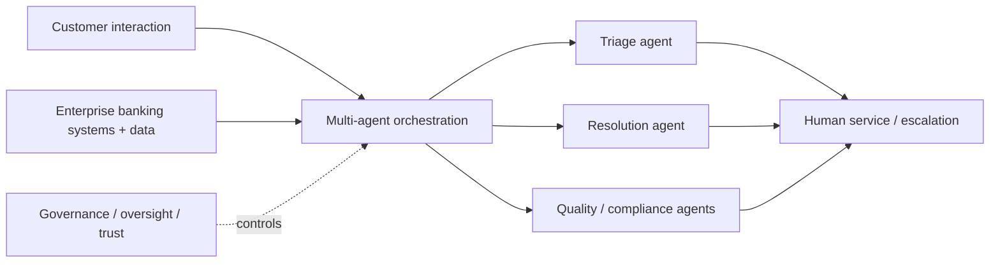

# KeyBank + TCS + Google Cloud Next '26 — Multi-Agent Contact Center Signal

[[index|← Home]] · [[bfsi/banking-ai]] · [[tcs/ai-partnerships]] · [[ai/agentic-ai-bfsi-architecture]]

## Evidence summary

**Event/session date:** 22 April 2026  
**Entity:** KeyBank + Google Cloud + Tata Consultancy Services  
**Session:** *The Rise of the AI Workforce: Orchestrating Multi-Agent Systems in the Enterprise*  
**Evidence class:** `official-post / public-event evidence`  
**Primary public source:** https://www.linkedin.com/posts/tcs-financial-services-and-insurance_googlecloudnext26-aiworkforce-agenticai-activity-7467254625772003329-IweE  
**Confidence:** high for the public discussion and named participants; insufficient for a production-deployment claim.

## What TCS publicly states

In its public Financial Services and Insurance post following Google Cloud Next '26, TCS describes AI-driven contact centers as moving from reactive service toward proactive, insight-led customer engagement. The session brought together leaders from KeyBank, Google Cloud and TCS to discuss collaborative AI agents operating across four explicitly named contact-center functions:

- triage
- resolution
- compliance
- quality

The public takeaways emphasize:

- multi-agent systems for proactive, intelligence-led operations
- cloud ecosystems as a scaling layer for AI orchestration
- governance and oversight as requirements for responsible adoption
- movement from AI strategy toward measurable banking outcomes

## Public speakers

The TCS post names:

- **Kimberly Agin** — Head of Contact Center & Conversational AI Performance and Enablement, KeyBank
- **Maxim Afanasyev** — Financial Services Market Lead, JAPAC, Google Cloud
- **Sathiskumar Venkataramani** — Global Head, BFSI Business Ops Transformation Strategic Initiative, TCS

These titles are recorded only as published in the public source and should not be used to infer private reporting lines or project ownership.

## Why this signal matters

This is stronger than generic TCS product marketing because it places the multi-agent orchestration discussion in a **named-bank, named-cloud-partner, named-TCS-leader** context and focuses on a concrete banking workflow: the contact center.

The public architecture implied by the discussion can be reconstructed editorially as:

**Diagram status:** editorial reconstruction of the public session language; it is **not** an internal TCS or KeyBank architecture diagram.

## Evidence boundary

The session and TCS post do **not** establish that KeyBank has deployed the complete multi-agent architecture described above. The public material does not disclose:

- which specific agent workflows, if any, are live at KeyBank
- production versus pilot status
- model providers used in any KeyBank implementation
- system architecture or integration topology
- transaction/contact volumes
- measured business outcomes attributable to a TCS implementation

Accordingly, the evidence remains `official-post / public-event evidence`, not `deployed` or `public-case-study`.

## Cross-source debugging value

The session aligns with several already-public TCS patterns:

1. the Bengaluru BFSI Gemini Experience Center positions Google Cloud/Gemini around agentic AI, customer service, back-office operations and regulatory compliance;
2. TCS Cognitive Automation Platform describes multi-agent orchestration, knowledge/context layers, human approvals and governance/observability;
3. current banking analyst evidence says TCS has implemented agentic AI use cases including call summarization, but without naming clients.

Together these sources show a recurring public pattern around **customer-service agent orchestration + cloud scale + governance + human oversight**. This note does not infer that the unnamed banking implementations belong to KeyBank.

## Watch questions

- Does TCS, KeyBank or Google Cloud later publish a case study naming production contact-center agents?
- Does a full session recording expose more precise architecture, deployment-state or outcome language?
- Does the same triage → resolution → compliance → quality vocabulary recur in CAP, Gemini Experience Center or named banking case studies?
- Does TCS later identify evaluation, observability, authorization or escalation mechanisms used in this banking pattern?

## Related

[[bfsi/banking-ai]] · [[tcs/ai-partnerships]] · [[ai/agentic-ai-bfsi-architecture]] · [[media/watchlist]]
