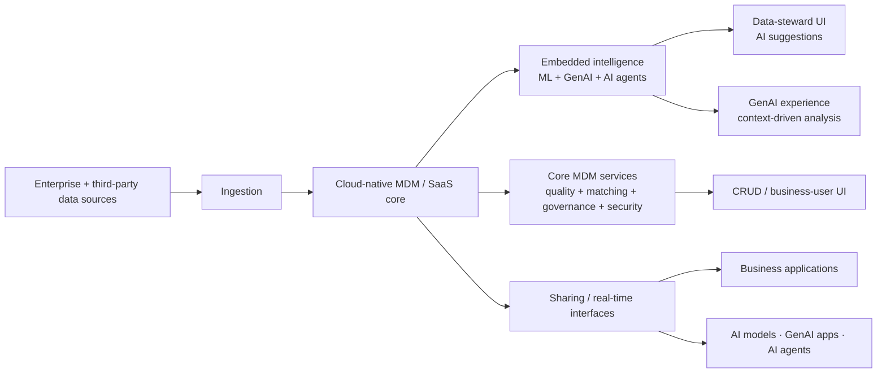
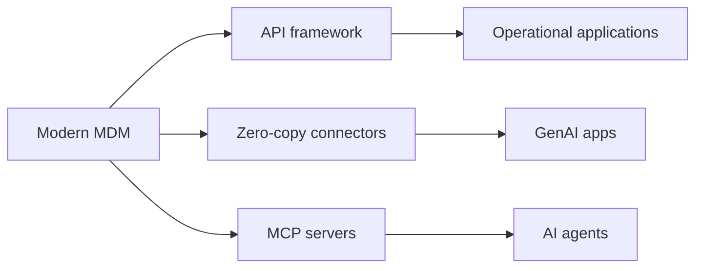
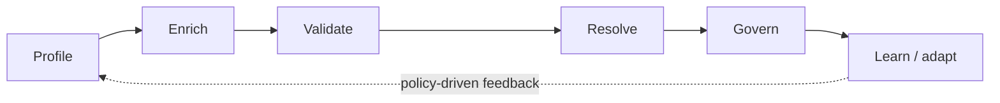
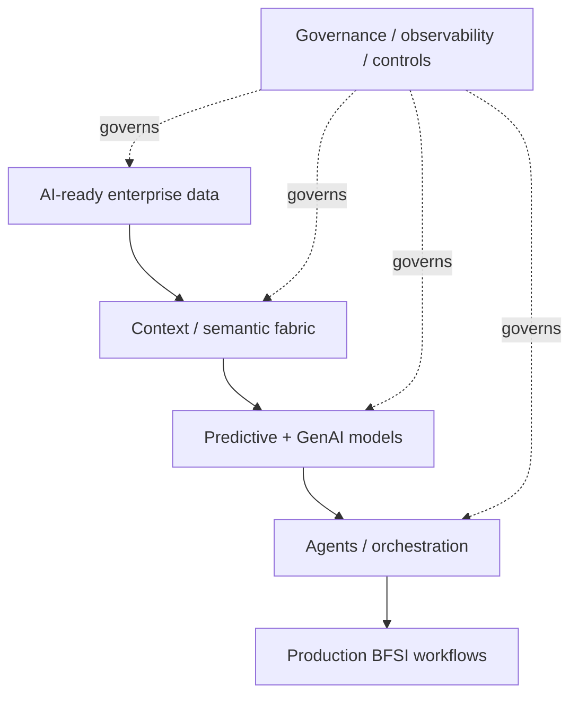

# Modern MDM + AI-ready Data for BFSI

[[index|← Home]] · [[research/bfsi-ai-reading-room]] · [[tcs/public-language-glossary]] · [[people/public-capability-network]] · [[media/visual-reference-library]]

> **Evidence status:** `thought-leadership / architecture`. This note summarizes a public TCS BFSI white paper. It describes TCS' published architectural viewpoint for modern master data management; it is not evidence of one internal TCS platform implementation or a named client deployment.

**Primary source:** https://www.tcs.com/what-we-do/industries/banking/white-paper/modern-mdm-ai-ready-enterprise-data-bfsi

## Why this paper matters

The paper fills an important layer beneath TCS' public GenAI and agentic-AI story: **production AI requires a continuous supply of trusted, contextual, secure, compliant, real-time, discoverable and consumable data**.

TCS explicitly argues that traditional MDM was designed largely for human consumption and post-facto analytics, whereas AI models, GenAI applications and AI agents require a much more dynamic data foundation.

## Public architectural thesis

TCS describes a modern MDM platform as serving two simultaneous purposes:

1. **Deliver AI-ready data** to AI models, GenAI applications and AI agents.
2. **Use AI inside MDM** to improve data quality, stewardship and governance.

This makes MDM both a **data-supply layer for AI** and an **AI-augmented control system for data itself**.

**Editorial study reconstruction only.** The official source contains **Figure 1: “A modern MDM architecture to enable a continuous flow of AI-ready data for AI models, AI applications and AI agents.”**

## AI-ready data — public TCS definition

The paper characterizes AI-ready data using attributes that recur across TCS' broader BFSI AI material:

- trusted
- contextual
- secure
- compliant
- real-time
- discoverable
- consumable

That is materially broader than “clean training data.” It includes operational context, permissions, lineage, policy and delivery mechanics.

## Why legacy MDM becomes a bottleneck

TCS highlights several limitations of conventional MDM for AI-era BFSI:

- batch-oriented rather than real-time data availability
- limited support for unstructured information and cross-domain relationships
- fragmented customer consent
- weak support for AI-era auditability / traceability / observability
- difficulty supporting graph-oriented customer-360 views
- insufficient integration with AI applications and increasingly autonomous workflows

## Embedded intelligence layer

TCS explicitly combines three AI modes inside the MDM hub:

| AI mode | Public role described by TCS |
|---|---|
| Traditional AI / ML | matching, duplicate detection and data-quality functions |
| GenAI | natural-language search, exploration and stewardship experience |
| Agentic AI | automated data-quality and stewardship actions across the lifecycle |

The paper says AI agents can help deliver structured context used to ground LLMs, support valid actions and reduce hallucination risk.

## Real-time AI interfaces

A particularly high-signal architectural detail is TCS' explicit recommendation for real-time integration through:

- API frameworks
- zero-copy data connectors
- **Model Context Protocol (MCP) servers**

This places MDM not merely behind enterprise applications but directly in the runtime path of AI applications and agents.

## Privacy, security and governance controls

The source names controls including:

- consent management
- masking and encryption
- attribute-level access control
- data lineage
- observability
- auditability
- data-quality governance
- workflow-driven stewardship

This aligns with the broader TCS BFSI pattern that **governance is embedded in runtime/data architecture rather than bolted on after model deployment**.

## Graph-based data models

TCS says flexible graph-based models help represent unstructured data and relationships, enabling richer customer-360 views and personalization. This is important because it connects the public MDM viewpoint to the same broader need for semantic/contextual enterprise knowledge seen in [[atlas/architecture-atlas#2-context-fabric--architecture-reconstructed-from-tcs-figure-1]].

## Future state: agentic MDM

TCS' forward-looking view is that MDM itself evolves into an agentic platform. The paper describes agents acting across the MDM lifecycle to:

The intended characteristics are self-learning, policy-driven and proactive data management.

**Evidence boundary:** this is a TCS-authored future-state view, not proof that every listed function is already deployed autonomously in production.

## Public professional capability signal

The page publicly names:

### Abhik Das

**Public TCS role:** Solution Architect, Data & Analytics Group, TCS BFSI.

**Public topic context:** enterprise MDM, customer-360, MDM architecture, operating-model transformation and AI-ready data foundations.

### Neeraj Arora

**Public TCS role:** Managing Partner, Data & Analytics Group, TCS BFSI; the page states that he leads the **MDM CoE for the BFSI sector**.

**Public topic context:** MDM consulting, architecture, program management and large-scale transformation.

These are source-published professional roles only; no reporting structure is inferred.

## Cross-source intelligence connection

This source strengthens a pattern already visible across multiple independent public TCS BFSI sources:

The notable addition from this paper is the explicit **real-time data-serving layer for agents via APIs, zero-copy connectors and MCP**, plus AI-driven stewardship of the data foundation itself.

## What not to infer

- The architecture is not proof of one internally deployed TCS MDM product.
- “MCP servers” on the paper does not imply every TCS BFSI agent implementation uses MCP.
- The MDM CoE public role does not reveal reporting lines, staffing, customers or private programs.
- Future-state agentic MDM is `thought-leadership`, not a production-status claim.

## Related

[[research/bfsi-ai-reading-room]] · [[tcs/public-language-glossary#ai-ready-data]] · [[people/public-capability-network]] · [[media/visual-reference-library]] · [[intelligence/public-operating-model-inference]]