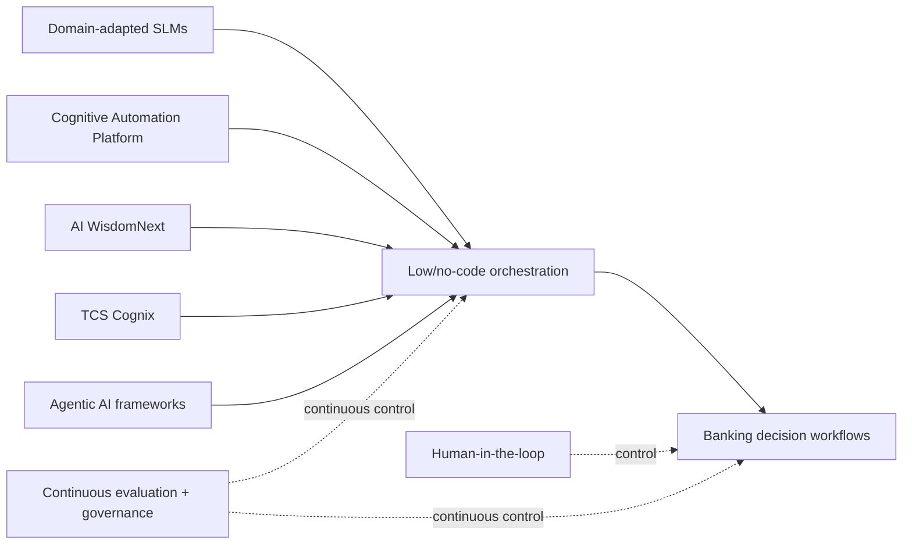

# NelsonHall — TCS GenAI + Process Automation in Banking (2026 public signal)

[[index|← Home]] · [[tcs/public-ai-initiative-index]] · [[tcs/tcs-bfsi-ai-offerings]] · [[bfsi/banking-ai]] · [[intelligence/public-operating-model-inference]]

> **Evidence class:** `analyst-recognition / official TCS summary`. This note preserves what TCS publicly reports about NelsonHall's assessment. It is not a substitute for the underlying paid analyst report and does not turn analyst recognition into customer-deployment evidence.

## Source and dates

- **TCS publication date:** 2026-07-03
- **Underlying NelsonHall assessment cited by TCS:** *GenAI and Process Automation in Banking NEAT*, Andy Efstathiou, 2025-12-09
- **Primary public source:** https://www.tcs.com/who-we-are/newsroom/analyst-reports/tcs-a-leader-gen-ai-process-automation-banking

## Material public facts

TCS says NelsonHall positioned it as a **Leader** in the 2025 NEAT for GenAI and Process Automation in Banking, assessing 16 vendors.

The TCS page says the assessment highlights movement from **bolt-on AI implementations toward AI-native banking environments**, with TCS positioned around a lifecycle approach rather than isolated automation use cases.

TCS publicly connects the following components in one banking-specific operating stack:

- **TCS Cognitive Automation Platform**
- **TCS AI WisdomNext**
- **TCS Cognix**
- next-generation **agentic AI frameworks**
- **domain-adapted small language models**
- **low-code / no-code orchestration**
- **human-in-the-loop controls**
- responsible-AI guardrails
- a hyperscaler and fintech partner ecosystem

Babu Unnikrishnan, identified by TCS on this page as **CTO, BFSI Americas**, describes a banking transformation approach centered on **end-to-end, decision-centric workflows rather than isolated AI use cases**, underpinned by **spec-driven engineering with continuous evaluation and governance**.

TCS lists public banking outcome areas spanning:

- customer servicing
- lending
- payments
- trade finance
- fraud management
- regulatory compliance

## Why this matters to the public architecture graph

This is useful because it links several previously separate public TCS concepts on a single banking-specific page:

**Diagram status:** editorial reconstruction from the public TCS analyst-recognition page; it is **not** an internal TCS architecture diagram.

The especially high-value vocabulary is:

**AI-native banking → decision-centric workflows → domain SLMs → orchestration → HITL → continuous evaluation → governance**.

That vocabulary is more operationally specific than generic statements about GenAI adoption because it describes how TCS publicly frames the engineering and control loop required to move from experiments toward enterprise-scale banking AI.

## Evidence boundary

- `analyst-recognition`: yes
- `product-capability`: the cited TCS products are publicly named, but this page is not itself a product specification
- `deployed`: **not established by this source**
- `pilot`: **not established by this source**
- named banking customer: **none on this page**
- production architecture: **not disclosed**
- measured customer KPI: **not disclosed**
- regulator endorsement: **none**

The phrase **continuous evaluation and governance** is attributable to TCS' public statement on the page. It should not be interpreted as evidence that every TCS banking AI implementation uses an identical control architecture.

## Cross-source debugging note

This source strengthens existing repository evidence around:

1. CAP as a BFSI automation/agentic execution layer.
2. AI WisdomNext as an enterprise model/agent/data orchestration and governance layer.
3. Human-in-the-loop, guardrails and observability as recurring production-control vocabulary.
4. A shift from isolated use cases toward end-to-end workflow and decision redesign.

However, this run does **not** promote a new higher-order inference from this source alone. The page is primarily a TCS-hosted summary of an analyst assessment, so the underlying evidence family is not independent enough by itself to establish a new operating-model fact.

## Related

[[tcs/tcs-bfsi-ai-offerings]] · [[bfsi/banking-ai]] · [[research/ai-agents-phased-adoption-bfsi]] · [[research/agentic-ai-business-observability-control-plane]] · [[intelligence/public-operating-model-inference]]
