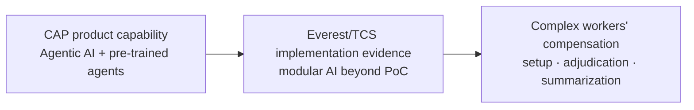

# P&C Insurance Agentic AI — Beyond-PoC Public Evidence

[[bfsi/insurance-ai]] · [[bfsi/public-implementations]] · [[tcs/public-ai-initiative-index]] · [[intelligence/public-operating-model-inference]]

## Source

**Publication date:** 2026-02-16  
**Publisher:** Tata Consultancy Services, summarizing Everest Group P&C Insurance BPS PEAK Matrix 2025  
**Evidence class:** `analyst-recognition / implementation-evidence`  
**Primary URL:** https://www.tcs.com/who-we-are/newsroom/analyst-reports/tcs-named-leader-p-and-c-insurance-bps

## Material public facts

TCS' public summary says Everest Group found that TCS had **moved beyond PoCs in AI initiatives** and was **deploying modular solutions** to automate three parts of complex workers' compensation claims:

1. setup
2. adjudication
3. summarization

The same source describes TCS' IT-BPS delivery model as combining:

- cognitive automation
- GenAI
- agentic AI
- modular solutions
- pre-trained agents
- plug-and-play operational constructs

The publicly named insurance use cases include:

- FNOL
- underwriting triage
- commercial underwriting
- claims summarization
- policy indexing
- subrogation
- litigation support
- broking operations
- reinsurance services

TCS states that its P&C back-office scope covers more than **25 products** and **400 unique processes** across personal, commercial and specialty lines.

## Cognitive Automation Platform relationship

The source explicitly describes **TCS Cognitive Automation Platform (CAP)** as a suite of **Agentic AI solutions and pre-trained agents** supporting intelligent automation for insurance carriers.

This is useful because it connects three public evidence layers that should not be conflated:



**Diagram status:** editorial reconstruction of the public source. It is not an internal TCS architecture diagram.

## Status-transition debugging

The significant transition is:

```text
PoC / experimentation
        ↓
modular AI solutions being deployed
        ↓
complex workers' compensation workflows
        ↓
setup + adjudication + summarization
```

This materially strengthens the insurance evidence graph because it moves at least part of TCS' public P&C AI story beyond conceptual capability and PoC language.

## Evidence boundary

Do **not** upgrade this to a named `deployed` customer case.

The public source does not disclose:

- insurer identity
- whether each modular solution is fully production-live
- deployment scale or transaction volume
- model/provider stack
- agent architecture
- human-approval thresholds
- measured business outcomes

The correct repository status is therefore **anonymous `implementation-evidence`**, with the source's own wording preserved that TCS had moved beyond PoCs and was deploying modular solutions.

## Cross-source interpretation

This evidence is consistent with other public TCS insurance signals already captured in the repository:

- CAP's public agentic orchestration and reusable-agent capability
- AmTrust's deployed AI/automation E&S workflow
- TCS' claims thought leadership describing assist → augment → transform
- the ITC Vegas 2026 agenda emphasizing composable AI, orchestration, trust and production architecture

However, these sources do **not** establish that they are all the same implementation or customer architecture.

## Inference decision

No new higher-order operating-model inference is promoted from this note alone. The source strongly reinforces the existing pattern that TCS is moving insurance AI from point experimentation toward modular, workflow-level orchestration, but the independent evidence threshold for a distinct new inference has not materially changed.

## Related

[[bfsi/insurance-ai]] · [[bfsi/public-implementations]] · [[tcs/public-ai-initiative-index]] · [[events/public-event-watch]]
