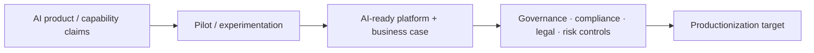

# PostTrade 360 2026 — AI from Pilot to Production in Post-Trade

[[events/public-event-watch]] · [[bfsi/capital-markets-ai]] · [[bfsi/risk-compliance-ai]] · [[tcs/public-ai-initiative-index]]

> **Evidence boundary:** this note captures public event and official-post evidence about TCS BaNCS' post-trade AI productionization discussion. It does not claim that a specific customer has deployed the discussed architecture or that every TCS BaNCS AI capability is live in production.

## Evidence status

`official-post / completed-public-event / thought-leadership / product-capability-context`

## Event

- **Event:** PostTrade 360° 2026, Stockholm
- **Session date:** September 3, 2026
- **Session:** *Making AI real in post-trade operations – from pilot projects to production*
- **Host:** Tata Consultancy Services (TCS BaNCS)
- **Official TCS BaNCS public post:** https://www.linkedin.com/showcase/tcs-bancs
- **Independent event agenda:** https://2026.posttrade360.com/components/59492

## Material public signal

In an official TCS BaNCS LinkedIn post published around the event, TCS states that AI in post-trade operations has moved beyond the question of whether it matters and frames the next challenge as moving **from pilot projects to actual deployment**.

The public discussion topics named by TCS are:

- developing **AI-ready software platforms**;
- establishing a strong **business case for AI investment**;
- navigating **governance**;
- navigating **compliance**;
- navigating **legal** requirements;
- navigating **risk management** requirements.

TCS publicly names **Giles Elliott** and **Sanjay Prasad** in connection with the session.

## Independent event-organizer corroboration

The PostTrade 360 organizer independently lists the TCS BaNCS-hosted session *Making AI real in post-trade operations – from pilot projects to production* on September 3, 2026.

The same event agenda separately includes a session titled *AI in post-trade operations: readiness, governance and control ahead of T+1*, described as examining:

- where AI is already embedded in production workflows;
- where firms should proceed cautiously;
- which control frameworks are required for responsible scaling.

That second session is industry-level evidence rather than evidence of a TCS deployment, but it independently corroborates that **production readiness + governance/control** was a current post-trade industry theme at the same event.

## Cross-source debugging

The useful status transition is not:

`pilot -> proven TCS production deployment`

The evidence does **not** support that claim.

The defensible transition is:

**Diagram status:** editorial reconstruction of public event language; not an internal TCS architecture.

This aligns with other current public TCS BFSI language around moving AI from experimentation/PoCs toward governed production, but this event is especially useful because it applies that pattern specifically to **post-trade operations**.

## Relationship to existing BaNCS deployment evidence

TCS separately states in its 2026 ISITC event material that its **AI-enabled Corporate Actions solution** is deployed at more than 60 leading financial institutions. That remains a stronger `deployed` product-level signal than this PostTrade session.

However, the public sources do not establish that:

- the 60+ corporate-actions deployments use the same components discussed in this PostTrade panel;
- the panel refers to one specific TCS BaNCS AI product;
- the panel's productionization recommendations are implemented at a named customer;
- Quartz Intelligent Insights, Quartz Surveillance, BaNCS AI Compass, or another named TCS product is the architecture being discussed.

## Derived observation

TCS BaNCS' public capital-markets AI narrative is becoming more operationally explicit: the discussion is shifting from AI feature availability toward the **conditions required to cross the pilot-to-production boundary** — software readiness, economics/business case, governance, compliance, legal controls, and risk management.

**Confidence:** `high` for the public-language shift; `unknown` for customer-level implementation scope.

This is **not promoted as a new higher-order operating-model inference** because it largely strengthens an existing repository pattern around governed AI productionization rather than establishing a distinct new model.

## Sources

1. TCS BaNCS official LinkedIn page/post stream, PostTrade 360° 2026 post: https://www.linkedin.com/showcase/tcs-bancs
2. PostTrade 360° 2026 official event agenda: https://2026.posttrade360.com/components/59492
3. TCS BaNCS at ISITC Annual Securities Operations Summit 2026: https://www.tcs.com/who-we-are/events/tcs-bancs-isitc-annual-securities-operations-summit-2026

## Related

[[events/public-event-watch]] · [[bfsi/capital-markets-ai]] · [[bfsi/risk-compliance-ai]] · [[research/tcs-bancs-corporate-actions-control-plane-2026]]
