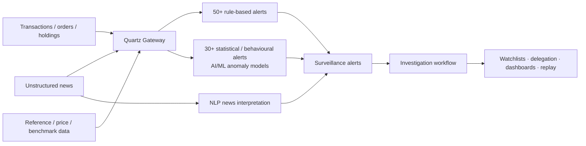

# Quartz Surveillance — public AI/ML capability map

[[bfsi/capital-markets-ai|← Capital markets AI]] · [[bfsi/risk-compliance-ai]] · [[tcs/public-ai-initiative-index]] · [[events/public-event-watch]]

> Evidence class: `product-capability`. This note documents only what TCS publishes publicly about Quartz Surveillance. It does **not** establish a named production customer deployment.

## Source and provenance

- **Publisher:** Tata Consultancy Services
- **Public product page:** https://www.tcs.com/what-we-do/products-platforms/quartz/solution/quartz-surveillance
- **Publication date:** not displayed on the current product page
- **Verified/accessed:** 2026-09-10
- **Confidence:** high for the published product capabilities; no production-customer inference

## What TCS publicly describes

TCS describes Quartz Surveillance as a market-surveillance solution for regulators, exchanges and other market participants that monitors trading behaviour and holding patterns and raises alerts for potential market abuse.

The current page exposes a materially more detailed surveillance stack than the repository previously captured:

- **AI/ML anomaly detection** is used to detect anomalous activity.
- **Labelled alert data** is used to create and train models intended to reduce false positives.
- **Natural-language processing** is used to extract and interpret unstructured news.
- Data can arrive from the wider financial ecosystem in **real time or periodically through Quartz Gateway**.
- The solution supports **50+ rule-based alerts**.
- It also supports **30+ statistical / behavioural-pattern alerts**.
- Published manipulation scenarios include wash trades, mark-the-close, front running, collusion detection, circular trading and spoofing.
- Multi-market coverage explicitly includes equity, fixed income, FX, commodities and derivatives.
- Investigation capabilities include online/offline alerts, case workflows, covert alerts, watchlists, workflow delegation/subscription, dashboards/reporting and market replay.

## Public architecture abstraction

The following is an **editorial reconstruction from the public product description**, not an internal TCS architecture diagram.

## Cross-source debugging

This product page sharpens the public Quartz story already visible in two 2026 event surfaces:

1. **PostTrade 360 Stockholm — 2 September 2026:** TCS publicly positioned Quartz Surveillance as AI-powered surveillance for proactive market-abuse detection, participant monitoring and regulatory-compliance support.
2. **Sibos 2026 — planned 28 September–1 October 2026:** TCS positions Quartz around AI + DLT across digital assets, compliance/KYC, surveillance and market intelligence.
3. **Current Quartz Surveillance product page:** exposes the concrete hybrid control mechanics — deterministic rules plus statistical/behavioural AI/ML plus NLP over unstructured news.

This supports a public product-level pattern of **hybrid surveillance rather than AI-only surveillance**: rules remain explicit, while ML/NLP extend anomaly detection and unstructured-information processing.

### Evidence boundary

The three sources are all TCS-owned public surfaces, so this is **not promoted as an independent higher-order operating-model inference**. The current product page does not name a customer, state that all alert types are live at any specific institution, disclose production volumes/latency, identify model families, or connect Quartz Surveillance to CAP, AI WisdomNext, AI Spectrum, Context Fabric or BaNCS AI Compass.

The anonymous APAC-exchange graph-surveillance implementation documented in [[research/advanced-quantz-apac-exchange-market-surveillance]] is kept separate: TCS does not publicly state that the AQuA deployment is Quartz Surveillance.

## Why this matters

For the public TCS capital-markets AI map, Quartz Surveillance can now be described more precisely as a **multi-signal surveillance product combining rules, statistical/behavioural detection, ML-based anomaly detection, NLP-based news interpretation and investigation workflow tooling**. This is stronger than generic “AI-powered surveillance” positioning, but remains `product-capability` evidence until a deployment is explicitly published.

## Related

[[bfsi/capital-markets-ai]] · [[bfsi/risk-compliance-ai]] · [[events/public-event-watch]] · [[research/advanced-quantz-apac-exchange-market-surveillance]]
