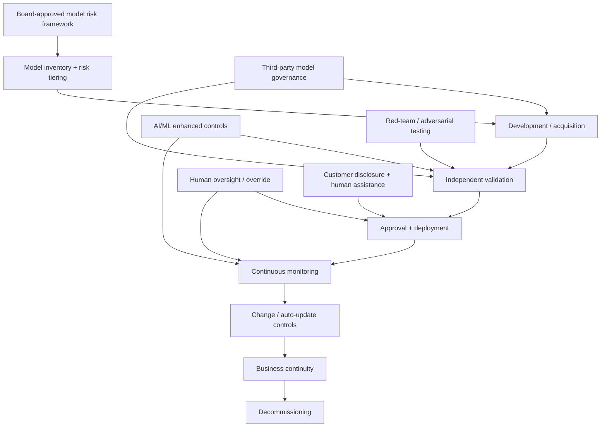

# RBI Draft Model Risk Management Guidance 2026 — AI/ML Control Implications

[[index|← Home]] · [[regulations/india-ai-bfsi]] · [[bfsi/risk-compliance-ai]] · [[intelligence/public-operating-model-inference]]

> **Evidence status:** `regulatory / draft consultation`. This is a Reserve Bank of India draft, not a final binding direction. The consultation window closed on July 24, 2026. Do not present the draft as a final rule unless a later RBI source explicitly finalises it.

## Primary regulatory signal

On **June 24, 2026**, RBI issued the draft **Guidance on Regulatory Principles for Model Risk Management** (Press Release **2026-2027/528**) for public comment.

RBI states that the draft applies to all models used by covered regulated entities, including **third-party models** and models employing **Artificial Intelligence / Machine Learning**. Its scope includes commercial banks, small finance banks, payments banks, local area banks, regional rural banks, co-operative banks, all-India financial institutions, NBFCs, asset reconstruction companies and credit information companies.

Primary RBI domain / draft-notification area:
- https://www.rbi.org.in/
- https://www.rbi.org.in/Scripts/BS_ViewREwiseDraftDirections.aspx

RBI press-release title/date reference: **“RBI issues draft ‘Guidance on Regulatory Principles for Model Risk Management’” — June 24, 2026.**

## Control architecture stated in the draft

The draft moves model risk — including AI/ML model risk — into a formal lifecycle-governance perimeter.

Publicly described control themes include:

- Board-approved **Model Risk Management Framework (MRMF)**
- risk-based model tiering
- model inventory and lifecycle governance
- independent model validation
- continuous oversight and monitoring
- change management
- business continuity and decommissioning
- governance of third-party models
- enhanced controls for AI/ML models

### AI/ML-specific control themes

The draft explicitly calls for attention to risks including:

- bias and discriminatory outputs
- explainability / interpretability limitations
- overfitting and poor generalisation
- spurious correlations
- output variability, stochastic behaviour and model uncertainty
- data quality, representativeness and completeness
- data drift and concept drift
- adversarial conditions and manipulation attempts
- generative/customer-facing model security risks

It also calls for **structured challenge processes such as red-teaming or equivalent testing**, particularly for models involving customer interaction or generative capabilities.

For models with dynamic or automatic updates, the draft calls for tighter boundaries on what can change automatically, justification for automatic updates, stronger data-quality checks and more frequent monitoring.

## Human-accountability boundary

RBI's draft treats human oversight as a core control for AI-enabled automated decisions. Secondary reporting on the draft, consistent with the RBI text, highlights review/override mechanisms intended to address automation bias and over-reliance on model output.

For customer-facing AI systems, the draft is publicly described as requiring stronger transparency and cyber controls, including safeguards against prompt injection/adversarial inputs, disclosure that the customer is interacting with AI, disclosure of limitations, and an option to move to human assistance.

## Third-party-model implication

A high-value architectural signal is that **outsourcing a model does not outsource accountability**. The draft includes third-party models inside the same governance perimeter and requires the regulated entity to identify and manage risks arising from information limitations, vendor dependencies and inadequate model transparency.

This is directly relevant to enterprise GenAI architectures that use external foundation models, hosted APIs, agent frameworks or model marketplaces: procurement/vendor assurance is only one control layer; regulated entities still need their own validation, monitoring, access controls and decision-accountability mechanisms.

## Editorial control-plane reconstruction

**Diagram status:** editorial reconstruction of public RBI draft-control themes. It is not an RBI architecture diagram and is not a TCS internal architecture.

## Connection to TCS public material — comparison, not endorsement

RBI does **not** endorse TCS products. However, the regulatory control vocabulary can be compared with TCS' independently published BFSI AI material.

Across TCS public sources, recurring controls include:

- explainability / traceability
- human oversight
- guardrails
- continuous monitoring / observability
- governance
- model risk / bias management
- auditability
- decision evidence
- agent/tool permissions
- lifecycle testing and evaluation

Relevant public TCS sources already captured in the repository include:

- [[research/responsible-ai-financial-crime-governance]]
- [[research/ai-agents-phased-adoption-bfsi]]
- [[research/smart-risk-enterprise-to-agentic-risk-intelligence]]
- [[bfsi/risk-compliance-ai]]
- [[tcs/public-ai-initiative-index]]

### Derived observation

**Confidence: high for vocabulary/control convergence; not a deployment claim.**

The RBI draft and multiple TCS BFSI sources independently converge on the same runtime-governance primitives: inventory, validation, explainability, human accountability, monitoring, testing and third-party controls. This strengthens the existing repository inference that production agentic AI in regulated BFSI requires a durable governance/control plane rather than one-time pre-deployment review.

**Alternative explanation:** these controls may simply reflect broad industry best practice and common model-risk disciplines rather than any distinctive TCS operating model.

**Falsifier:** future TCS production material that materially de-emphasises independent validation, human override, continuous monitoring or model/agent governance despite regulatory movement in the opposite direction.

## Status-transition significance

This source is important because it moves Indian banking AI governance from mainly principles-level discussion toward **specific model-lifecycle control expectations**. The draft should be watched for:

1. final RBI issuance or replacement;
2. changes to AI/ML-specific safeguards;
3. effective dates and applicability;
4. whether customer-facing GenAI controls survive into the final text;
5. whether agentic/autonomous systems receive additional explicit treatment.

## Sources

- Reserve Bank of India — draft-notification / regulation portal: https://www.rbi.org.in/
- RBI press-release reference: *RBI issues draft ‘Guidance on Regulatory Principles for Model Risk Management’*, June 24, 2026, Press Release 2026-2027/528.
- Reuters summary of the June 24, 2026 RBI draft: https://www.reuters.com/business/rbi-proposes-guidelines-banks-manage-ai-risks-2026-06-24/

## Related

[[regulations/india-ai-bfsi]] · [[bfsi/risk-compliance-ai]] · [[research/responsible-ai-financial-crime-governance]] · [[intelligence/public-operating-model-inference]]
