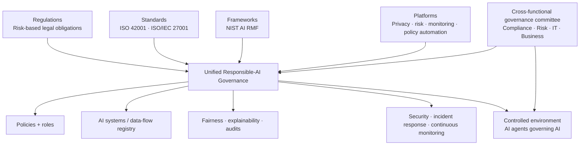

# TCS BFSI Responsible AI — Unified Governance Blueprint

[[index|← Home]] · [[bfsi/risk-compliance-ai]] · [[regulations/india-ai-bfsi]] · [[media/visual-reference-library]] · [[ai/agentic-ai-bfsi-architecture]]

> **Evidence class:** `thought-leadership`  
> **Publisher:** Tata Consultancy Services (TCS)  
> **Publication date:** not stated on the public page; do not infer one from crawl/index dates  
> **Public source:** https://www.tcs.com/what-we-do/industries/banking/white-paper/responsible-ai-blueprint-bfsi  
> **Confidence:** high for the published TCS viewpoint; this is not customer-deployment or regulator-endorsement evidence.

## Why this source matters

TCS' public paper **“A Blueprint for Responsible AI in BFSI”** moves beyond generic responsible-AI principles and publishes a concrete governance composition model for banks, financial institutions and insurers.

The paper's central proposition is that responsible AI should be operationalized by integrating four classes of control infrastructure:

1. **Regulations** — legal obligations and risk-based requirements.
2. **Standards** — management-system and information-security structures such as ISO 42001 and ISO/IEC 27001.
3. **Frameworks** — especially the NIST AI Risk Management Framework (AI RMF).
4. **Platforms** — technical systems for privacy, risk/ethical-AI assessment, monitoring, policy automation, compliance tracking and workflow execution.

This makes the source useful as a public **governance architecture**, not only an ethics statement.

## Published NIST-to-control mapping

TCS maps the four NIST AI RMF functions to responsible-AI control objectives:

| NIST AI RMF function | TCS responsible-AI pillar | Published objective |
|---|---|---|
| Govern | Governance and compliance | Establish policies, roles and ethical standards for AI use |
| Map | Model monitoring and accountability | Identify AI systems, data flows and lifecycle risks |
| Measure | Bias/fairness + explainability/transparency | Evaluate performance, fairness and interpretability using metrics and audits |
| Manage | Security and risk management | Mitigate risk through security controls, incident response and continuous monitoring |

This is especially useful because it links governance vocabulary to operating controls rather than leaving the framework at policy level.

## High-risk BFSI control surface

The paper explicitly calls out high-risk AI applications such as:

- personalized credit scoring
- portfolio balancing
- claims automation
- fraud monitoring
- biometric identification

For these and comparable systems, TCS says firms need controls around data quality, documentation, traceability, post-market monitoring, legality, fairness and safety.

## Organizational operating model

TCS recommends a **cross-functional governance committee** spanning compliance, risk, IT and business teams. Its public operating responsibilities include:

- assessing existing AI practices
- benchmarking them against applicable regulation and standards
- defining a strategic responsible-AI roadmap
- inserting guardrails across the AI lifecycle
- prioritizing high-risk use cases, data quality and transparency
- running recurring risk and impact assessments
- continually monitoring and auditing AI systems and governance structures

This is `thought-leadership`: the paper does not identify a named bank or insurer operating this exact committee model.

## Material agentic-AI control signal

One recommendation is particularly important for the repository's agentic-AI control-plane map:

> TCS recommends building a **controlled environment using AI agents to govern AI**.

The public page does not specify the implementation architecture, model provider, agent framework or production customer for such a control environment. Therefore this must remain a **governance design recommendation**, not a deployed capability claim.

Potential control roles implied by the surrounding paper include policy checks, risk assessment, monitoring, documentation, audit support and compliance tracking; these are editorial mappings from the published governance functions and should not be represented as a named TCS product implementation.

## Official public visual

The page publishes **Figure 1: “Components of an AI governance strategy.”** TCS' description says the visual brings together:

- regulations
- standards
- frameworks
- platforms
- NIST AI RMF functions
- policies
- registry

The repository links the official page and does not re-host the copyrighted artwork. See [[media/visual-reference-library]].

### Editorial study reconstruction

**Diagram status:** editorial reconstruction of the public paper's governance relationships. It is **not** an internal TCS architecture diagram.

## Cross-source debugging

This source strengthens—but does not by itself prove—a broader control-plane pattern already visible in the repository:

- **Context Fabric:** policy, regulatory, workflow and human-override context is injected into agent behavior.
- **Cognitive Automation Platform:** agent governance, policy controls, guardrails and observability are product capabilities.
- **BaNCS AI Compass:** responsible/traceable AI, guardrails and audit logging are explicit product design goals.
- **Model-risk-management paper:** agentic AI is mapped across development, independent validation and audit, with continuous self-monitoring.
- **SEBI CyberSuraksha frontier-AI paper:** regulator-hosted material emphasizes agent identity, delegated authority, tool/action logging and intervention controls.

The responsible-AI blueprint adds an enterprise governance layer above these technical patterns: **regulation + standards + frameworks + platforms + organizational accountability**.

### Status discipline

Do **not** infer that:

- the EU AI Act, NIST, ISO, RBI, SEBI or IRDAI endorses a TCS product;
- CAP, WisdomNext, AI Spectrum, BaNCS AI Compass or Context Fabric implements this exact blueprint;
- the “AI agents to govern AI” recommendation is already deployed at a named customer;
- every BFSI AI application is legally classified the same way in every jurisdiction.

## Derived pattern status

**No new repository-level operating-model inference promoted in this note.**

The source is TCS-owned thought leadership and strongly reinforces an existing public pattern: responsible AI is moving from model-level checks toward an enterprise control plane combining lifecycle registries, policy, monitoring, auditability, human accountability and increasingly agent-aware controls. Independent customer/regulator evidence remains necessary before upgrading any TCS-specific implementation claim.

## Public professional author

**Prasad Chitta** is identified on the source page as a **Chief Architect in the Data & Analytics Group of TCS' BFSI business unit**, leading AI and analytics strategy for BFSI, with published focus on responsible/adaptive AI, regulatory compliance and enterprise-scale transformation.

This records only the professional title/topic relationship published by TCS at the source date; no reporting-line or private organizational inference is made.

## Related

[[bfsi/risk-compliance-ai]] · [[research/responsible-ai-financial-crime-governance]] · [[research/agentic-ai-model-risk-management-three-lines-defense]] · [[research/sebi-frontier-ai-readiness-enterprise-resilience-2026]] · [[media/visual-reference-library]]
