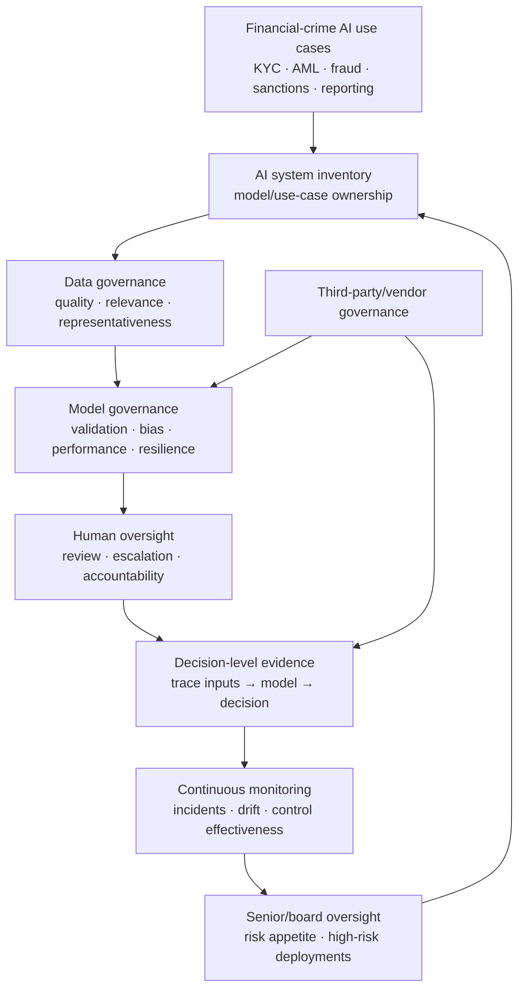
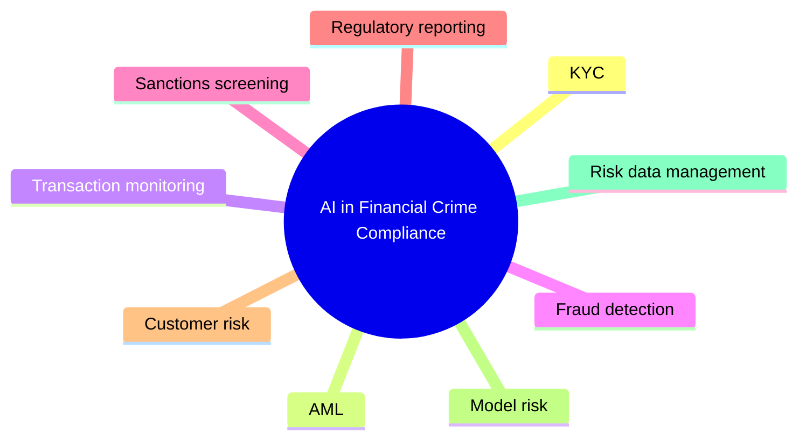

# Responsible AI in Financial Crime — Public TCS Governance Model

[[index|← Home]] · [[bfsi/risk-compliance-ai]] · [[people/public-capability-network]] · [[intelligence/public-operating-model-inference]]

**Evidence status:** `thought-leadership / governance`  
**Primary source:** https://www.tcs.com/what-we-do/industries/banking/white-paper/responsible-ai-financial-crime-global-compliance-governance

> This note captures TCS-authored public guidance. It is not a statement that regulators endorse TCS products or that every TCS client uses this architecture.

## Core public thesis

TCS frames Responsible AI in financial-crime compliance as moving from an ethics-only concern toward an operational governance discipline. The paper connects AI-supported KYC, fraud, sanctions, transaction monitoring and regulatory reporting with requirements for explainability, fairness, accountability, auditability, resilience, human oversight and reconstructible decisions.

## Governance stack reconstructed from the public paper

**Diagram status:** editorial reconstruction from the source's described control themes; not a TCS internal architecture diagram.

## High-value control requirements in the TCS paper

The page explicitly discusses:

- inventories of AI systems and high-risk deployments
- data quality and suitability for training/inference
- model decisions traceable to specific data inputs
- model validation and bias controls
- human-in-the-loop oversight
- vendor and third-party governance
- incident readiness
- board/senior-management accountability
- cross-border AI deployment/data-flow governance
- real-time governance monitoring rather than static checklists
- **decision-level audit evidence** rather than policy-only compliance

## Financial-crime functions explicitly in scope

## Architecture implication

The paper strengthens a recurring public TCS pattern: in regulated BFSI AI, governance is increasingly described as a **runtime/control-plane concern**, not a final approval gate. This aligns conceptually with governance/observability language in Cognitive Automation Platform, traceability/guardrails in BaNCS AI Compass, and critique/regulatory-context concepts in Context Fabric.

That is a cross-source public pattern, not evidence that these products share one internal implementation.

## Public author

### Partha Pratim Ghosh

TCS publicly describes Partha Pratim Ghosh as a consultant in the Risk Practice of its BFSI business unit. His published experience spans market risk, credit risk, financial crime, model risk and risk data management.

**Source:** same TCS paper above.

## Evidence boundary

- Regulatory frameworks referenced inside the TCS paper remain regulator material; TCS' interpretation is TCS-authored thought leadership.
- No regulator endorsement of TCS, CAP, BaNCS, Quartz or any other product is implied.
- No client deployment is inferred from this paper.

## Related

[[bfsi/risk-compliance-ai]] · [[ai/agentic-ai-bfsi-architecture]] · [[research/ai-roi-lifecycle-and-coe]] · [[people/public-capability-network]]
