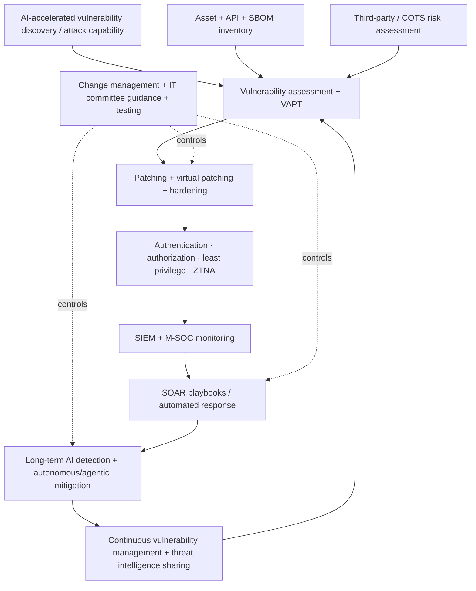

# SEBI 2026 Advisory — AI Vulnerability Detection, Cyber Resilience and Agentic Mitigation

[[index|← Home]] · [[regulations/india-ai-bfsi]] · [[bfsi/risk-compliance-ai]] · [[ai/agentic-ai-bfsi-architecture]]

> **Evidence class:** `regulatory / advisory`  
> **Regulator:** Securities and Exchange Board of India (SEBI)  
> **Published:** May 5, 2026  
> **Circular:** HO/13/19/12(1)2026-ITD-1_CIMGI/10873/2026  
> **Primary source:** https://www.sebi.gov.in/legal/circulars/may-2026/advisory-on-emerging-advanced-artificial-intelligence-ai-tools-for-vulnerability-detection_101270.html  
> **Primary PDF:** https://www.sebi.gov.in/sebi_data/attachdocs/may-2026/1777992004516.pdf

## Why this advisory is unusually important for AI architecture

SEBI's May 2026 advisory is not merely a warning about AI-generated cyber threats. It explicitly treats advanced AI vulnerability-discovery capability as a change in the **speed, scale and operational risk profile** of securities-market cybersecurity, then translates that concern into concrete controls for regulated entities and their technology ecosystems.

The advisory is addressed broadly across the securities-market ecosystem, including AIFs, clearing corporations, credit-rating agencies, custodians, depositories and depository participants, investment advisers/research analysts, KRAs, merchant bankers, mutual funds/AMCs, portfolio managers, RTAs, stock brokers, exchanges and venture-capital funds.

## Risk model stated by SEBI

SEBI says emerging AI-driven vulnerability-identification tools can increase risk because they can identify and potentially exploit existing vulnerabilities at **speed and scale**. The circular also calls out risks to:

- data confidentiality
- application integrity
- reliability of outputs
- interconnected market participants, where weaknesses can create cascading impact

This is therefore both an **AI-model risk** issue and a **systemic cyber-resilience** issue.

## cyber-suraksha.ai task force

SEBI states that it constituted the **cyber-suraksha.ai** task force with representatives from market infrastructure institutions (MIIs), qualified RTAs, qualified regulated entities and other relevant stakeholders.

The task force mandate includes:

1. examining cybersecurity risks posed by AI-based models and devising a uniform mitigation strategy
2. facilitating sharing of threat intelligence, vulnerability-management practices, use cases and response playbooks
3. priority reporting of cyber incidents, malicious activity, major attack vectors and vulnerabilities relevant to securities-market resilience
4. reviewing the cyber-security posture of third-party application-service providers, including empaneled vendors

SEBI states that the annexed advisory followed consultation with this task force on risks from AI platforms used for vulnerability discovery.

## Control requirements and recommendations in Annexure-A

### 1. Patch and vulnerability management

- apply current operating-system and application patches immediately for known vulnerabilities
- where patches are unavailable, consider virtual patching as an interim protection measure
- perform vulnerability assessment using conventional and suitable AI-based tools where possible
- carry out regular/continuous security audits under SEBI's Cyber Security and Cyber Resilience Framework

### 2. Third-party and vendor risk

Regulated entities are directed to engage vendors for timely patch release and deployment. Exchanges and depositories are to require empaneled COTS application vendors to assess risks arising from AI-led vulnerability-detection models and implement safeguards such as patching, VAPT, continuous monitoring and hardening.

This makes the control perimeter extend beyond the regulated entity into the application-supply chain.

### 3. Change management

Even minor system changes should include:

- full documentation
- impact analysis
- structured review
- rigorous testing
- secure deployment

The stated objective is operational resilience and system stability.

### 4. API security

SEBI's advisory explicitly requires or recommends controls including:

- maintaining an up-to-date API/application inventory
- strong authentication and authorization
- least-privilege information access and transfer
- API rate limiting and throttling
- whitelist-based API connectivity

For agentic-AI architecture, these controls are especially relevant because tool-using agents often act through APIs. This is an architecture-control mapping only; SEBI does **not** endorse any TCS agent platform or architecture.

### 5. SOC monitoring and automated response

The advisory calls for vigorous day-to-day monitoring of systems and networks, including examination of low-priority SOC alerts. It also says regulated entities should implement enhanced **SOAR playbooks integrated with SIEM solutions**, after thorough testing where feasible.

The circular highlights the Market SOC (M-SOC) operated by NSE and BSE as a centralized 24x7 monitoring and threat-detection platform and asks eligible regulated entities not yet onboarded to expedite onboarding in view of AI-driven attack risk.

### 6. Scenario-based risk assessment

SEBI's existing CSCRF risk-assessment perimeter includes regulated entities and their third-party service providers. The advisory says scenario-based testing should cover internal and external cyber risks and that the capability of AI-based models may be considered as one such risk scenario.

### 7. Hardening, Zero Trust and software supply-chain visibility

The annexure calls for:

- secure configurations and system hardening
- disabling unnecessary services/default accounts
- least privilege
- Zero Trust Network Access (ZTNA)
- periodically updated asset inventory
- Software Bill of Materials (SBOM) for critical applications, including open-source components

### 8. Long-term AI and agentic mitigation plan

The strongest forward-looking statement appears at the end of the annexure. SEBI says regulated entities need to prepare a **long-term plan for usage of AI in detection and autonomous/agentic mitigation**.

The same paragraph also calls for:

- recalibration of risks for AI-accelerated threats
- AI-augmented SOC transformation
- continuous vulnerability management using AI tools

This is a concrete regulator-issued use of **agentic** terminology in a cyber-control context. It does not mean autonomous remediation should be uncontrolled; the advisory repeatedly anchors the overall process in testing, governance, least privilege, change management, monitoring and IT-committee guidance.

## Editorial architecture reconstruction

**Diagram status:** editorial reconstruction of SEBI's public advisory; it is not an official SEBI architecture diagram and not a TCS internal architecture.

## TCS relevance — control mapping only

This advisory is relevant when evaluating public TCS BFSI AI material that discusses agent governance, observability, API/tool permissions, human oversight, risk controls, SOC automation or agentic operations. The safe mapping is:

**SEBI regulatory signal → required/expected control capabilities → architecture pattern → possible fit of public TCS capabilities.**

It is **not** valid to reverse that chain into a claim that SEBI endorses TCS Cognitive Automation Platform, AI WisdomNext, BaNCS AI Compass, Quartz, Context Fabric or any other TCS offering.

## Evidence boundary

- `regulatory / advisory`, not a TCS deployment
- regulator-issued circular, but applicability should be read from the addressed-entity list and underlying CSCRF obligations
- no TCS product is named
- no customer implementation is established
- no inference about internal TCS controls or customer architectures is made

## Related

[[regulations/india-ai-bfsi]] · [[bfsi/risk-compliance-ai]] · [[ai/agentic-ai-bfsi-architecture]] · [[intelligence/public-operating-model-inference]]
