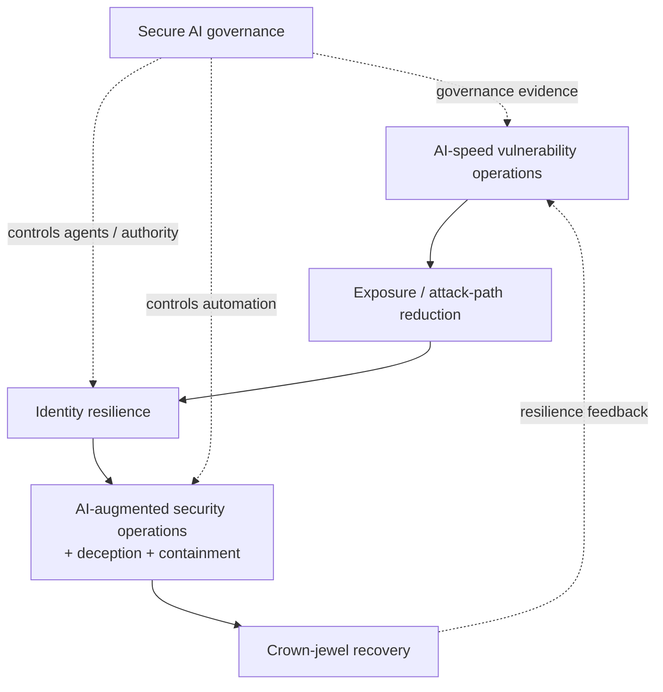

# SEBI CyberSuraksha — Frontier AI Readiness and Enterprise Resilience

[[index|← Home]] · [[regulations/india-ai-bfsi]] · [[bfsi/risk-compliance-ai]] · [[ai/agentic-ai-bfsi-architecture]]

> **Evidence status:** `regulator-published knowledge / thought-leadership`. This is a Deloitte Touche Tohmatsu India LLP perspective published through SEBI's CyberSuraksha portal on **16 August 2026**. It is **not** a SEBI circular, regulation, binding direction, or endorsement of any TCS product.

## Primary source

- SEBI CyberSuraksha listing: https://cybersuraksha-ai.sebi.gov.in/
- Regulator-hosted PDF: https://cybersuraksha-ai.sebi.gov.in/documents/48365173/0/Frontier_AI_Readiness_Enterprise_Resilience.pdf/bd92d325-a730-ec92-2e3e-feb634cd4ed0?t=1786867808004
- Published/listed: 2026-08-16
- Publisher/host: SEBI CyberSuraksha
- Document authoring organization: Deloitte Touche Tohmatsu India LLP

## Why this paper matters to the BFSI AI control graph

The paper treats frontier AI as a **machine-speed risk multiplier** rather than a completely new cybersecurity problem. Its core proposition is that existing security fundamentals remain relevant, but operating models must respond at higher speed and with tighter control over identities, agents, connectors, authority and recovery.

It describes six connected enterprise workstreams:

1. AI-speed vulnerability operations
2. exposure and attack-path reduction
3. identity resilience
4. AI-augmented security operations, deception and containment
5. crown-jewel recovery
6. secure AI governance

## Agentic-AI governance controls explicitly described

The most relevant section for agentic AI says agents should be governed as **delegated actors**, because their risk depends on the combination of data, tools, permissions and autonomy available to them.

The public paper recommends controls including:

- inventorying agents, copilots, models, plugins, connectors and tools
- assigning an owner, approved purpose, data access and action scope
- least privilege, with read-only access as the default unless writes are justified
- enforcing controls in downstream applications/data systems instead of relying on model prompts for restraint
- logging prompts, tool calls, data access, outputs and downstream actions
- operational ability to pause an agent, revoke tokens or disable a connector
- adversarial testing against hostile instructions/content in documents, email, websites, repositories and tickets
- re-testing when models, system instructions, tools, connectors or permissions change
- separating orchestration, logging, evaluation, tools and controls from the underlying model where practical to reduce single-model dependency
- monitored kill switches and auditable containment

## Identity and non-human actor controls

The paper explicitly extends identity governance to **service accounts, workloads, bots, scripts and AI agents**. It recommends documented ownership/purpose/privilege/review cycles and replacing static credentials with managed identity, federation or short-lived tokens where possible.

This is highly relevant to BFSI agent architectures because it moves governance from model-level safety into **runtime identity + authorization + tool/action control**.

## Machine-speed security operations

The paper argues that AI can compress vulnerability discovery/exploitation timelines from traditional monthly cycles toward minutes or hours. It therefore recommends continuous vulnerability operations, business-context prioritization, automated remediation where appropriate, governed exceptions and pre-authorized response actions.

For AI-augmented security operations, it emphasizes telemetry across identity, endpoints, cloud, SaaS, APIs and applications, while retaining raw evidence so AI-assisted investigations can reconstruct attack paths rather than relying only on generated alerts.

## Human-control boundary

The paper is not advocating unconstrained autonomous response. It explicitly says irreversible response actions should not be delegated to unproven automation. Early automation should focus on reversible actions with explicit triggers, scope, rollback and audit trails.

That creates a useful public control principle:

**higher autonomy -> stronger identity constraints + telemetry + reversible action design + explicit intervention/kill mechanisms**

## Published visual — six-workstream programme

The PDF includes **“Image 2: The six workstream programme for a resilient enterprise”** around page 6 of the PDF. The repository does not re-host that copyrighted figure.

### Editorial reconstruction

**Diagram status:** editorial reconstruction of the six named workstreams and their control relationships. It is **not** the original SEBI/Deloitte artwork and is not an internal TCS architecture.

## Cross-source architecture relevance to TCS BFSI AI

This paper independently strengthens several control themes already visible in public TCS BFSI AI material:

- agent/runtime governance
- observability and audit trails
- tool/action boundaries
- human oversight
- identity and permissions
- model portability / abstraction
- continuous monitoring
- context-aware decisioning

The overlap is useful for architecture comparison only. **SEBI has not endorsed TCS Cognitive Automation Platform, AI WisdomNext, Context Fabric, AI Spectrum, BaNCS AI Compass, or any other TCS product.**

## Derived pattern — not an internal fact

**Pattern:** Financial-sector agentic-AI governance is shifting from “model governance” alone toward **actor governance**: identity, delegated authority, tool permissions, action scope, runtime telemetry, intervention and recovery.

**Evidence strength:** medium as a regulator-hosted/public-control pattern. This paper itself is one source family and therefore does not independently justify a new repository-level operating-model inference.

**Alternative explanation:** the recommendations may primarily reflect general enterprise cybersecurity practice adapted to AI rather than a distinct financial-sector agent-governance regime.

**Falsifier:** future binding guidance could remain focused primarily on traditional model validation without extending governance to agent identities, tools, connectors, runtime actions and delegated authority.

## Evidence boundary

- `regulator-published knowledge`: yes
- `thought-leadership`: yes
- `regulatory / binding requirement`: **no**
- `TCS product evidence`: **no**
- `customer deployment evidence`: **no**

## Related

[[regulations/india-ai-bfsi]] · [[bfsi/risk-compliance-ai]] · [[ai/agentic-ai-bfsi-architecture]] · [[intelligence/public-operating-model-inference]]
