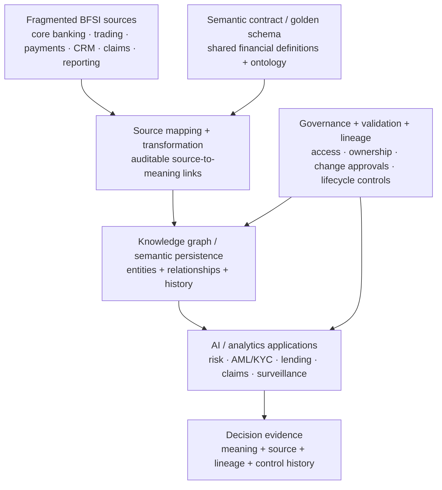

# Semantic Data Models — Context, Auditability and AI RoI in BFSI

[[research/bfsi-ai-reading-room|← Reading room]] · [[atlas/architecture-atlas]] · [[intelligence/public-operating-model-inference]] · [[people/public-capability-network]]

**Primary source:** https://www.tcs.com/what-we-do/industries/banking/white-paper/semantic-data-models-ai-roi-growth-bfsi  
**Publisher:** Tata Consultancy Services  
**Evidence class:** `thought-leadership / public-article-example / architecture`  
**Publication date:** not exposed reliably on the current TCS page; do not invent one.  
**Captured:** 2026-09-09

> Evidence boundary: the architecture is TCS-authored public guidance. The three implementation examples below are anonymized TCS-published examples. They are useful as public-case evidence but are not independently customer-corroborated and their client identities must not be inferred.

## Why this source matters

This paper adds a sharper data-architecture layer underneath the already-captured TCS **Context Fabric** and **AI-ready data** themes. TCS argues that BFSI AI does not fail only because of model quality; inconsistent enterprise meaning creates **semantic debt** across risk, finance, compliance, operations and AI systems.

The paper treats a Semantic Data Model (SDM) as a governed, machine-readable semantic layer that separates business meaning from physical source-system implementation and makes definitions, relationships, lineage and controls reusable across AI and analytical workloads.

## Public architecture signal

TCS' Figure 1 is titled **“From fragmented data to context-based AI.”** It positions a governed semantic layer between fragmented sources such as core banking/data lakes and AI applications. The public description associates this layer with trusted AI-ready data, stronger risk precision, regulatory alignment, faster insight and audit-ready lineage.

TCS' Figure 2 is titled **“A four-phase SDM lifecycle for BFSI.”** The public description defines four engineering phases:

1. **Semantic contract definition** — knowledge engineers define a golden schema / ontology for shared financial meaning.
2. **Source mapping and transformation** — data engineers map core banking, trading, payments, CRM, claims and reporting sources to that shared meaning.
3. **Graph construction and persistence** — platform engineers turn semantics and mappings into an executable knowledge-graph layer.
4. **Validation, governance and delivery** — AI/application developers consume certified data under validation, lineage and lifecycle controls.

TCS also states that SDMs can support virtual, materialized and hybrid deployment patterns and can scale using modern graph platforms and high-performance computing.

### Editorial reconstruction — not an internal TCS diagram



**Diagram status:** editorial reconstruction of the two public TCS figures and their descriptions; it is not an internal TCS architecture diagram and does not reproduce TCS artwork.

## Control-plane implications

The paper makes three control properties explicit:

- **Consistent meaning:** the same customer, transaction, exposure, instrument or legal-entity semantics should be reused across reports, models and geographies rather than rebuilt per use case.
- **Built-in governance:** mappings, definitions, ownership, access rules and change approvals are part of the data operating model before AI consumes the data.
- **Auditability:** an AI decision should carry enough semantic, source, lineage, validation and control history that a model-risk team, auditor or regulator does not need a separate evidence-reconstruction exercise.

This is materially consistent with the repo's existing **context-as-control-layer** and **runtime-governance** themes, but this source adds a specific data-engineering mechanism: governed semantic contracts + graph persistence + lineage.

## Public anonymized implementation examples

### APAC exchange — market-abuse surveillance — `public-article-example`

TCS describes a large APAC exchange using a knowledge graph underpinned by an SDM to connect trades, orders, instruments, participants and relationships for near-real-time market-abuse surveillance.

TCS reports:

- broader coverage extending beyond trade-only patterns to layering, spoofing, circular trading and trade-to-communications linkages
- around **20–30% reduction in manual review effort**
- a potential **15–25% reduction in escalation/reporting turnaround**

**Boundary:** the exchange is unnamed; do not infer identity. Treat outcome figures as TCS-published claims.

### Large US financial institution — operational resilience — `public-article-example`

TCS describes deployment of an SDM with graph architecture to create a unified, time-aware view of devices, services, users and dependencies.

TCS reports:

- **30% reduction in root-cause-analysis time**
- around **15% improvement in incident resolution**
- better operational resilience and change-impact visibility

**Boundary:** customer identity is not public in this source.

### Global bank — governed semantics for risk/finance/compliance — `public-article-example`

TCS describes a global bank implementing a governed SDM to standardize definitions across risk, finance, compliance and analytics and reuse approved entities and relationships across reporting, analytics and model workflows.

TCS reports:

- around **20% reduction in manual reconciliation / interpretation effort**
- **15–25% potential increase in model adoption rates**
- improved traceability from business terms to source data, controls and approved definitions
- shared-model collaboration scaling to roughly **197 contributors, 6,400 commits and 2,400 pull requests**

**Boundary:** the bank is unnamed and the figures remain TCS-published claims.

## Public capability-network signal

The TCS page names three authors:

- **Sourav Dey** — Data Science Consultant, Advanced Quantz & Analytics (AQuA), TCS BFSI; TCS associates him with ML-led design and scaling AI/data-science delivery for BFSI customers.
- **Naveena Palliyan** — Industry Advisor, AQuA, TCS BFSI; TCS associates her with enterprise advanced analytics for large investment banks.
- **Baljeet Saini** — Chief Architect for Data Science & ML Engineering, AQuA, TCS BFSI; TCS associates him with enterprise-scale AI/ML platforms, quantitative solutions, data-driven architecture and engineering-first AI adoption.

Only source-published professional roles/topic relationships are retained.

## Cross-source intelligent debugging

This source should be read together with:

- **Context Fabric — The Backbone of Agentic AI in BFSI**: context spans process, policy, regulation, data/tools and a semantic mesh.
- **Modern MDM: AI-ready Data to Scale Enterprise AI in BFSI**: governed, contextual, consumable data is treated as an AI prerequisite.
- **The End of AI Pilots**: the public enterprise-AI architecture includes a data/intelligence fabric grounding models and agents.

### Derived pattern — strengthens an existing inference

Across these independent TCS public sources, a recurring pattern is now clearer:

```text
physical data systems
        ↓
governed semantic / master-data layer
        ↓
enterprise context fabric
        ↓
models + agents + orchestration
        ↓
controlled BFSI decisions / actions
        ↓
audit evidence + feedback
```

This **strengthens** the repository's existing inference that “context” is becoming an enterprise architecture/control layer. It does not create evidence of an internal TCS implementation standard, and it should not be represented as one.

## Falsifier / alternative explanation

**Alternative explanation:** semantic layers, knowledge graphs, master-data governance and lineage are common enterprise-data architecture practices; the recurrence may partly reflect broader industry convergence rather than a uniquely TCS operating model.

**Falsifier:** if future TCS BFSI architecture material moves away from governed reusable semantics toward isolated application-level retrieval/prompt patterns, or if production sources show semantic governance is not materially used in scaling AI, confidence in the strategic-layer interpretation should be reduced.

## Related

[[research/modern-mdm-ai-ready-data-bfsi]] · [[intelligence/public-operating-model-inference#inference-4--context-is-being-elevated-to-a-strategic-control-layer-not-treated-as-prompt-engineering]] · [[bfsi/risk-compliance-ai]] · [[bfsi/capital-markets-ai]]
