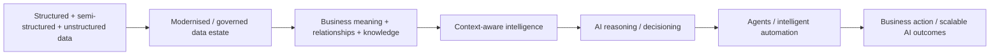

# Smart Data for Smarter AI → Context-aware Intelligence — TCS + Snowflake 2026

[[index|← Home]] · [[tcs/public-language-glossary]] · [[intelligence/public-operating-model-inference]] · [[research/semantic-data-models-ai-roi-bfsi]] · [[tcs/ai-partnerships]]

> **Evidence scope:** public TCS material only. This note captures a current public architecture/strategy signal; it does **not** assert an internal TCS architecture or a named BFSI production deployment.

## Current event signal

**Event:** Snowflake World Tour Bangalore 2026  
**Date:** September 10, 2026  
**Evidence class:** `planned/current-public-event / product-capability / ecosystem-partnership`  
**Primary source:** https://www.tcs.com/who-we-are/events/tcs-at-snowflake-world-tour-bangalore-2026

TCS publicly positions its **Smart Data for Smarter AI** approach with Snowflake as a move **beyond AI-ready data** toward **context-aware intelligence**.

The event page says the combined approach is intended to transform fragmented enterprise data into **trusted business context** that can support:

- better decisions
- intelligent automation
- real-time insights
- enterprise-scale AI
- agentic innovation

The page makes the agentic link unusually explicit: TCS says context includes the **business meaning, relationships, and knowledge** that allow AI to make better decisions, and describes the target as business context that **AI can reason with and agents can act upon**.

Publicly named speaker:
- **Ram Viswanathan — Managing Partner, Data Analytics & Business Intelligence, TCS**

Session title:
- **“Beyond AI-ready data: Building context-aware intelligence with TCS and Snowflake”**

## Durable TCS data-language context

TCS' public Data & Analytics service page separately describes **Smart Data for Smarter AI** as its data foundation for modern AI systems.

Primary source: https://www.tcs.com/what-we-do/services/data-and-analytics

The public data model includes:

1. **Expand the data estate** — combine structured, semi-structured and unstructured data.
2. **AI-first data engineering** — use AI to accelerate data-platform/data-program delivery.
3. **Reimagine insights** — move insight generation toward real-time execution.
4. **Data exploitation** — predictive/prescriptive analytics at scale.
5. **Prepare data for AI** — make data usable for new AI products/services.

Named supporting TCS capabilities on that page include **Datom**, Data Fabric, advanced analytics and interpretable model outputs.

## Cross-source debugging

### 1. AI-ready data → context-aware intelligence

The Snowflake event sharpens TCS vocabulary from a generic readiness problem into a semantics/context problem:

```text
fragmented data
  → trusted/scalable data foundation
  → business meaning + relationships + knowledge
  → context-aware intelligence
  → AI reasoning
  → agent action
```

This is consistent with the previously captured BFSI **Context Fabric** and **Semantic Data Model** material, but should not be treated as proof that the Snowflake implementation is the same technical component as Context Fabric.

### 2. Relationship to BFSI semantic-data evidence

The BFSI Semantic Data Model paper describes governed semantics, golden schemas and knowledge graphs as mechanisms for creating shared business meaning across risk, finance, compliance and AI systems.

Related note: [[research/semantic-data-models-ai-roi-bfsi]]

The Snowflake event now supplies a broader enterprise-data formulation using highly similar architectural logic: **data becomes useful to AI when meaning and relationships are made explicit enough for reasoning and action**.

### 3. Relationship to Google Cloud agent evidence

TCS' April 24, 2026 Google Cloud partnership expansion states that TCS had built **3,000+ industry- and context-aware agents on Gemini Enterprise** and announced an **Agentic AI Data Accelerator** intended to create a cloud-native foundation for AI at scale.

Primary source: https://www.tcs.com/who-we-are/newsroom/news-alert/tcs-deepens-partnership-google-cloud-power-ai-native-autonomous-enterprises

This is a separate ecosystem relationship. It should **not** be merged into a joint Snowflake/Google architecture. The useful higher-level signal is that **context-aware** vocabulary is recurring across different TCS partner stacks.

## Editorial architecture reconstruction



**Diagram status:** editorial reconstruction from public TCS wording. It is **not** an internal TCS architecture diagram and does not reproduce copyrighted TCS artwork.

## Evidence boundary

- `product-capability / public-event positioning`: establishes TCS' current public data-to-context-to-agent language.
- `ecosystem-partnership`: establishes a TCS + Snowflake go-to-market/technical positioning around data foundations.
- It does **not** establish a named BFSI customer deployment.
- It does **not** prove Snowflake is the implementation substrate for TCS Context Fabric.
- It does **not** prove that Google Cloud's context-aware agents and the Snowflake data approach are part of one deployed architecture.

## Intelligence effect

This materially strengthens existing **Inference 4 — “Context” is being elevated to a strategic control layer, not treated as prompt engineering**.

No new higher-order inference is created in this note because the repository already captures that pattern at very-high confidence. The new evidence adds an important **data-foundation mechanism** and demonstrates that TCS is publicly carrying the context concept across a second major ecosystem surface.

## Sources

- TCS — Snowflake World Tour Bangalore 2026: https://www.tcs.com/who-we-are/events/tcs-at-snowflake-world-tour-bangalore-2026
- TCS — Smart Data for AI / Data & Analytics: https://www.tcs.com/what-we-do/services/data-and-analytics
- TCS — Google Cloud autonomous-enterprise partnership expansion, April 24, 2026: https://www.tcs.com/who-we-are/newsroom/news-alert/tcs-deepens-partnership-google-cloud-power-ai-native-autonomous-enterprises

## Related

[[intelligence/public-operating-model-inference]] · [[research/semantic-data-models-ai-roi-bfsi]] · [[tcs/public-language-glossary]] · [[tcs/ai-partnerships]]
