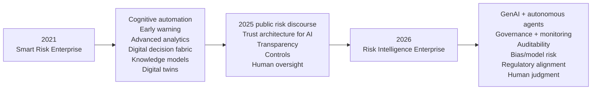
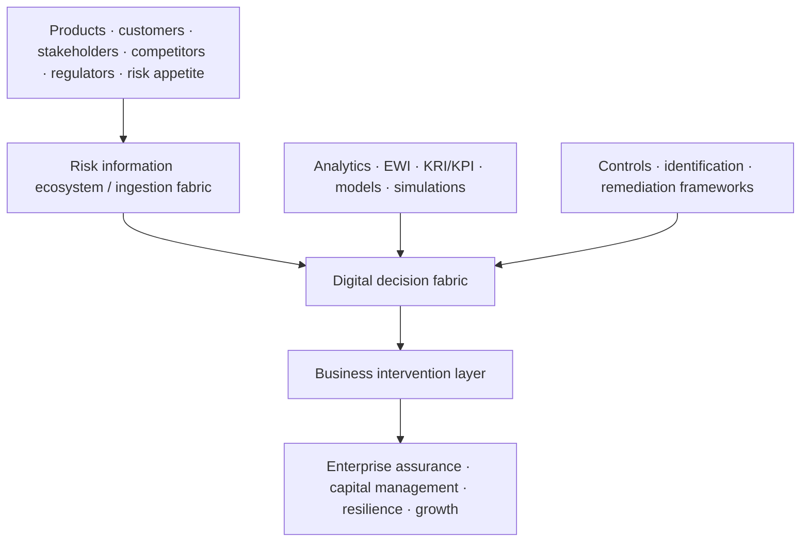
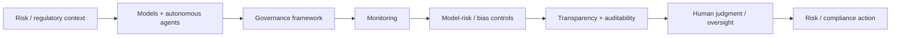

# From Smart Risk Enterprise to Agentic Risk Intelligence — Public TCS Evolution

[[bfsi/risk-compliance-ai]] · [[events/public-event-watch]] · [[people/public-voices]] · [[media/visual-reference-library]]

> **Evidence boundary:** this note traces changes in TCS' *publicly published* risk-management language and architecture. It does not claim that the diagrams map to one internal platform, organization, client program, or reporting structure.

## Why this matters

A useful way to understand TCS BFSI risk/AI positioning is to compare older public architecture with current public event language instead of reading each source in isolation.

The evidence shows a durable theme:

This is an **editorial reconstruction of public evolution**, not a TCS-published roadmap.

---

## 1. 2021 baseline — Smart Risk Enterprise

**Evidence status:** `thought-leadership / historical architecture`

TCS' 2021 white paper **“Building a smart risk enterprise in financial institutions”** argued that financial institutions should evolve risk management using digitalization and advanced analytics for near-real-time risk management, enterprise assurance and growth.

Primary source: https://www.tcs.com/content/dam/global-tcs/en/pdfs/insights/whitepapers/smart-risk-management-banking.pdf

### Figure 1 — Smart Risk Enterprise Capability Framework

The paper publicly identifies capability blocks including:

- cognitive automation
- early-warning signals and insights
- advanced analytics and visualization
- simulation of production and strategy recommendations
- service externalization

It connects those capabilities to outcomes such as lower risk exposure, faster intervention, near-real-time risk insight, forecasting, back-testing and customer-centric risk decisions.

### Figure 2 — Smart Risk Enterprise Target Architecture

The accompanying text describes:

- a **risk information ecosystem / information fabric**
- an **AI-backed digital fabric** for data-driven decision-making
- an **intervention layer** integrated with frontline business-performance management
- risk-decision frameworks
- customer-behaviour analytics
- KRI/KPI frameworks
- early-warning signals
- integrated risk and compliance
- automated RCSA
- risk simulations / digital twins
- operational resilience
- stress testing

Editorial study reconstruction:

### Three-phase transition roadmap

The same paper describes a progression:

1. strengthen risk frameworks with data-driven methods, insights and automation;
2. move toward real-time risk management, greater automation and a decision fabric;
3. introduce newer models such as risk-service externalization, behavioral analytics and digital twins.

This is notable because several concepts that appear in today's AI discussion — information/context layers, decision fabrics, continuous intervention and intelligent automation — have visible public predecessors in TCS' earlier risk architecture.

---

## 2. Public leadership continuity — Vijayaraghavan Venkatraman

The 2021 paper identifies **Vijayaraghavan Venkatraman (Vijay)** as **Global Head, Risk Management and Regulatory Compliance, TCS BFSI** at the time of publication.

TCS' author biography states that his work spans:

- risk transformation
- data-science-led innovation
- RegTech-based compliance implementations
- solution design and framework development
- risk/compliance innovation
- thought leadership
- domain competence development

The same person is publicly named by TCS as the speaker for **Risk Live North America 2026**, with the title **Global Head - BFSI Risk Management & Regulatory Compliance, TCS**.

2026 source: https://www.tcs.com/who-we-are/events/tcs-at-risk-live-north-america-2026

**Interpretation discipline:** this is evidence of long-running public topic leadership, not evidence about private reporting lines or internal project ownership.

---

## 3. 2026 public agenda — Risk Intelligence Enterprise

**Evidence status:** `planned / public-event`

TCS' Risk Live North America 2026 page is titled around **Building the Risk Intelligence Enterprise** and positions the September 24 event around moving from experimentation to trust in AI and agentic intelligence across risk and compliance.

The public roundtable and panel topics include:

- where AI is creating value across risk/compliance
- scaling AI and agentic capabilities responsibly
- governance and monitoring frameworks
- adoption success factors and metrics
- robust, transparent and auditable models
- model risk, bias and unintended consequences
- regulatory expectations and internal risk appetite
- human judgment, oversight and accountability

This makes the 2026 control model much more explicit than the older architecture:

**Study reconstruction only.**

---

## 4. Cross-source evolution

| Public dimension | 2021 Smart Risk Enterprise | 2026 Risk Intelligence Enterprise |
|---|---|---|
| Automation | cognitive automation | GenAI + agentic/autonomous capabilities |
| Decision support | advanced analytics / digital decision fabric | AI/agentic decision workflows under controls |
| Data/context | risk information ecosystem | governance + risk/regulatory context increasingly explicit |
| Monitoring | early warnings / KRI/KPI / near-real-time risk | AI governance and continuous monitoring |
| Controls | controls/remediation framework | robustness, transparency, auditability, bias/model-risk controls |
| Human role | intervention layer | explicit human judgment and oversight |
| Risk objective | enterprise assurance + growth | risk effectiveness + regulatory confidence + resilience + agility |

### Derived public observation

The public language suggests **continuity plus an AI-layer upgrade**, rather than a total reset of the risk architecture. Earlier themes — information fabrics, analytics, decision frameworks, automation, interventions and resilience — remain recognizable, while 2026 adds autonomous agents, explicit AI governance, model-risk controls, auditability and human oversight.

**Confidence:** `high` for the public-language continuity; `low/unknown` for any claim about shared internal implementation.

### Alternative explanation

The similarity may partly reflect stable risk-management concepts that are common across the industry rather than direct technical lineage between TCS offerings.

### Falsifier

A future primary TCS source explicitly stating that the Smart Risk Enterprise architecture was retired/replaced by a fundamentally unrelated architecture would weaken the lineage interpretation.

---

## Sources

- TCS, *Building a smart risk enterprise in financial institutions: Toward competitive advantage and growth* (copyright 2021): https://www.tcs.com/content/dam/global-tcs/en/pdfs/insights/whitepapers/smart-risk-management-banking.pdf
- TCS, *Risk Live North America 2026*: https://www.tcs.com/who-we-are/events/tcs-at-risk-live-north-america-2026

## Related

[[bfsi/risk-compliance-ai]] · [[intelligence/public-operating-model-inference]] · [[people/public-voices]] · [[events/public-event-watch]]
